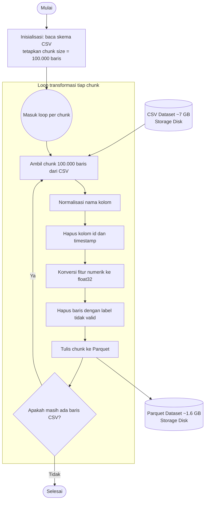

## **4.1 Pemuatan dan Transformasi Data ke Format Parquet**

Dataset CSE-CIC-IDS2018 merupakan salah satu dataset *benchmark* yang umum digunakan dalam penelitian deteksi intrusi. Data tersebut tersedia dalam format CSV (*Comma Separated Values*) dengan total ukuran sekitar 7 GB. Karakteristik ini menimbulkan tantangan tersendiri pada tahap pemuatan data, karena CSV bersifat *row-oriented*, sehingga proses pembacaan, *parsing*, dan seleksi kolom cenderung dilakukan secara sekuensial. Apabila seluruh data CSV diproses secara berulang pada setiap tahap eksperimen, biaya komputasi dan waktu pemrosesan akan menjadi sangat tinggi, terutama ketika data digunakan untuk melatih model deep learning. Oleh karena itu, penelitian ini melakukan konversi data dari format CSV ke Parquet.

Parquet dipilih karena merupakan format penyimpanan *columnar* yang mendukung kompresi, menyimpan skema data secara eksplisit, serta memungkinkan pembacaan hanya pada kolom yang dibutuhkan. Dengan demikian, proses pemuatan data menjadi lebih efisien, hemat memori, dan lebih reprodusibel dibandingkan membaca ulang berkas CSV berukuran besar secara terus-menerus. Konversi ini tidak dilakukan secara langsung, melainkan melalui serangkaian tahap praproses agar data yang dihasilkan konsisten dan siap digunakan pada tahap pemodelan.

Tahap transformasi yang dilakukan meliputi:

1. Normalisasi nama kolom.
Dataset berpotensi memiliki nama kolom yang tidak konsisten, misalnya perbedaan penggunaan huruf kapital, spasi, atau karakter khusus. Normalisasi dilakukan agar setiap kolom memiliki nama yang seragam dan dapat dipetakan secara konsisten ketika beberapa berkas data digabungkan atau dibaca oleh pipeline pemrosesan.

2. Penghapusan kolom yang tidak diperlukan.
Kolom seperti identifier unik dan waktu kejadian (timestamp) dihilangkan. Kolom identifier tidak memiliki nilai prediktif dan berpotensi menyebabkan kebocoran data (data leakage), sedangkan kolom waktu tidak digunakan karena rancangan model LSTM dalam penelitian ini tidak memanfaatkan urutan temporal antar-kejadian sebagai fitur masukan.

3. Penyeragaman tipe data numerik menjadi float32.
Seluruh fitur numerik dipastikan memiliki tipe data float32. Langkah ini penting untuk mengurangi konsumsi memori, mempercepat komputasi pada framework deep learning, serta menjaga konsistensi tipe data antarfitur sehingga tidak menimbulkan galat saat proses pelatihan model.

4. Penghapusan baris dengan label tidak valid.
Baris yang memiliki label kosong, tidak sesuai skema kelas, atau gagal dipetakan ke kelas target akan dihapus. Tahap ini memastikan bahwa data yang digunakan dalam pembelajaran terbimbing (supervised learning) hanya terdiri atas pasangan fitur dan label yang sah.

Untuk menjaga efisiensi memori, proses transformasi tidak dilakukan pada seluruh 7 GB data sekaligus. Data CSV dibaca dan diproses secara bertahap (chunking) sebanyak 100.000 baris per iterasi. Setiap potongan data yang telah melalui normalisasi nama kolom, seleksi kolom, penyeragaman tipe data, dan pembersihan label kemudian ditulis ke dalam berkas Parquet. Dengan pendekatan ini, setiap berkas Parquet yang dihasilkan maksimum berisi 100.000 baris.

Pendekatan chunking tersebut menghindari risiko kehabisan memori, memungkinkan pemrosesan secara batch, serta mempermudah validasi dan audit data. Secara keseluruhan, pipeline pemuatan data ini mengubah data mentah berukuran besar menjadi kumpulan berkas Parquet yang lebih terstruktur, ringkas, dan siap digunakan pada tahap pemodelan. Selain meningkatkan efisiensi pemuatan data, konversi ke format Parquet juga memberikan dampak signifikan terhadap ukuran penyimpanan. Dari sekitar 7 GB pada format CSV, total data Parquet yang dihasilkan dapat menyusut menjadi sekitar 1,6 GB, bergantung pada skema kompresi dan karakteristik data. Dengan demikian, proses konversi ini tidak hanya mempercepat akses dan pemrosesan data, tetapi juga mengurangi kebutuhan ruang penyimpanan secara signifikan.