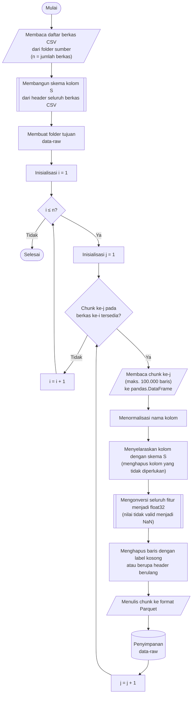

## **4.1 Pemuatan dan Transformasi Data ke Format Parquet**

Dataset CSE-CIC-IDS2018 merupakan salah satu dataset *benchmark* yang umum digunakan dalam penelitian deteksi intrusi. Data tersebut tersedia dalam format CSV (*Comma Separated Values*) dengan total ukuran sekitar 7 GB. Karakteristik ini menimbulkan tantangan tersendiri pada tahap pemuatan data, karena CSV bersifat *row-oriented*, sehingga proses pembacaan, *parsing*, dan seleksi kolom cenderung dilakukan secara sekuensial. Apabila seluruh data CSV diproses secara berulang pada setiap tahap eksperimen, biaya komputasi dan waktu pemrosesan akan menjadi sangat tinggi, terutama karena data yang sama digunakan berulang kali untuk pelatihan, penyetelan hiperparameter, dan pengujian ketahanan pada lima algoritma klasifikasi. Oleh karena itu, penelitian ini melakukan konversi data dari format CSV ke Parquet.

Parquet dipilih karena merupakan format penyimpanan *columnar* yang mendukung kompresi, menyimpan skema data secara eksplisit, serta memungkinkan pembacaan hanya pada kolom yang dibutuhkan. Dengan demikian, proses pemuatan data menjadi lebih efisien, hemat memori, dan lebih reprodusibel dibandingkan membaca ulang berkas CSV berukuran besar secara terus-menerus. Penulisan dan pembacaan berkas Parquet dilaksanakan menggunakan pustaka *PyArrow* dengan algoritma kompresi Snappy, yang memprioritaskan kecepatan kompresi dan dekompresi sehingga pembacaan ulang data pada tahap-tahap berikutnya tidak menjadi hambatan. Indeks baris (*index*) tidak disimpan karena tidak memuat informasi yang relevan bagi pemodelan. Konversi ini tidak dilakukan secara langsung, melainkan melalui serangkaian tahap praproses agar data yang dihasilkan konsisten dan siap digunakan pada tahap pemodelan.

Rancangan proses konversi didasarkan pada empat keputusan desain. Pertama, data dibaca dan diproses secara bertahap per potongan (*chunk*) agar kebutuhan memori tidak bergantung pada ukuran total dataset. Kedua, seluruh berkas dipetakan ke satu skema kolom yang seragam, mengingat susunan kolom antarberkas CSV tidak selalu identik. Ketiga, setiap berkas CSV diproses secara independen sehingga pemrosesannya dapat dijalankan secara paralel. Keempat, berkas CSV asli tidak dimodifikasi dan hasil konversi ditulis ke folder terpisah, sehingga data sumber tetap utuh dan proses konversi dapat diulang apabila diperlukan.

Prosedur pemuatan dan transformasi data dilaksanakan melalui algoritma berikut:

1. **Memuat daftar berkas CSV.** Seluruh berkas berekstensi CSV pada folder sumber (*cse-cic-ids2018*) didaftar dan diurutkan secara alfabetis sehingga urutan pemrosesan bersifat deterministik. Jumlah berkas dinyatakan sebagai *n*.

2. **Membangun skema kolom terpadu.** Pada tahap ini hanya baris judul (*header*) dari setiap berkas yang dibaca sehingga biaya komputasinya rendah. Nama kolom dinormalisasi, kolom yang tidak diperlukan dikecualikan, dan kolom yang belum tercatat ditambahkan ke dalam skema dengan mempertahankan urutan kemunculannya. Skema yang dihasilkan terdiri atas 79 kolom, yaitu 78 fitur dan satu kolom label, yang selanjutnya menjadi acuan bagi seluruh berkas. Skema dibentuk satu kali sebelum pemrosesan paralel dimulai sehingga seluruh berkas Parquet yang dihasilkan memiliki susunan kolom yang identik.

3. **Membaca berkas CSV secara bertahap.** Setiap berkas dibaca per *chunk* sebanyak maksimum 100.000 baris ke dalam *pandas.DataFrame*. Pembacaan dilaksanakan dengan parameter *low_memory=False* agar tipe data ditentukan berdasarkan seluruh baris dalam satu *chunk*, karena nilai non-numerik yang tersisip pada kolom numerik dapat menyebabkan inferensi tipe data yang tidak konsisten apabila dilakukan secara parsial.

4. **Menormalisasi nama kolom.** Spasi di awal dan akhir nama kolom dihapus, dan seluruh huruf diubah menjadi huruf kecil. Dataset berpotensi memiliki nama kolom yang tidak konsisten, misalnya perbedaan penggunaan huruf kapital atau spasi. Normalisasi dilaksanakan agar setiap kolom memiliki nama yang seragam dan dapat dipetakan secara konsisten ketika beberapa berkas data digabungkan atau dibaca oleh *pipeline* pemrosesan.

5. **Menyelaraskan kolom dengan skema dan menghapus kolom yang tidak diperlukan.** Susunan kolom pada setiap *chunk* disesuaikan dengan skema. Kolom yang tidak terdapat pada skema dihapus, yaitu *Flow ID*, alamat IP sumber, alamat IP tujuan, port sumber, dan waktu kejadian (*Timestamp*), sedangkan kolom pada skema yang tidak dijumpai pada suatu berkas diisi dengan *NaN*. Kolom identifier tidak memiliki nilai prediktif dan berpotensi menyebabkan kebocoran data (*data leakage*). Alamat IP dan port sumber, misalnya, bersifat spesifik terhadap mesin tertentu pada lingkungan pengujian sehingga model berisiko menghafal identitas mesin, bukan mempelajari karakteristik lalu lintas jaringan. Kolom waktu tidak digunakan karena model dalam penelitian ini memperlakukan setiap aliran jaringan (*flow*) sebagai observasi yang independen dan tidak memanfaatkan urutan temporal antar-kejadian sebagai fitur masukan. Sebaliknya, port tujuan (*Dst Port*) dan protokol (*Protocol*) dipertahankan karena merepresentasikan layanan dan protokol yang diakses oleh aliran jaringan tersebut.

6. **Menyeragamkan tipe data fitur menjadi *float32*.** Seluruh kolom fitur, yaitu seluruh kolom selain label, dikonversi menjadi bilangan numerik menggunakan fungsi *pandas.to_numeric* dengan parameter *errors="coerce"*, kemudian direpresentasikan dalam tipe *float32*. Nilai yang tidak dapat dikonversi menjadi bilangan diubah menjadi *NaN*, sehingga proses tidak terhenti dan penanganannya dapat ditunda ke tahap imputasi. Tipe *float32* dipilih untuk mengurangi konsumsi memori menjadi setengah dari *float64*, mempercepat komputasi pada *framework* pemodelan, serta menjaga konsistensi tipe data antarfitur sehingga tidak menimbulkan galat saat proses pelatihan model. Kolom label dikecualikan dari konversi ini dan tetap berupa teks hingga tahap pengodean label.

7. **Menghapus baris dengan label tidak valid.** Baris dinyatakan tidak valid apabila kolom label kosong atau berisi teks "label", yaitu sisa baris judul kolom yang tersisip berulang di tengah berkas CSV. Baris demikian memuat teks pada seluruh kolom fitur sehingga nilainya telah diubah menjadi *NaN* pada langkah sebelumnya, dan barisnya dihapus pada langkah ini. Pemeriksaan dilaksanakan setelah spasi dihapus dan huruf diubah menjadi huruf kecil agar variasi penulisan tetap terdeteksi, sedangkan nilai label pada baris yang valid tidak diubah. Tahap ini memastikan bahwa data yang digunakan dalam pembelajaran terbimbing (*supervised learning*) hanya terdiri atas pasangan fitur dan label yang sah.

8. **Menyimpan hasil ke format Parquet.** Setiap *chunk* yang telah dibersihkan ditulis sebagai satu berkas Parquet pada folder *data-raw*. Nama berkas terdiri atas nama berkas CSV asal yang diikuti nomor *chunk* lima digit yang dimulai dari 00001, sehingga urutan leksikografis berkas sama dengan urutan *chunk* pada berkas asal. Dengan mempertahankan nama berkas CSV asal, tanggal pengambilan data dapat ditelusuri kembali dan digunakan untuk mengelompokkan berkas pada tahap pembagian dataset (Subbab 4.3). Langkah 3 hingga 8 diulang untuk setiap *chunk* pada setiap berkas hingga seluruh berkas CSV selesai dikonversi.

Untuk menjaga efisiensi memori, proses transformasi tidak dilakukan pada seluruh 7 GB data sekaligus. Data CSV dibaca dan diproses secara bertahap (*chunking*) sebanyak 100.000 baris per iterasi. Setiap *chunk* yang telah melalui normalisasi nama kolom, seleksi kolom, penyeragaman tipe data, dan pembersihan label kemudian ditulis ke dalam berkas Parquet. Dengan pendekatan ini, setiap berkas Parquet yang dihasilkan maksimum berisi 100.000 baris. Ukuran *chunk* tersebut ditetapkan sebagai kompromi antara kebutuhan memori dan jumlah berkas yang dihasilkan, yaitu cukup kecil untuk ditampung dalam memori oleh setiap proses paralel, namun cukup besar untuk membatasi jumlah berkas dan biaya operasi baca-tulis.

Pemrosesan antarberkas CSV dijalankan secara paralel menggunakan pustaka *joblib* dengan *backend* *loky* yang berbasis proses (*process-based*), sehingga setiap berkas ditangani oleh proses terpisah dan tidak dibatasi oleh *Global Interpreter Lock* (GIL) pada Python. Jumlah proses pekerja (*worker*) ditetapkan sama dengan seluruh inti CPU yang tersedia, sedangkan jumlah *thread* internal pada setiap pekerja dibatasi menjadi satu untuk mencegah *oversubscription*, yaitu kondisi ketika jumlah *thread* aktif melebihi jumlah inti CPU. Di dalam satu berkas, *chunk* diproses secara berurutan sehingga setiap pekerja hanya memproses satu *chunk* pada satu waktu. Dengan demikian, kebutuhan memori puncak sebanding dengan jumlah pekerja dikalikan ukuran *chunk*, dan tidak bergantung pada ukuran berkas CSV.

Pendekatan *chunking* tersebut menghindari risiko kehabisan memori, memungkinkan pemrosesan secara *batch*, serta mempermudah validasi dan audit data. Secara keseluruhan, *pipeline* pemuatan data ini mengubah data mentah berukuran besar menjadi kumpulan berkas Parquet yang lebih terstruktur, ringkas, dan siap digunakan pada tahap pemodelan. Selain meningkatkan efisiensi pemuatan data, konversi ke format Parquet juga memberikan dampak signifikan terhadap ukuran penyimpanan. Dari sekitar 7 GB pada format CSV, total data Parquet yang dihasilkan dapat menyusut menjadi sekitar 1,6 GB dengan kompresi Snappy, bergantung pada karakteristik data. Dengan demikian, proses konversi ini tidak hanya mempercepat akses dan pemrosesan data, tetapi juga mengurangi kebutuhan ruang penyimpanan secara signifikan.
