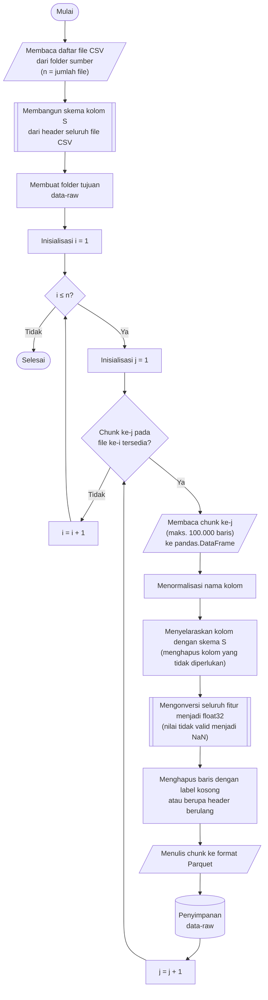

## **4.1 Pemuatan dan Transformasi Data ke Format Parquet**

# 4.1 Pemuatan dan Transformasi Data ke Format Parquet

Dataset CSE-CIC-IDS2018 merupakan salah satu dataset benchmark yang sangat umum dan sering digunakan dalam penelitian deteksi intrusi berbasis pembelajaran mesin. Dataset tersebut tersedia dalam format CSV (Comma Separated Values) dengan total ukuran dataset sebesar 7 gigabytes. Format data dan ukuran dataset tersebut menimbulkan permasalahan pada tahap pemuatan data, karena CSV bersifat *row-oriented*, sehingga proses pembacaan, parsing, dan seleksi kolom cenderung dilakukan secara sekuensial. Apabila seluruh data CSV diproses dan dimuat berulang-ulang di tiap tahapan, biaya komputasi dan waktu pemrosesan akan menjadi sangat tinggi, terutama karena data yang sama digunakan berulang kali untuk pelatihan, penyetelan hiperparameter, dan pengujian ketahanan pada lima algoritma klasifikasi. Oleh karena itu, penelitian ini melakukan konversi data dari format CSV ke Parquet.

*Parquet* dipilih karena merupakan format penyimpanan *columnar* yang mendukung kompresi. Parquet menyimpan data secara eksplisit, *binary*, serta memungkinkan pembacaan hanya pada kolom yang dibutuhkan. Maka dari itu, pemuatan data menjadi lebih efisien, dan hemat memori, dibandingkan membaca ulang CSV berukuran besar berulang-ulang. Penulisan dan pembacaan Parquet menggunakan library PyArrow dengan algoritma kompresi Snappy, yang memprioritaskan kecepatan kompresi dan dekompresi sehingga pembacaan ulang data pada tahap-tahap berikutnya tidak menjadi hambatan. Indeks baris tidak disimpan karena tidak memuat informasi yang relevan bagi pemodelan. Konversi ini tidak dilakukan secara langsung, melainkan melalui serangkaian tahap praproses agar data yang dihasilkan konsisten dan siap digunakan pada tahap pemodelan.

Prosedur pemuatan dan transformasi data dilaksanakan melalui algoritma berikut:

1. **Pemuatan data**, Seluruh file CSV dari dataset CSE-CIC-IDS2018 yang terdapat pada direktori sumber (`cse-cic-ids2018`) dimuat ke dalam lingkungan pemrosesan.
2. **Penyusunan skema acuan**, Skema atau struktur acuan kolom dibangun sebagai standar bersama, sehingga data dari setiap file CSV dimuat dengan struktur yang seragam.
3. **Normalisasi nama kolom**, Nama setiap kolom dinormalisasi ke format yang konsisten agar kolom yang sama antar dokumen dapat dipetakan dengan benar.
4. **Penghapusan kolom yang tidak relevan**, Kolom yang tidak berkontribusi pada proses pemodelan, yaitu pengenal (id), penanda waktu (timestamp), serta kolom yang tidak konsisten antar dokumen dihapus.
5. **Konversi tipe data**, Seluruh fitur numerik dikonversi ke tipe `float32` untuk menekan penggunaan memori tanpa mengorbankan presisi yang diperlukan.
6. **Pembersihan baris tidak valid**. Baris yang tidak sesuai dihapus, terutama baris header yang muncul berulang di dataset.

```mermaid
flowchart TD
    mulai(["Mulai"])
    mulai --> input_csv[/"Membaca daftar file CSV<br>dari folder sumber<br>(n = jumlah file)"/]
    input_csv --> skema[["Membangun skema kolom S<br>dari header seluruh file CSV"]]
    skema --> buat_folder["Membuat folder tujuan<br>data-raw"]
    buat_folder --> init_i["Inisialisasi i = 1"]
    init_i --> cek_i{"i ≤ n?"}

    cek_i -->|"Tidak"| selesai(["Selesai"])
    cek_i -->|"Ya"| init_j["Inisialisasi j = 1"]
    init_j --> cek_j{"Chunk ke-j pada<br>file ke-i tersedia?"}

    cek_j -->|"Tidak"| inc_i["i = i + 1"]
    inc_i --> cek_i

    cek_j -->|"Ya"| baca_chunk[/"Membaca chunk ke-j<br>(maks. 100.000 baris)<br>ke pandas.DataFrame"/]
    baca_chunk --> norm_kolom["Menormalisasi nama kolom"]
    norm_kolom --> selaras["Menyelaraskan kolom dengan skema S<br>(menghapus kolom yang tidak diperlukan)"]
    selaras --> cast_float[["Mengonversi seluruh fitur menjadi float32<br>(nilai tidak valid menjadi NaN)"]]
    cast_float --> hapus_label["Menghapus baris dengan label kosong<br>atau berupa header berulang"]
    hapus_label --> tulis[/"Menulis chunk ke format Parquet"/]
    tulis --> simpan[("Penyimpanan<br>data-raw")]
    simpan --> inc_j["j = j + 1"]
    inc_j --> cek_j
```

Untuk menjaga efisiensi memori, proses transformasi tidak dilakukan pada seluruh data sekaligus. Data dibaca dan diproses secara bertahap sebanyak 100.000 baris per iterasi. Setiap bagian atau *chunk* yang telah melalui normalisasi nama kolom, seleksi kolom, penyeragaman tipe data, dan pembersihan dirubah ke dalam file Parquet. Dengan pendekatan ini, setiap file Parquet yang dihasilkan maksimum berisi 100.000 baris. Ukuran *chunk* tersebut ditetapkan sebagai kompromi antara kebutuhan memori dan jumlah file yang dihasilkan, yaitu cukup kecil untuk ditampung dalam memori oleh setiap proses paralel, namun cukup besar untuk membatasi jumlah file dan biaya operasi baca-tulis.

Pemrosesan tersebut dijalankan secara paralel menggunakan `joblib` dengan backend `loky` yang berbasis proses (*process-based*), sehingga setiap file data ditangani secara terpisah dan tidak dibatasi oleh Global Interpreter Lock (GIL) pada Python. Jumlah proses paralel ditetapkan sama dengan seluruh core CPU yang tersedia, sedangkan jumlah thread internal pada setiap task dibatasi menjadi satu untuk mencegah *oversubscription*, yaitu kondisi ketika jumlah thread aktif melebihi jumlah core CPU. Di dalam satu file, *chunk* diproses secara berurutan sehingga setiap pekerja hanya memproses satu *chunk* pada satu waktu. Dengan demikian, kebutuhan memori puncak sebanding dengan jumlah pekerja dikalikan ukuran *chunk*, dan tidak bergantung pada ukuran file CSV.

Dari sekitar 7 GB pada format CSV, total data Parquet yang dihasilkan dapat menyusut menjadi sekitar 1,6 GB dengan kompresi Snappy. Dengan demikian, proses konversi ini tidak hanya mempercepat akses dan pemrosesan data, tetapi juga mengurangi kebutuhan ruang penyimpanan secara signifikan.