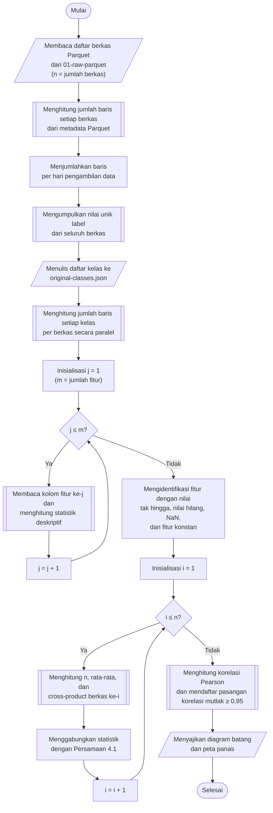

## **4.2 Analisis Data Eksploratif (*Exploratory Data Analysis*)**

Data hasil konversi pada Subbab 4.1 tidak langsung digunakan untuk pemodelan. Data terlebih dahulu ditelaah melalui analisis data eksploratif (*Exploratory Data Analysis*, EDA) untuk mengenali karakteristik dataset, yaitu sebaran data antarhari pengambilan, distribusi kelas, statistik setiap fitur, serta permasalahan kualitas data seperti nilai tak hingga (*infinite*), nilai hilang (*missing value*), fitur konstan, dan fitur yang saling berkorelasi kuat. Temuan pada tahap ini menjadi dasar keputusan pada tahap-tahap berikutnya, yaitu pembersihan data (Subbab 4.3), penghapusan data duplikat (Subbab 4.4), pembagian dataset (Subbab 4.5), dan rancangan *pipeline* praproses (Subbab 4.7). Dengan demikian, setiap langkah praproses yang diterapkan memiliki alasan yang dapat ditelusuri kembali pada data.

EDA dilakukan pada data di folder `data-pipeline/01-raw-parquet`, yang terdiri atas 168 berkas Parquet dengan total 16.232.943 baris, 78 fitur, dan satu kolom label. Ukuran data tersebut tidak memungkinkan seluruh data dimuat ke memori sekaligus, sehingga setiap analisis dirancang agar hanya membaca bagian data yang dibutuhkan. Jumlah baris dibaca dari metadata berkas Parquet tanpa membaca isi data, distribusi kelas dihitung per berkas, statistik deskriptif dihitung per fitur dengan hanya membaca satu kolom pada setiap perhitungan, dan korelasi antarfitur dihitung per berkas kemudian digabungkan. Pembacaan per kolom dimungkinkan oleh sifat *columnar* format Parquet dan dilakukan secara *lazy* menggunakan library `Polars`, sedangkan pemrosesan per berkas dijalankan secara paralel menggunakan `joblib` dengan delapan proses.

Prosedur analisis data eksploratif dilaksanakan melalui algoritma berikut:

1. **Penghitungan baris per hari**, Jumlah baris setiap berkas dibaca dari metadata Parquet, kemudian dijumlahkan menurut tanggal pengambilan data yang diambil dari awal nama berkas, yaitu pola `YYYY-MM-DD`.
2. **Penyusunan daftar kelas**, Seluruh nilai unik pada kolom label dikumpulkan dari setiap berkas, diurutkan secara alfabetis, dan disimpan pada berkas `cache/original-classes.json` sebagai acuan daftar kelas bagi tahap pengodean label (Subbab 4.6).
3. **Penghitungan distribusi kelas**, Jumlah baris setiap kelas dihitung pada setiap berkas, kemudian dijumlahkan per hari dan untuk seluruh dataset beserta persentasenya.
4. **Penghitungan statistik deskriptif**, Untuk setiap fitur dihitung jumlah baris, jumlah nilai hilang, jumlah NaN, jumlah nilai tak hingga, nilai minimum, maksimum, rata-rata, median, simpangan baku, jumlah nilai negatif, jumlah nilai nol, dan jumlah nilai unik. Statistik nilai dihitung hanya dari nilai yang terhingga (*finite*) agar tidak terdistorsi oleh nilai tak hingga.
5. **Identifikasi fitur bermasalah**, Fitur yang memuat nilai tak hingga, nilai hilang, atau NaN disaring dari statistik deskriptif beserta persentase barisnya, demikian pula fitur konstan, yaitu fitur yang hanya memiliki satu nilai unik.
6. **Analisis korelasi**, Koefisien korelasi Pearson dihitung antara seluruh pasangan fitur yang tidak konstan, kemudian pasangan dengan nilai mutlak korelasi sedikitnya 0,95 didaftar sebagai pasangan yang berkorelasi tinggi.
7. **Visualisasi**, Hasil analisis disajikan dalam bentuk diagram batang jumlah baris per hari dan per kelas, peta panas (*heatmap*) jumlah baris setiap kelas pada setiap hari, dan peta panas korelasi antarfitur.

Korelasi tidak dapat dihitung langsung pada seluruh data karena membutuhkan seluruh baris di memori. Oleh karena itu, setiap berkas diringkas menjadi tiga statistik, yaitu jumlah baris $n$, vektor rata-rata $\mu$, dan matriks jumlah hasil kali simpangan (*cross-product*) $C$, yang hanya dihitung dari baris yang seluruh nilainya terhingga. Ringkasan dari dua kelompok data $a$ dan $b$ kemudian digabungkan menggunakan persamaan berikut.

$n=n_{a}+n_{b},\ \ \delta ={\mu }_{b}-{\mu }_{a},\ \ \mu ={\mu }_{a}+\delta \frac{n_{b}}{n},\ \ C=C_{a}+C_{b}+\delta {\delta }^{T}\frac{n_{a}n_{b}}{n}$ (4.1)

Persamaan 4.1 adalah persamaan penggabungan statistik kovarians, dengan $n_{a}$ dan $n_{b}$ adalah jumlah baris, ${\mu }_{a}$ dan ${\mu }_{b}$ adalah vektor rata-rata, serta $C_{a}$ dan $C_{b}$ adalah matriks *cross-product* dari kedua kelompok. Penggabungan dilakukan berurutan untuk seluruh berkas, sehingga statistik yang diperoleh sama dengan perhitungan pada seluruh data sekaligus tanpa harus memuat seluruh data ke memori. Koefisien korelasi kemudian dihitung dari matriks gabungan tersebut.

$r_{jk}=\frac{C_{jk}}{\sqrt{C_{jj}\,C_{kk}}}$ (4.2)

Persamaan 4.2 adalah koefisien korelasi Pearson antara fitur ke-$j$ dan fitur ke-$k$, dengan $C_{jk}$ adalah elemen matriks *cross-product* gabungan. Nilai $r_{jk}$ berada pada rentang −1 hingga 1, dan nilai mutlak yang mendekati 1 menandakan hubungan linear yang kuat antara kedua fitur.

Hasil EDA menunjukkan bahwa data tidak tersebar merata antarhari. Tanggal 20 Februari 2018 memuat 7.948.748 baris atau sekitar 49% dari seluruh data, sedangkan tanggal 1 Maret 2018 hanya memuat 331.100 baris. Distribusi kelas juga sangat tidak seimbang. Kelas *Benign* memuat 13.484.708 baris atau 83,07% dari seluruh data, sedangkan kelas *SQL Injection* hanya memuat 87 baris, dan setiap kelas serangan hanya muncul pada satu atau dua hari pengambilan data. Ringkasan temuan EDA beserta tindak lanjutnya disajikan pada Tabel 4.1.

Tabel 4.1 Temuan Analisis Data Eksploratif dan Tindak Lanjutnya

| Temuan | Hasil analisis | Tindak lanjut |
| :--- | :--- | :--- |
| Nilai tak hingga | *flow_pkts_s* (95.760 baris, 0,59%) dan *flow_byts_s* (36.039 baris, 0,22%) | Baris dihapus (Subbab 4.3) |
| Nilai hilang | *flow_byts_s* (59.721 baris, 0,37%) | Baris dihapus (Subbab 4.3) |
| NaN | Tidak ditemukan | Tidak diperlukan |
| Fitur konstan | 8 fitur yang bernilai nol pada seluruh baris | Fitur dihapus (Subbab 4.3) |
| Nilai negatif | 14 baris dengan *flow_duration* negatif, serta nilai negatif pada fitur selang waktu antarpaket (*IAT*) | Dipertahankan |
| Korelasi tinggi | 46 pasangan fitur dengan $\lvert r\rvert$ ≥ 0,95, delapan di antaranya berkorelasi sempurna | Direduksi dengan PCA (Subbab 4.7) |
| Ketidakseimbangan kelas | *Benign* 83,07%, kelas terkecil *SQL Injection* 87 baris | Pembagian berstrata (Subbab 4.5), SMOTE (Subbab 4.7), dan F1-*score* makro (Subbab 4.8) |

Nilai tak hingga dan nilai hilang berasal dari penyebab yang sama. Fitur *flow_byts_s* dan *flow_pkts_s* merupakan laju byte dan laju paket per detik yang dihitung dengan membagi jumlah byte atau jumlah paket dengan durasi aliran. Seluruh 95.760 baris yang bermasalah memiliki durasi aliran (*flow_duration*) bernilai nol. Pada baris dengan jumlah byte lebih dari nol, pembagian dengan nol menghasilkan nilai tak hingga, sedangkan pada 59.721 baris yang jumlah byte-nya juga nol, pembagian nol dengan nol menghasilkan nilai yang tidak terdefinisi dan tersimpan sebagai nilai hilang. Tidak ditemukannya NaN disebabkan oleh nilai yang tidak dapat dikonversi menjadi bilangan pada Subbab 4.1 tersimpan sebagai nilai kosong (*null*) pada berkas Parquet, sehingga tercatat sebagai nilai hilang.

Delapan fitur konstan yang ditemukan adalah *bwd_psh_flags*, *bwd_urg_flags*, serta enam fitur *bulk*, yaitu *fwd_byts_b_avg*, *fwd_pkts_b_avg*, *fwd_blk_rate_avg*, *bwd_byts_b_avg*, *bwd_pkts_b_avg*, dan *bwd_blk_rate_avg*. Fitur tersebut bernilai nol pada seluruh baris sehingga tidak membawa informasi apa pun untuk membedakan kelas. Analisis korelasi pada 70 fitur yang tersisa menemukan banyak fitur yang redundan, misalnya *subflow_fwd_pkts* dengan *tot_fwd_pkts* dan *fwd_pkt_len_mean* dengan *fwd_seg_size_avg* yang berkorelasi sempurna, karena keduanya dihitung dari besaran yang sama oleh CICFlowMeter. Redundansi ini tidak ditangani dengan menghapus fitur satu per satu, tetapi dengan reduksi dimensi menggunakan PCA pada Subbab 4.7, yang menggabungkan fitur-fitur yang saling berkorelasi ke dalam komponen utama yang sama.

Nilai negatif yang ditemukan pada durasi aliran dan selang waktu antarpaket tidak dihapus. Nilai tersebut merupakan bilangan terhingga yang tetap dapat diproses oleh seluruh algoritma, dan jumlahnya sangat kecil, misalnya hanya 14 baris yang memiliki durasi aliran negatif. Penanganan lebih lanjut terhadap nilai negatif memerlukan asumsi mengenai kesalahan pencatatan pada CICFlowMeter yang berada di luar ruang lingkup penelitian ini. Tahap EDA tidak mengubah data, sehingga seluruh berkas pada folder `data-pipeline/01-raw-parquet` tetap utuh dan menjadi masukan bagi tahap pembersihan data.
