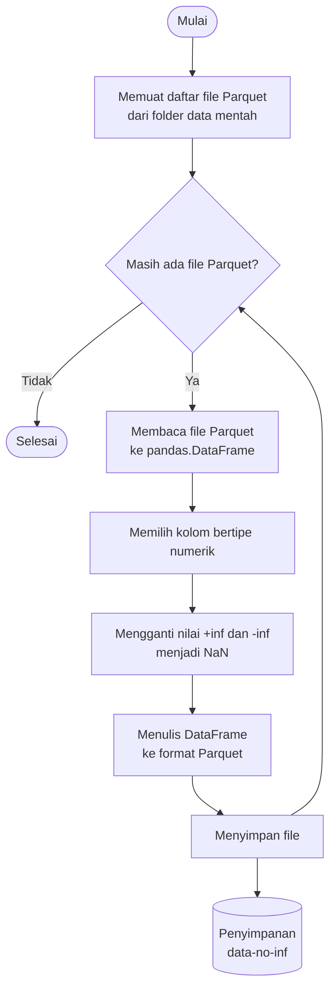

## **4.2 Membersihkan Data Bernilai Tak Hingga (*Infinite Values*)**

Pada dataset CSE-CIC-IDS2018, sejumlah fitur merupakan hasil komputasi rasio atau pembagian antar variabel, misalnya kecepatan aliran data terhadap durasi koneksi. Ketika durasi yang tercatat sangat singkat, atau terjadi kesalahan pencatatan pada CICFlowMeter v3, nilai penyebut pada perhitungan tersebut dapat bernilai nol. Kondisi ini menyebabkan fitur yang bergantung pada pembagian tersebut menghasilkan nilai tak hingga (*infinite*), yang secara matematis tidak terdefinisi dan tidak dapat diolah dengan baik oleh model pembelajaran mesin.

Oleh karena itu, nilai tak hingga tersebut perlu ditangani sebelum data digunakan pada tahap pemodelan. Pendekatan yang diterapkan adalah mengonversi setiap nilai tak hingga menjadi *NaN* (*Not a Number*), sehingga keberadaannya dapat diperlakukan secara konsisten sebagai data yang hilang (*missing value*) dan selanjutnya ditangani melalui proses imputasi pada tahap berikutnya.

Tahap pembersihan yang dilakukan meliputi:

1. Memuat daftar berkas Parquet.
Seluruh berkas Parquet hasil transformasi pada tahap sebelumnya didata dari folder data mentah. Setiap berkas kemudian diproses satu per satu, sehingga proses pembersihan dapat dilakukan tanpa memuat seluruh dataset ke dalam memori sekaligus.

2. Membaca berkas ke dalam *DataFrame*.
Berkas Parquet yang sedang diproses dibaca ke dalam *pandas.DataFrame* agar nilai pada setiap kolom dapat diperiksa dan dimanipulasi.

3. Memilih kolom bertipe numerik.
Hanya kolom numerik yang dipilih, karena nilai tak hingga hanya dapat muncul pada fitur bertipe numerik. Kolom non-numerik, seperti label kelas, tidak diubah agar tidak terjadi kerusakan data.

4. Mengganti nilai tak hingga menjadi *NaN*.
Setiap nilai positif tak hingga (+inf) maupun negatif tak hingga (-inf) pada kolom numerik diganti dengan *NaN*. Dengan demikian, seluruh nilai yang tidak valid secara matematis terwakili dalam satu representasi data hilang yang seragam.

5. Menyimpan hasil ke format Parquet.
*DataFrame* yang telah dibersihkan ditulis kembali dalam format Parquet ke folder terpisah (*data-no-inf*), sehingga data mentah tetap utuh dan proses dapat ditelusuri kembali. Langkah 2 sampai 5 diulang hingga seluruh berkas selesai diproses.

