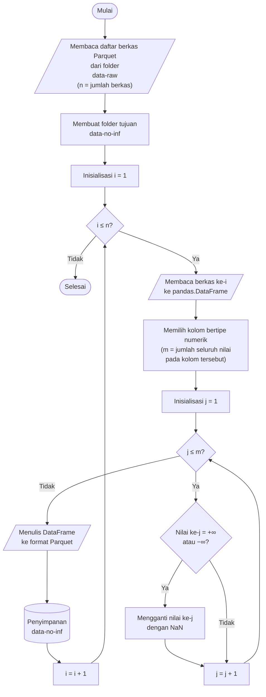

## **4.2 Membersihkan Data Bernilai Tak Hingga (*Infinite Values*)**

Pada dataset CSE-CIC-IDS2018, sejumlah fitur merupakan hasil komputasi rasio atau pembagian antar variabel, misalnya kecepatan aliran data terhadap durasi koneksi. Ketika durasi yang tercatat sangat singkat, atau terjadi kesalahan pencatatan pada CICFlowMeter v3, nilai penyebut pada perhitungan tersebut dapat bernilai nol. Kondisi ini menyebabkan fitur yang bergantung pada pembagian tersebut menghasilkan nilai tak hingga (*infinite*), yang secara matematis tidak terdefinisi dan tidak dapat diolah dengan baik oleh model pembelajaran mesin.

Oleh karena itu, nilai tak hingga tersebut perlu ditangani sebelum data digunakan pada tahap pemodelan. Pendekatan yang diterapkan adalah mengonversi setiap nilai tak hingga menjadi *NaN* (*Not a Number*), sehingga keberadaannya dapat diperlakukan secara konsisten sebagai data yang hilang (*missing value*) dan selanjutnya ditangani melalui proses imputasi pada tahap berikutnya. Pendekatan ini dipilih dibandingkan penghapusan baris karena penghapusan berpotensi mengurangi jumlah sampel, termasuk sampel pada kelas minoritas yang jumlahnya sudah terbatas, serta dibandingkan penggantian dengan nilai konstan tertentu karena nilai tersebut bersifat arbitrer dan dapat mendistorsi distribusi fitur.

Konversi ini dilaksanakan sebelum pembagian dataset karena bersifat deterministik pada setiap nilai dan tidak memerlukan statistik apa pun yang dipelajari dari data, sehingga tidak menimbulkan kebocoran data (*data leakage*). Sebaliknya, penentuan nilai pengganti pada tahap imputasi memerlukan statistik data sehingga baru dilaksanakan setelah pembagian dataset.

Prosedur pembersihan nilai tak hingga dilaksanakan melalui algoritma berikut:

1. **Memuat daftar berkas Parquet.** Seluruh berkas Parquet hasil transformasi pada tahap sebelumnya didaftar dari folder *data-raw* dan diurutkan secara alfabetis, dengan jumlah berkas dinyatakan sebagai *n*. Folder tujuan *data-no-inf* dibuat apabila belum tersedia. Setiap berkas kemudian diproses satu per satu, sehingga proses pembersihan dapat dilaksanakan tanpa memuat seluruh dataset ke dalam memori sekaligus.

2. **Membaca berkas ke dalam struktur data tabular.** Berkas ke-*i* dibaca ke dalam *pandas.DataFrame* menggunakan mesin *PyArrow* agar nilai pada setiap kolom dapat diperiksa dan dimanipulasi. Pembacaan dilakukan per berkas sehingga kebutuhan memori dibatasi oleh ukuran satu berkas, yaitu maksimum 100.000 baris.

3. **Memilih kolom bertipe numerik.** Pemilihan dilaksanakan berdasarkan tipe data, karena nilai tak hingga hanya dapat direpresentasikan pada tipe numerik *floating point*. Oleh karena seluruh fitur telah dikonversi menjadi *float32* pada Subbab 4.1, seluruh kolom fitur tercakup dalam pemilihan ini, sedangkan kolom non-numerik, yaitu kolom label, tidak diubah agar tidak terjadi kerusakan data. Jumlah seluruh nilai pada kolom terpilih dinyatakan sebagai *m*.

4. **Memeriksa dan mengganti nilai tak hingga menjadi *NaN*.** Setiap nilai pada kolom numerik diperiksa apakah bernilai +∞ atau −∞. Nilai yang memenuhi kondisi tersebut diganti dengan *NaN*, sedangkan nilai lainnya tidak diubah. Dengan demikian, seluruh nilai yang tidak valid secara matematis terwakili dalam satu representasi data hilang yang seragam. Pada implementasinya, pemeriksaan ini dijalankan secara tervektorisasi pada seluruh kolom numerik menggunakan fungsi *DataFrame.replace*.

5. **Menyimpan hasil ke format Parquet.** *DataFrame* yang telah dibersihkan ditulis ke folder *data-no-inf* dengan nama berkas yang identik dengan berkas sumber, menggunakan konfigurasi penulisan yang sama seperti pada tahap sebelumnya, yaitu *PyArrow*, kompresi Snappy, dan tanpa indeks baris. Data pada folder *data-raw* tidak diubah, sehingga data sebelum dan sesudah pembersihan dapat dibandingkan dan proses dapat ditelusuri kembali. Langkah 2 hingga 5 diulang hingga seluruh berkas selesai diproses.

Pembersihan dilaksanakan pada tingkat berkas dan setiap berkas diproses secara independen. Oleh karena itu, iterasi terhadap berkas pada diagram di atas dijalankan secara paralel menggunakan pustaka *joblib* dengan konfigurasi yang sama seperti pada Subbab 4.1. Dengan mempertahankan nama berkas, korespondensi satu-satu antara berkas sebelum dan sesudah pembersihan tetap terjaga, sehingga informasi tanggal pengambilan data pada nama berkas tetap tersedia bagi tahap pembagian dataset.

Keberhasilan pembersihan diverifikasi dengan menghitung jumlah nilai tak hingga pada setiap kolom numerik, yang dijumlahkan dari seluruh berkas, baik pada folder *data-raw* (sebelum penggantian) maupun pada folder *data-no-inf* (setelah penggantian). Hanya kolom yang mengandung nilai tak hingga yang dilaporkan, sehingga kolom yang terdampak dapat diidentifikasi, dan pemeriksaan setelah penggantian diharapkan tidak menemukan kolom yang masih memuat nilai tak hingga.
