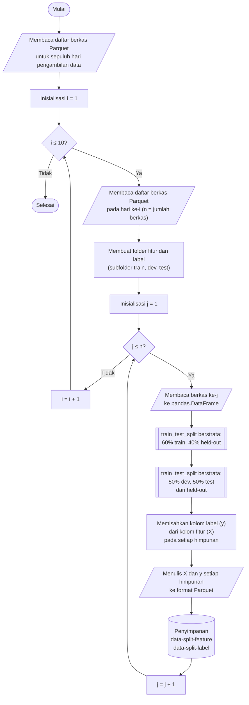

## **4.3 Pembagian Dataset (*Data Splitting*)**

Data dibagi menjadi tiga himpunan, yaitu data latih (*train set*), data validasi (*dev set*), dan data uji (*test set*), yang masing-masing memiliki peran berbeda dalam proses pengembangan model. Data latih digunakan untuk mempelajari parameter model, data validasi digunakan untuk menyetel hiperparameter serta memantau performa model selama pelatihan berlangsung, sedangkan data uji digunakan sebagai instrumen penilaian akhir yang sama sekali tidak dilibatkan dalam proses pelatihan maupun penyetelan. Pemisahan ketiga himpunan ini diperlukan agar performa yang dilaporkan benar-benar mencerminkan kemampuan generalisasi model terhadap data yang belum pernah diamati sebelumnya.

Proporsi pembagian yang diterapkan dalam penelitian ini adalah 60% untuk data latih, 20% untuk data validasi, dan 20% untuk data uji. Proporsi tersebut dinyatakan melalui dua parameter, yaitu ukuran data validasi dan ukuran data uji yang masing-masing bernilai 0,20, sedangkan ukuran data latih diturunkan dari sisanya. Jumlah kedua parameter tersebut disyaratkan berada di antara 0 dan 1 agar tersisa baris untuk pelatihan, dan proses dihentikan dengan galat apabila syarat ini tidak terpenuhi. Pembagian dilaksanakan sebelum tahap imputasi, penskalaan fitur, reduksi dimensi, dan *oversampling*, dengan tujuan mencegah terjadinya kebocoran data (*data leakage*). Hal ini disebabkan oleh keharusan bahwa seluruh statistik yang dipelajari pada tahap-tahap tersebut hanya boleh diturunkan dari data latih, sehingga tidak terjadi kontaminasi informasi dari data validasi maupun data uji ke dalam proses pembelajaran model.

Mengingat dataset CSE-CIC-IDS2018 memiliki distribusi kelas yang sangat tidak seimbang, pembagian data dilaksanakan secara berstrata (*stratified*) berdasarkan kolom label. Pendekatan ini menjaga agar proporsi setiap kelas, termasuk kelas-kelas minoritas, tetap konsisten pada ketiga himpunan hasil pembagian. Baris data diacak (*shuffle*) sebelum dibagi tanpa memperhatikan urutan waktu, sejalan dengan keputusan pada Subbab 4.1 untuk tidak memanfaatkan urutan temporal antar-kejadian. Nilai *random state* ditetapkan sebesar 42 pada seluruh proses pembagian agar hasilnya dapat direproduksi.

Prosedur pembagian data dilaksanakan melalui algoritma berikut:

1. **Memuat daftar berkas Parquet per hari pengambilan data.** Berkas Parquet hasil pembersihan nilai tak hingga dikelompokkan berdasarkan sepuluh hari pengambilan data, yaitu 14 Februari hingga 2 Maret 2018. Berkas dipilih berdasarkan kesesuaian tanggal pada nama berkas, dan proses dihentikan dengan galat apabila tidak ditemukan berkas pada suatu hari sehingga kelengkapan data dari kesepuluh hari pengambilan dapat dipastikan. Proses pembagian dijalankan secara berurutan untuk setiap hari, sedangkan di dalam satu hari, setiap berkas diproses secara paralel untuk mempersingkat waktu pemrosesan, dengan penggunaan memori yang tetap terkendali karena setiap pekerja hanya memuat satu berkas pada satu waktu.

2. **Membuat folder tujuan.** Folder terpisah dibuat untuk fitur dan label, masing-masing dengan subfolder *train*, *dev*, dan *test*. Pemisahan ini memungkinkan fitur dan label dimuat secara independen pada tahap pemodelan.

3. **Membaca berkas ke dalam struktur data tabular.** Berkas Parquet yang sedang diproses dibaca ke dalam *pandas.DataFrame*.

4. **Membagi baris data secara berstrata.** Pembagian dilaksanakan dua kali menggunakan fungsi *train_test_split*. Pada pembagian pertama, 60% baris dialokasikan sebagai data latih dan 40% sisanya disisihkan sebagai data sisihan (*held-out*). Pada pembagian kedua, data sisihan tersebut dibagi rata menjadi data validasi dan data uji, sehingga masing-masing setara dengan 20% dari data awal. Proporsi pada pembagian kedua dihitung sebagai rasio ukuran data uji terhadap ukuran data sisihan (0,20/0,40 = 0,50). Kedua tahap pembagian ini menerapkan stratifikasi berdasarkan kolom label.

5. **Memisahkan fitur dan label.** Pada setiap himpunan hasil pembagian, kolom label dipisahkan dari kolom fitur, menghasilkan dua *DataFrame*, yaitu fitur (*X*) dan label (*y*).

6. **Menyimpan hasil ke format Parquet.** Fitur dan label dari setiap himpunan ditulis ke folder tujuan masing-masing dengan nama berkas yang identik, sehingga pasangan fitur dan label dapat dicocokkan kembali pada tahap selanjutnya. Penulisan menggunakan konfigurasi yang sama seperti pada tahap sebelumnya, yaitu *PyArrow*, kompresi Snappy, dan tanpa indeks baris. Langkah 3 hingga 6 diulang hingga seluruh berkas pada hari tersebut selesai diproses, sebelum proses dilanjutkan ke hari pengambilan data berikutnya.

Pembagian data dilaksanakan secara terpisah pada tingkat berkas, bukan pada gabungan seluruh dataset, sehingga seluruh data tidak perlu dimuat ke dalam memori secara sekaligus. Oleh karena stratifikasi diterapkan secara konsisten pada setiap berkas, proporsi kelas pada gabungan seluruh berkas tetap mendekati target 60%, 20%, dan 20%. Kesesuaian ini diverifikasi dengan menghitung jumlah baris per kelas pada setiap himpunan dan membandingkan persentasenya terhadap proporsi target pembagian. Selain itu, karena setiap berkas berasal dari satu hari pengambilan data dan dibagi ke dalam ketiga himpunan, setiap himpunan memuat sampel dari seluruh hari pengambilan sehingga distribusi antarhari terwakili pada data latih, data validasi, dan data uji.