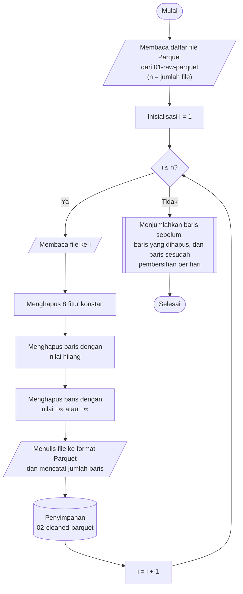

## **4.3 Pembersihan Data (*Data Cleaning*)**

Analisis data pada Subbab 4.2 menemukan tiga permasalahan terhadap kualitas data yang harus ditangani sebelum data digunakan untuk pemodelan, yaitu fitur konstan, nilai hilang, dan nilai tak hingga. Fitur konstan tidak membawa informasi untuk membedakan kelas, menambah dimensi data tanpa manfaat, dan memiliki simpangan baku nol sehingga tidak dapat distandarkan secara bermakna (Subbab 4.7). Nilai hilang dan nilai tak hingga tidak dapat diproses oleh sebagian besar algoritma, misalnya *Principal Component Analysis*, *K Nearest-Neighbor*, *Support Vector Machine*, dan *Logistic Regression*, karena nilai tersebut tidak memiliki besaran yang dapat dihitung jaraknya maupun dikalikan dengan bobot.

Fitur konstan ditangani dengan menghapus kolomnya, sedangkan nilai hilang dan nilai tak hingga ditangani dengan menghapus baris yang memuatnya. Penghapusan baris dipilih dibandingkan imputasi karena tiga alasan. Pertama, jumlah baris yang terdampak sangat kecil, yaitu 95.760 baris atau 0,59% dari seluruh data. Kedua, seluruh baris tersebut merupakan aliran dengan durasi nol (Subbab 4.2), sehingga nilai laju byte dan laju paket pada baris tersebut memang tidak terdefinisi dan tidak memiliki nilai pengganti yang benar. Penggantian dengan nilai tertentu, misalnya median atau nilai maksimum, akan memasukkan nilai buatan yang tidak pernah diukur. Ketiga, imputasi memerlukan statistik yang dipelajari dari data, sehingga harus dilakukan setelah pembagian dataset agar tidak terjadi kebocoran data (*data leakage*), sedangkan penghapusan baris tidak memerlukan statistik apa pun.

Seluruh langkah pembersihan bersifat deterministik pada setiap baris dan setiap kolom, sehingga aman dilaksanakan sebelum pembagian dataset (Subbab 4.5). Penghapusan fitur konstan juga tidak menimbulkan kebocoran data, karena fitur yang bernilai sama pada seluruh dataset pasti bernilai sama pula pada data latih maupun data uji. Daftar delapan fitur konstan ditetapkan dari hasil EDA dan digunakan sebagai konstanta pada seluruh file, sehingga setiap file memiliki susunan kolom yang identik setelah pembersihan.

Prosedur pembersihan data dilaksanakan melalui algoritma berikut:

1. **Pemuatan file**, Seluruh file Parquet pada folder didaftar dan diurutkan secara alfabetis, dan setiap file diproses secara terpisah.
2. **Penghapusan fitur konstan**, Delapan fitur konstan hasil EDA dihapus dari setiap file, sehingga setiap baris tersisa 70 fitur dan satu kolom label
3. **Penghapusan baris dengan nilai hilang**, Baris yang memiliki sedikitnya satu nilai hilang dihapus dan jumlahnya dicatat.
4. **Penghapusan baris dengan nilai tak hingga**, Baris yang memiliki sedikitnya satu nilai +∞ atau −∞ pada kolom numerik dihapus dan jumlahnya dicatat.
5. **Penyimpanan hasil**, Data yang telah dibersihkan ditulis ke folder dengan nama file yang sama dengan file sumber, sehingga informasi tanggal pengambilan data pada nama file tetap terjaga.
6. **Pelaporan hasil pembersihan**, Jumlah baris sebelum pembersihan, jumlah baris yang dihapus karena nilai hilang dan karena nilai tak hingga, serta jumlah baris setelah pembersihan dikumpulkan dari setiap file dan dijumlahkan per hari pengambilan data.

Setiap file dibersihkan secara independen, sehingga iterasi file pada diagram di atas dijalankan secara paralel menggunakan `joblib` dengan backend `loky` dan jumlah proses sebanyak inti CPU yang tersedia. Setiap proses hanya memuat satu file, yaitu maksimum 100.000 baris, sehingga kebutuhan memori tetap terkendali. Data pada folder yang dimuat tidak diubah, sehingga data sebelum dan sesudah pembersihan dapat dibandingkan dan proses pembersihan dapat diulang apabila diperlukan.