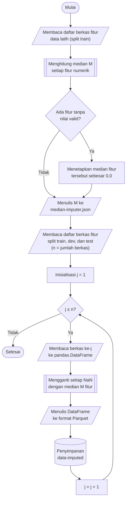

## **4.4 Imputasi Nilai Hilang (*Missing Value Imputation*)**

Setelah tahap pemuatan data (Subbab 4.1) dan pembersihan nilai tak hingga (Subbab 4.2), fitur pada dataset masih memuat nilai hilang (*missing value*) yang direpresentasikan sebagai *NaN*. Nilai tersebut berasal dari dua sumber, yaitu nilai yang tidak dapat dikonversi menjadi bilangan atau kolom yang tidak tersedia pada suatu berkas CSV (Subbab 4.1), serta nilai tak hingga yang telah diubah menjadi *NaN* (Subbab 4.2). Sebagian besar tahapan dan algoritma berikutnya tidak dapat memproses *NaN*, misalnya proyeksi *Principal Component Analysis* (Subbab 4.7) serta algoritma *K Nearest-Neighbor*, *Support Vector Machine*, dan *Logistic Regression*, sehingga setiap nilai hilang perlu diganti dengan nilai pengganti sebelum data digunakan lebih lanjut.

Metode imputasi yang diterapkan adalah penggantian dengan median setiap fitur. Median dipilih karena fitur lalu lintas jaringan berdistribusi sangat miring (*skewed*), dengan nilai ekstrem yang jarang muncul tetapi sangat besar, sehingga rata-rata cenderung tidak merepresentasikan nilai yang lazim. Pada data latih, misalnya, fitur *flow duration* memiliki median 20.967 sedangkan rata-ratanya mencapai 11.671.527, dan median bernilai nol pada 39 dari 78 fitur. Penggantian dengan rata-rata akan menghasilkan nilai yang jauh dari nilai lazim aliran jaringan, sedangkan median tetap mewakili sebagian besar data. Median juga dipilih dibandingkan penghapusan baris, dengan alasan yang sama seperti pada Subbab 4.2, serta dibandingkan metode imputasi berbasis model, misalnya berbasis tetangga terdekat, yang biaya komputasinya tidak praktis untuk lebih dari 16 juta baris. Konsekuensinya, imputasi dilakukan pada setiap fitur secara terpisah dan tidak memanfaatkan hubungan antarfitur.

Nilai median ditentukan hanya dari data latih (*train set*) dan selanjutnya diterapkan pada data latih, data validasi, dan data uji tanpa dihitung ulang. Hal ini diperlukan karena median merupakan statistik yang dipelajari dari data, sehingga penghitungannya pada gabungan seluruh data akan memasukkan informasi data validasi dan data uji ke dalam proses pembelajaran (*data leakage*), sebagaimana telah dibahas pada Subbab 4.3. Median disimpan pada berkas JSON agar imputasi dapat diterapkan secara identik pada setiap himpunan data, termasuk pada data uji yang diberi gangguan pada Subbab 4.15, yang nilai hilangnya juga diisi dengan median data latih yang sama. Imputasi dilaksanakan sebelum penskalaan fitur, reduksi dimensi, dan *oversampling* karena ketiga tahap tersebut, beserta seluruh algoritma klasifikasi, dirancang untuk bekerja pada data numerik yang lengkap.

Prosedur imputasi nilai hilang dilaksanakan melalui algoritma berikut:

1. **Memuat daftar berkas fitur data latih.** Seluruh berkas Parquet pada folder *data-split-feature/train* didaftar dan diurutkan secara alfabetis. Hanya berkas fitur yang digunakan karena berkas label disimpan terpisah dan tidak memuat nilai hilang, mengingat baris dengan label kosong telah dihapus pada Subbab 4.1.

2. **Menghitung median setiap fitur.** Seluruh berkas data latih dibaca secara *lazy* menggunakan fungsi *polars.scan_parquet* sebagai satu tabel, kemudian median setiap kolom bertipe numerik dihitung dengan mesin *streaming* sehingga seluruh data latih tidak perlu dimuat ke memori sekaligus. Nilai hilang tidak diikutsertakan dalam perhitungan median.

3. **Menangani fitur tanpa nilai valid.** Apabila suatu fitur tidak memiliki satu pun nilai valid pada data latih sehingga mediannya tidak dapat dihitung, median fitur tersebut ditetapkan sebesar 0,0 dan peringatan yang memuat nama fitur ditampilkan. Langkah ini menjamin bahwa setiap fitur memiliki nilai pengganti, dan nilai nol dipilih sebagai nilai bawaan (*fallback*) yang netral, sejalan dengan kenyataan bahwa nol merupakan median pada separuh dari seluruh fitur.

4. **Menyimpan median.** Pasangan nama fitur dan median disimpan pada berkas *cache/median-imputer.json*. Dengan penyimpanan ini, nilai pengganti tidak perlu dihitung ulang dan dapat dimuat kembali pada setiap tahap yang membutuhkannya.

5. **Membaca berkas fitur ke dalam struktur data tabular.** Untuk masing-masing dari ketiga himpunan, yaitu *train*, *dev*, dan *test*, setiap berkas Parquet dari folder *data-split-feature* dibaca ke dalam *pandas.DataFrame*. Folder tujuan *data-imputed* beserta subfolder *train*, *dev*, dan *test* dibuat apabila belum tersedia.

6. **Mengisi nilai hilang dengan median.** Setiap sel bernilai *NaN* diganti dengan median kolom yang bersangkutan menggunakan fungsi *DataFrame.fillna*, sedangkan sel yang telah memiliki nilai tidak diubah.

7. **Menyimpan hasil ke format Parquet.** *DataFrame* yang telah diimputasi ditulis ke folder *data-imputed* dengan nama berkas yang identik dengan berkas sumber, menggunakan konfigurasi penulisan yang sama seperti pada tahap sebelumnya, yaitu *PyArrow*, kompresi Snappy, dan tanpa indeks baris. Langkah 5 hingga 7 diulang hingga seluruh berkas pada ketiga himpunan selesai diproses.

Pengisian nilai hilang dilaksanakan pada tingkat berkas dan setiap berkas diproses secara independen. Oleh karena itu, ketiga himpunan diproses secara berurutan, sedangkan berkas di dalam satu himpunan diproses secara paralel menggunakan pustaka *joblib* dengan konfigurasi yang sama seperti pada Subbab 4.1. Pola yang sama, yaitu statistik dipelajari dari data latih kemudian diterapkan pada setiap himpunan per berkas, digunakan kembali pada penskalaan fitur (Subbab 4.6) dan reduksi dimensi (Subbab 4.7). Dengan mempertahankan nama berkas dan urutan baris, korespondensi satu-satu antara berkas fitur dan berkas label tetap terjaga.

Keberhasilan imputasi diverifikasi dengan menghitung jumlah nilai hilang pada setiap fitur, yang dijumlahkan dari seluruh berkas pada masing-masing himpunan, baik pada folder *data-split-feature* (sebelum imputasi) maupun pada folder *data-imputed* (setelah imputasi). Hanya fitur yang mengandung nilai hilang yang dilaporkan, sehingga fitur yang terdampak dapat diidentifikasi, dan pemeriksaan setelah imputasi diharapkan tidak menemukan fitur yang masih memuat nilai hilang.
