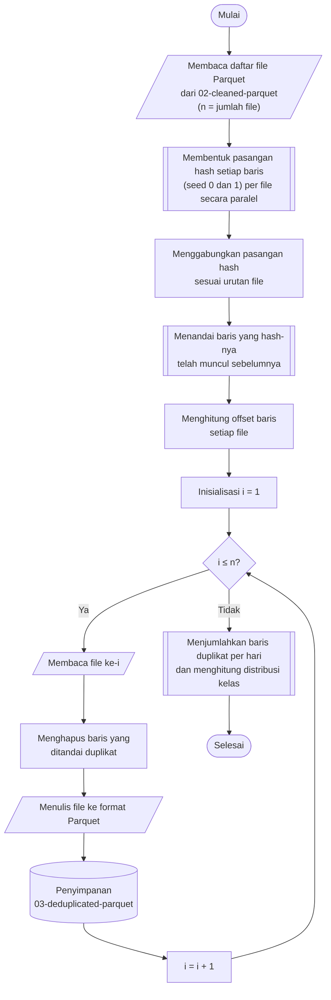

## **4.4 Penghapusan Data Duplikat (*Deduplication*)**

Dataset CSE-CIC-IDS2018 memuat banyak baris yang identik, yaitu baris dengan nilai yang sama persis pada seluruh fitur dan label. Duplikasi ini terutama muncul pada lalu lintas serangan yang dibangkitkan oleh perangkat otomatis, karena perangkat tersebut mengirimkan permintaan yang sama berulang kali sehingga CICFlowMeter mencatat aliran dengan karakteristik yang identik. Baris duplikat menimbulkan tiga permasalahan. Pertama, duplikat menggelembungkan jumlah sampel kelas tertentu sehingga distribusi kelas tidak mencerminkan keragaman aliran yang sebenarnya. Kedua, setelah pembagian dataset secara acak (Subbab 4.5), salinan dari baris yang sama dapat berada pada data latih dan data uji sekaligus, sehingga model dinilai pada baris yang sudah pernah dilihatnya dan kinerja yang dilaporkan menjadi terlalu optimis. Ketiga, duplikat menambah biaya komputasi pelatihan tanpa menambah informasi. Oleh karena itu, setiap baris duplikat dihapus dan hanya kemunculan pertamanya yang dipertahankan.

Duplikasi diperiksa pada seluruh dataset, bukan hanya di dalam satu file, karena salinan suatu baris dapat berada pada file yang berbeda, termasuk pada hari pengambilan data yang berbeda. Membandingkan seluruh baris secara langsung mengharuskan seluruh data berada di memori. Sebagai gantinya, setiap baris diringkas menjadi sidik jari (*fingerprint*) menggunakan fungsi *hash*. Setiap baris, yang terdiri atas 70 fitur dan label, di-*hash* dengan dua *seed* yang berbeda sehingga menghasilkan dua nilai *hash* 64-bit atau setara dengan sidik jari 128-bit. Penggunaan dua *hash* membuat peluang dua baris berbeda memiliki sidik jari yang sama menjadi sangat kecil sehingga dapat diabaikan. Sidik jari seluruh 16.137.183 baris hanya membutuhkan sekitar 258 MB memori, jauh lebih kecil daripada data aslinya.

> [!NOTES]
> 
> *"Setiap baris, yang terdiri atas 70 fitur dan label, di-*hash* dengan dua *seed* yang berbeda sehingga menghasilkan dua nilai *hash* 64-bit atau setara dengan sidik jari 128-bit. Penggunaan dua *hash* membuat peluang dua baris berbeda memiliki sidik jari yang sama menjadi sangat kecil sehingga dapat diabaikan. Sidik jari seluruh 16.137.183 baris hanya membutuhkan sekitar 258 MB memori, jauh lebih kecil daripada data aslinya."*
> 
> Gimana cara ngehitungnya???

Prosedur penghapusan data duplikat dilaksanakan melalui algoritma berikut:

1. **Pemuatan daftar file**, Seluruh file Parquet pada folder didaftar dan diurutkan secara alfabetis, sehingga urutan baris pada seluruh dataset bersifat deterministik.
2. **Pembentukan sidik jari baris**, Setiap baris pada setiap file di-*hash* dengan *seed* 0 dan 1, sehingga setiap baris memiliki sepasang nilai *hash*.
3. **Penandaan baris duplikat**, Pasangan *hash* dari seluruh file digabungkan sesuai urutan file, kemudian setiap baris yang pasangan *hash*-nya telah muncul pada baris sebelumnya ditandai sebagai duplikat. Kemunculan pertama setiap baris tidak ditandai.
4. **Pemetaan penanda ke setiap file**, Posisi awal (*offset*) baris setiap file di dalam urutan gabungan dihitung, sehingga penanda duplikat dapat dipotong kembali sesuai file asalnya.
5. **Penghapusan baris duplikat**, Pada setiap file, baris yang ditandai sebagai duplikat dihapus.
6. **Penyimpanan hasil**, Data yang telah dideduplikasi ditulis ke folder dengan nama file yang sama dengan file sumber.
7. **Pelaporan hasil**, Jumlah baris sebelum dan sesudah penghapusan serta jumlah baris duplikat dijumlahkan per hari, kemudian distribusi kelas setelah penghapusan duplikat dihitung ulang.

Pembentukan sidik jari dan penghapusan baris dilaksanakan per file secara paralel menggunakan `joblib`, sedangkan penandaan duplikat dilaksanakan satu kali pada gabungan sidik jari seluruh file. Karena file diurutkan menurut nama, yang diawali tanggal pengambilan data, kemunculan pertama yang dipertahankan adalah baris dari hari pengambilan yang paling awal. Label merupakan bagian dari sidik jari, sehingga dua baris dengan fitur yang identik tetapi label yang berbeda tidak dianggap duplikat dan keduanya tetap dipertahankan.