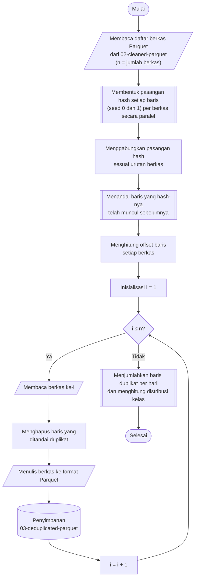

## **4.4 Penghapusan Data Duplikat (*Deduplication*)**

Dataset CSE-CIC-IDS2018 memuat banyak baris yang identik, yaitu baris dengan nilai yang sama persis pada seluruh fitur dan label. Duplikasi ini terutama muncul pada lalu lintas serangan yang dibangkitkan oleh perangkat otomatis, karena perangkat tersebut mengirimkan permintaan yang sama berulang kali sehingga CICFlowMeter mencatat aliran dengan karakteristik yang identik. Baris duplikat menimbulkan tiga permasalahan. Pertama, duplikat menggelembungkan jumlah sampel kelas tertentu sehingga distribusi kelas tidak mencerminkan keragaman aliran yang sebenarnya. Kedua, setelah pembagian dataset secara acak (Subbab 4.5), salinan dari baris yang sama dapat berada pada data latih dan data uji sekaligus, sehingga model dinilai pada baris yang sudah pernah dilihatnya dan kinerja yang dilaporkan menjadi terlalu optimis. Ketiga, duplikat menambah biaya komputasi pelatihan tanpa menambah informasi. Oleh karena itu, setiap baris duplikat dihapus dan hanya kemunculan pertamanya yang dipertahankan.

Duplikasi diperiksa pada seluruh dataset, bukan hanya di dalam satu berkas, karena salinan suatu baris dapat berada pada berkas yang berbeda, termasuk pada hari pengambilan data yang berbeda. Membandingkan seluruh baris secara langsung mengharuskan seluruh data berada di memori. Sebagai gantinya, setiap baris diringkas menjadi sidik jari (*fingerprint*) menggunakan fungsi *hash*. Setiap baris, yang terdiri atas 70 fitur dan label, di-*hash* dengan dua *seed* yang berbeda sehingga menghasilkan dua nilai *hash* 64-bit atau setara dengan sidik jari 128-bit. Penggunaan dua *hash* membuat peluang dua baris berbeda memiliki sidik jari yang sama menjadi sangat kecil sehingga dapat diabaikan. Sidik jari seluruh 16.137.183 baris hanya membutuhkan sekitar 258 MB memori, jauh lebih kecil daripada data aslinya.

Prosedur penghapusan data duplikat dilaksanakan melalui algoritma berikut:

1. **Pemuatan daftar berkas**, Seluruh berkas Parquet pada folder `data-pipeline/02-cleaned-parquet` didaftar dan diurutkan secara alfabetis, sehingga urutan baris pada seluruh dataset bersifat deterministik.
2. **Pembentukan sidik jari baris**, Setiap baris pada setiap berkas di-*hash* dengan *seed* 0 dan 1, sehingga setiap baris memiliki sepasang nilai *hash*.
3. **Penandaan baris duplikat**, Pasangan *hash* dari seluruh berkas digabungkan sesuai urutan berkas, kemudian setiap baris yang pasangan *hash*-nya telah muncul pada baris sebelumnya ditandai sebagai duplikat. Kemunculan pertama setiap baris tidak ditandai.
4. **Pemetaan penanda ke setiap berkas**, Posisi awal (*offset*) baris setiap berkas di dalam urutan gabungan dihitung, sehingga penanda duplikat dapat dipotong kembali sesuai berkas asalnya.
5. **Penghapusan baris duplikat**, Pada setiap berkas, baris yang ditandai sebagai duplikat dihapus.
6. **Penyimpanan hasil**, Data yang telah dideduplikasi ditulis ke folder `data-pipeline/03-deduplicated-parquet` dengan nama berkas yang sama dengan berkas sumber.
7. **Pelaporan hasil**, Jumlah baris sebelum dan sesudah penghapusan serta jumlah baris duplikat dijumlahkan per hari, kemudian distribusi kelas setelah penghapusan duplikat dihitung ulang.

Pembentukan sidik jari dan penghapusan baris dilaksanakan per berkas secara paralel menggunakan `joblib` dengan delapan proses, sedangkan penandaan duplikat dilaksanakan satu kali pada gabungan sidik jari seluruh berkas. Karena berkas diurutkan menurut nama, yang diawali tanggal pengambilan data, kemunculan pertama yang dipertahankan adalah baris dari hari pengambilan yang paling awal. Label merupakan bagian dari sidik jari, sehingga dua baris dengan fitur yang identik tetapi label yang berbeda tidak dianggap duplikat dan keduanya tetap dipertahankan.

Penghapusan duplikat mengurangi data secara signifikan, yaitu sebanyak 4.691.228 baris atau 29,07% dari data hasil pembersihan, sehingga tersisa 11.445.955 baris. Perubahan jumlah baris setiap kelas disajikan pada Tabel 4.3.

Tabel 4.3 Jumlah Baris Setiap Kelas Sebelum dan Sesudah Penghapusan Duplikat

| Kelas | Sebelum | Sesudah | Duplikat dihapus |
| :--- | ---: | ---: | ---: |
| *Benign* | 13.390.249 | 10.095.152 | 24,61% |
| *DDoS attacks-LOIC-HTTP* | 576.191 | 575.012 | 0,20% |
| *DDOS attack-HOIC* | 686.012 | 198.861 | 71,01% |
| *DoS attacks-Hulk* | 461.912 | 145.199 | 68,57% |
| *Bot* | 286.191 | 144.535 | 49,50% |
| *Infilteration* | 160.639 | 139.341 | 13,26% |
| *SSH-Bruteforce* | 187.589 | 94.048 | 49,86% |
| *DoS attacks-GoldenEye* | 41.508 | 41.392 | 0,28% |
| *DoS attacks-Slowloris* | 10.990 | 9.712 | 11,63% |
| *DDOS attack-LOIC-UDP* | 1.730 | 1.730 | 0,00% |
| *Brute Force -Web* | 611 | 553 | 9,49% |
| *Brute Force -XSS* | 230 | 228 | 0,87% |
| *SQL Injection* | 87 | 84 | 3,45% |
| *DoS attacks-SlowHTTPTest* | 139.890 | 55 | 99,96% |
| *FTP-BruteForce* | 193.354 | 53 | 99,97% |
| **Total** | **16.137.183** | **11.445.955** | **29,07%** |

Dampak terbesar terjadi pada kelas *FTP-BruteForce* dan *DoS attacks-SlowHTTPTest*, yang hampir seluruh barisnya merupakan salinan dari sedikit aliran yang unik, sehingga masing-masing hanya menyisakan 53 dan 55 baris. Kedua kelas yang semula termasuk kelas besar tersebut berubah menjadi kelas yang paling langka. Sebaliknya, kelas *Benign* tetap mendominasi dengan proporsi 88,20%, sedikit lebih besar daripada sebelum penghapusan duplikat. Distribusi kelas setelah penghapusan duplikat inilah yang menjadi dasar pembagian dataset pada Subbab 4.5, dan kelangkaan ekstrem pada beberapa kelas menjadi alasan penggunaan F1-*score* rata-rata makro sebagai kriteria pemilihan model (Subbab 4.8).
