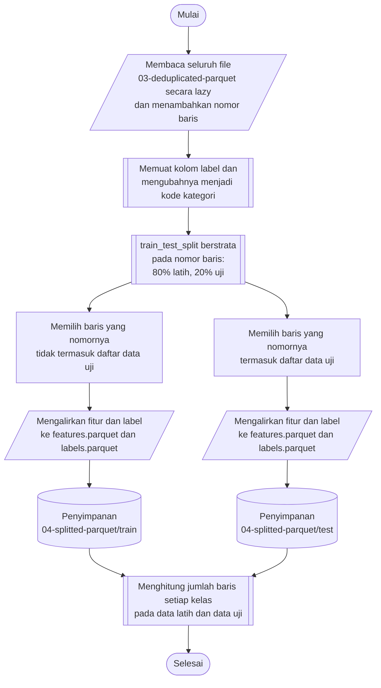

## **4.5 Pembagian Dataset (*Data Splitting*)**

Data hasil penghapusan duplikat perlu dibagi menjadi dua himpunan, yaitu data latih (*train set*) dan data uji (*test set*). Data latih digunakan untuk mempelajari parameter model sekaligus untuk memilih hyperparamater, sedangkan data uji digunakan sebagai instrumen penilaian akhir yang sama sekali tidak dilibatkan dalam proses pelatihan maupun pemilihan hyperparamater. Data uji juga menjadi dasar pembentukan skenario gangguan pada pengujian ketahanan (Subbab 4.14), sehingga data uji harus tetap terpisah dari seluruh proses yang mempelajari statistik dari data.

Proporsi pembagian yang diterapkan adalah 80% untuk data latih dan 20% untuk data uji. Himpunan data validasi tidak dipisahkan secara tetap, melainkan dibentuk berulang kali dari data latih melalui validasi silang (*cross-validation*) pada tahap pemilihan hyperparamater (Subbab 4.8). Dengan rancangan ini, setiap kombinasi hyperparamater dinilai pada beberapa himpunan validasi yang berbeda sehingga hasil pemilihannya lebih stabil daripada penilaian pada satu himpunan validasi tetap, dan jumlah data yang tersedia untuk pelatihan menjadi lebih besar. Pembagian dilaksanakan sebelum seluruh tahap yang mempelajari statistik dari data, yaitu penskalaan fitur, reduksi dimensi, dan SMOTE (Subbab 4.7), serta perhitungan statistik untuk simulasi gangguan (Subbab 4.14), sehingga tidak terjadi kebocoran data (*data leakage*) dari data uji ke dalam proses pembelajaran.

Mengingat distribusi kelas yang sangat tidak seimbang (Subbab 4.4), pembagian dilaksanakan secara berstrata (*stratified*) berdasarkan label. Pendekatan ini menjaga agar proporsi setiap kelas, termasuk kelas yang hanya memiliki puluhan baris, tetap sama pada data latih dan data uji. Baris data diacak sebelum dibagi tanpa memperhatikan urutan waktu, karena model dalam penelitian ini memperlakukan setiap aliran jaringan sebagai observasi yang independen (Subbab 4.1). Nilai *random state* ditetapkan sebesar 42 agar hasil pembagian dapat direproduksi.

Pembagian dilaksanakan pada gabungan seluruh file sekaligus, bukan per file, sehingga stratifikasi berlaku tepat pada seluruh dataset. Agar seluruh data tidak perlu dimuat ke memori, pembagian hanya dilakukan pada nomor baris (*row index*) dan kode label. Seluruh file dibaca secara *lazy* sebagai satu tabel dengan nomor baris yang ditambahkan sesuai urutan file, kemudian hanya kolom label yang dimuat dan diubah menjadi kode kategori. Pembagian berstrata menghasilkan daftar nomor baris data uji, dan berdasarkan daftar tersebut setiap baris dialirkan (*streaming*) ke file data latih atau file data uji tanpa memuat seluruh fitur ke memori.

Prosedur pembagian dataset dilaksanakan melalui algoritma berikut:

1. **Pemuatan data secara *lazy***, Seluruh file Parquet pada folder `data-pipeline/03-deduplicated-parquet` dibaca secara *lazy* sebagai satu tabel, dan setiap baris diberi nomor baris sesuai urutan file.
2. **Pemuatan label**, Hanya kolom label yang dimuat ke memori dan diubah menjadi kode kategori sesuai daftar kelas pada `cache/original-classes.json` (Subbab 4.2).
3. **Penentuan baris data uji**, Nomor baris dibagi secara berstrata berdasarkan kode label menggunakan `train_test_split` dari library `scikit-learn`, dengan ukuran data uji 20% dan *random state* 42.
4. **Pemisahan data latih dan data uji**, Baris yang nomornya termasuk daftar data uji dialirkan ke data uji, sedangkan baris lainnya dialirkan ke data latih.
5. **Pemisahan fitur dan label**, Pada setiap himpunan, kolom nomor baris dihapus, kemudian fitur dan label disimpan pada dua file terpisah, yaitu `features.parquet` dan `labels.parquet`, pada folder `data-pipeline/04-splitted-parquet/train` dan `data-pipeline/04-splitted-parquet/test`.
6. **Pemeriksaan distribusi kelas**, Jumlah baris setiap kelas pada data latih dan data uji dihitung, kemudian persentase data uji terhadap jumlah keduanya dibandingkan dengan target 20%.

Fitur dan label disimpan pada file terpisah agar keduanya dapat dimuat secara independen, misalnya label saja pada perhitungan distribusi kelas dan pengodean label (Subbab 4.6). Kedua file pada satu himpunan memiliki urutan baris yang sama, sehingga baris ke-*i* pada file fitur berpasangan dengan baris ke-*i* pada file label.