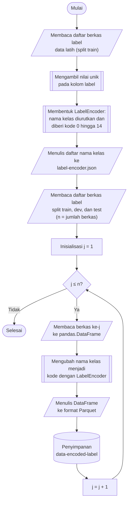

## **4.5 Pengodean Label (*Label Encoding*)**

Kolom label pada dataset berisi nama kelas dalam bentuk teks, yaitu satu kelas lalu lintas normal (*Benign*) dan empat belas kelas serangan, misalnya *Bot*, *SQL Injection*, dan *DoS attacks-Hulk*. Implementasi algoritma klasifikasi yang digunakan dalam penelitian ini, beserta fungsi *loss* dan metrik evaluasi yang menyertainya, menghendaki label kelas dalam bentuk bilangan bulat. Oleh karena itu, setiap nama kelas dipetakan ke sebuah bilangan bulat menggunakan *LabelEncoder* dari pustaka *scikit-learn*, yang mengurutkan nama kelas secara leksikografis (alfabetis) dan memberi kode 0 hingga 14, sehingga *Benign* memperoleh kode 0 dan *SSH-Bruteforce* memperoleh kode 14.

Pengodean bilangan bulat dipilih dibandingkan pengodean *one-hot* karena label direpresentasikan dalam satu kolom sehingga kebutuhan memorinya jauh lebih kecil untuk lebih dari 16 juta baris, dan karena seluruh algoritma yang digunakan menerima label bilangan bulat secara langsung, misalnya *sparse categorical cross-entropy* pada *Logistic Regression* dan *multi:softprob* pada *XGBoost*. Kode tersebut hanya berfungsi sebagai pengenal kelas dan tidak mengandung makna urutan atau besaran, karena seluruh algoritma memperlakukan label sebagai kategori nominal.

Himpunan kelas ditentukan dari data latih dan pemetaan yang dihasilkan disimpan sebagai daftar nama kelas pada berkas JSON, dengan posisi setiap nama pada daftar sama dengan kodenya. Berkas ini memungkinkan pengode dibentuk kembali secara identik dan digunakan untuk menerjemahkan hasil prediksi berupa kode kembali menjadi nama kelas pada laporan klasifikasi dan *confusion matrix*. Penentuan kelas dari data latih menjaga konsistensi dengan tahap-tahap lain yang seluruh statistiknya dipelajari dari data latih. Apabila terdapat nama kelas pada data validasi atau data uji yang tidak dijumpai pada data latih, proses transformasi dihentikan dengan galat sehingga kelas tersebut tidak menerima kode secara diam-diam. Pada dataset ini, pembagian berstrata (Subbab 4.3) menghasilkan kelima belas kelas pada ketiga himpunan sehingga kondisi tersebut tidak terjadi. Pengodean dilaksanakan pada berkas label yang disimpan terpisah dari fitur pada Subbab 4.3, sehingga tahap ini tidak bergantung pada praproses fitur dan tidak mengubah jumlah maupun urutan baris.

Prosedur pengodean label dilaksanakan melalui algoritma berikut:

1. **Memuat daftar berkas label data latih.** Seluruh berkas Parquet pada folder *data-split-label/train* didaftar dan diurutkan secara alfabetis.

2. **Menentukan himpunan kelas.** Berkas label data latih dibaca secara *lazy* menggunakan fungsi *polars.scan_parquet*, kemudian nilai unik pada kolom label diambil dengan mesin *streaming* sehingga seluruh label tidak perlu dimuat ke memori sekaligus. Hasilnya adalah daftar nama kelas yang terdapat pada data latih, yaitu lima belas kelas.

3. **Membentuk pengode label.** Objek *LabelEncoder* dilatih pada daftar nama kelas. Nama kelas diurutkan secara leksikografis dan setiap nama menerima kode 0 hingga 14 sesuai posisinya pada urutan tersebut.

4. **Menyimpan pemetaan kelas.** Daftar nama kelas, dengan posisi yang sama dengan kodenya, disimpan pada berkas *cache/label-encoder.json*. Berkas ini dimuat kembali untuk membentuk pengode yang identik pada tahap pengodean, dan untuk mengembalikan kode menjadi nama kelas pada tahap evaluasi.

5. **Membaca berkas label ke dalam struktur data tabular.** Untuk masing-masing dari ketiga himpunan, yaitu *train*, *dev*, dan *test*, setiap berkas Parquet dari folder *data-split-label* dibaca ke dalam *pandas.DataFrame*. Folder tujuan *data-encoded-label* beserta subfolder *train*, *dev*, dan *test* dibuat apabila belum tersedia.

6. **Mengubah nama kelas menjadi kode.** Kolom label ditransformasikan menggunakan fungsi *LabelEncoder.transform* dan hasilnya disusun menjadi *DataFrame* dengan satu kolom label bertipe bilangan bulat.

7. **Menyimpan hasil ke format Parquet.** *DataFrame* label ditulis ke folder *data-encoded-label* dengan nama berkas yang identik dengan berkas sumber, menggunakan konfigurasi penulisan yang sama seperti pada tahap sebelumnya, yaitu *PyArrow*, kompresi Snappy, dan tanpa indeks baris. Langkah 5 hingga 7 diulang hingga seluruh berkas pada ketiga himpunan selesai diproses.

Pengodean dilaksanakan pada tingkat berkas dan setiap berkas diproses secara independen, sehingga ketiga himpunan diproses secara berurutan sedangkan berkas di dalam satu himpunan diproses secara paralel menggunakan pustaka *joblib* dengan konfigurasi yang sama seperti pada Subbab 4.1. Dengan mempertahankan nama berkas, setiap berkas label tetap berpasangan satu-satu dengan berkas fitur yang bersangkutan. Kesesuaian jumlah baris pada setiap pasangan tersebut diperiksa kembali pada saat data dimuat untuk pelatihan model (Subbab 4.9).

Keberhasilan pengodean diverifikasi dengan menghitung jumlah baris pada setiap kelas di setiap himpunan, yang dijumlahkan dari seluruh berkas, kemudian kode kelas diterjemahkan kembali menjadi nama kelas menggunakan pemetaan yang tersimpan. Pemeriksaan ini memastikan bahwa pemetaan dapat dibalik tanpa kehilangan informasi dan bahwa seluruh 16.232.943 baris data terbagi ke dalam lima belas kelas. Hasil pemeriksaan juga memperlihatkan ketidakseimbangan kelas yang ekstrem: kelas *Benign* memuat 13.484.708 baris atau sekitar 83% dari seluruh data, sedangkan kelas *SQL Injection* hanya memuat 87 baris. Ketidakseimbangan ini menjadi dasar penerapan SMOTE pada data latih (Subbab 4.8) dan penggunaan F1-*score* rata-rata makro sebagai kriteria pemilihan model (Subbab 4.9).
