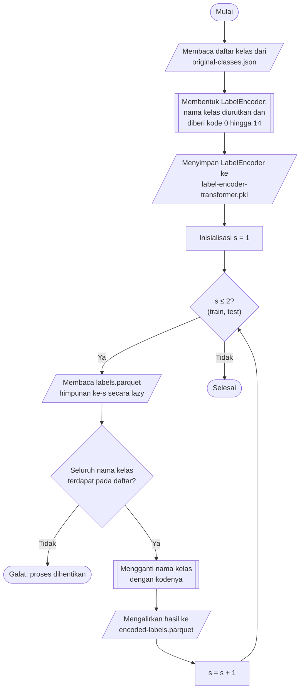

## **4.6 Pengodean Label (*Label Encoding*)**

Kolom label pada dataset berisi nama kelas dalam bentuk teks, yaitu satu kelas lalu lintas normal (*Benign*) dan empat belas kelas serangan. Algoritma klasifikasi dan metrik evaluasi yang digunakan pada penelitian ini menghendaki label dalam bentuk bilangan bulat. Oleh karena itu, setiap nama kelas dipetakan ke sebuah bilangan bulat menggunakan `LabelEncoder` dari library `scikit-learn`. `LabelEncoder` mengurutkan nama kelas secara leksikografis (alfabetis) dan memberikan kode 0 hingga 14 sesuai posisi setiap nama pada urutan tersebut, sebagaimana disajikan pada Tabel 4.5.

Tabel 4.5 Pemetaan Nama Kelas ke Kode Label

| Kode | Kelas | Kode | Kelas |
| :---: | :--- | :---: | :--- |
| 0 | *Benign* | 8 | *DoS attacks-Hulk* |
| 1 | *Bot* | 9 | *DoS attacks-SlowHTTPTest* |
| 2 | *Brute Force -Web* | 10 | *DoS attacks-Slowloris* |
| 3 | *Brute Force -XSS* | 11 | *FTP-BruteForce* |
| 4 | *DDOS attack-HOIC* | 12 | *Infilteration* |
| 5 | *DDOS attack-LOIC-UDP* | 13 | *SQL Injection* |
| 6 | *DDoS attacks-LOIC-HTTP* | 14 | *SSH-Bruteforce* |
| 7 | *DoS attacks-GoldenEye* | | |

Pengodean bilangan bulat dipilih dibandingkan pengodean *one-hot* karena label cukup direpresentasikan dalam satu kolom, sehingga kebutuhan memorinya jauh lebih kecil untuk lebih dari 11 juta baris, dan karena seluruh algoritma yang digunakan menerima label bilangan bulat secara langsung. Kode label hanya berfungsi sebagai pengenal kelas dan tidak mengandung makna urutan maupun besaran, karena seluruh algoritma memperlakukan label sebagai kategori nominal.

`LabelEncoder` dibentuk dari daftar kelas yang disusun pada tahap EDA (Subbab 4.2), yaitu daftar seluruh nama kelas yang terdapat pada dataset. Pembentukan dari daftar kelas tidak menimbulkan kebocoran data, karena daftar tersebut hanya memuat nama kelas yang telah diketahui dari dokumentasi dataset dan tidak memuat statistik apa pun yang dipelajari dari nilai fitur. Pembagian berstrata pada Subbab 4.5 juga menjamin bahwa kelima belas kelas terdapat pada data latih maupun data uji. Objek `LabelEncoder` yang telah dibentuk disimpan pada berkas `cache/label-encoder-transformer.pkl` menggunakan `joblib`, sehingga pemetaan yang sama dapat dimuat kembali pada setiap tahap, termasuk untuk menerjemahkan kode hasil prediksi menjadi nama kelas pada tahap evaluasi (Subbab 4.15 dan Subbab 4.16).

Prosedur pengodean label dilaksanakan melalui algoritma berikut:

1. **Pemuatan daftar kelas**, Daftar nama kelas dimuat dari berkas `cache/original-classes.json` hasil EDA.
2. **Pembentukan pengode label**, `LabelEncoder` dilatih pada daftar nama kelas, sehingga setiap nama kelas memperoleh kode sesuai urutan alfabetisnya.
3. **Penyimpanan pengode label**, Objek `LabelEncoder` disimpan pada berkas `cache/label-encoder-transformer.pkl`.
4. **Pengodean label data latih dan data uji**, Untuk masing-masing himpunan, berkas `labels.parquet` dibaca secara *lazy*, setiap nama kelas diganti dengan kodenya sesuai urutan kelas pada `LabelEncoder`, dan hasilnya dialirkan ke berkas `encoded-labels.parquet` pada folder yang sama. Proses dihentikan dengan galat apabila ditemukan nama kelas yang tidak terdapat pada daftar kelas.

Pengodean dilaksanakan pada berkas label yang telah dipisahkan dari fitur pada Subbab 4.5, sehingga tahap ini tidak bergantung pada fitur dan tidak mengubah jumlah maupun urutan baris. Berkas `labels.parquet` yang berisi nama kelas tetap dipertahankan, sedangkan berkas `encoded-labels.parquet` digunakan pada seluruh tahap pemodelan dan pengujian. Pembacaan dan penulisan secara *lazy* dan *streaming* membuat seluruh 9.156.764 label data latih tidak perlu dimuat ke memori sekaligus.

Kelas *Benign* memperoleh kode 0, dan kode ini digunakan pada tahap evaluasi untuk membedakan prediksi lalu lintas normal dari prediksi serangan. Pembedaan tersebut diperlukan pada metrik deteksi serangan, misalnya laju deteksi serangan dan laju alarm palsu, yang memperlakukan seluruh kelas selain *Benign* sebagai serangan (Subbab 4.15).
