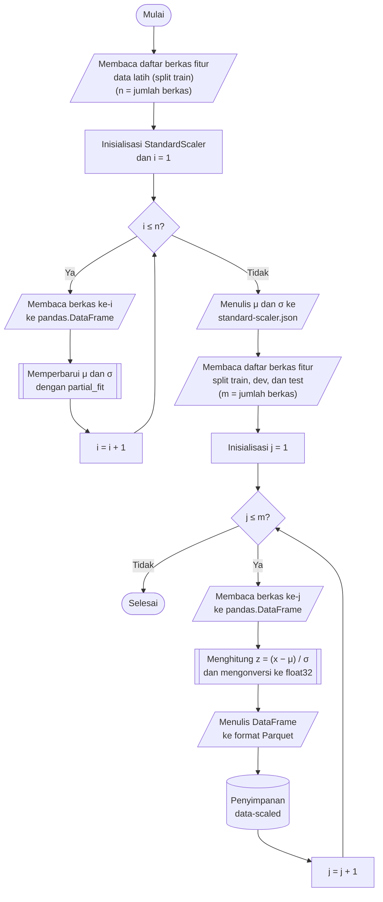

## **4.6 Penskalaan Fitur (*Feature Scaling*)**

Fitur pada dataset CSE-CIC-IDS2018 memiliki skala yang sangat berbeda. Fitur seperti durasi aliran (*flow duration*) memiliki simpangan baku sekitar 5,9 × 10⁸ pada data latih, sedangkan fitur seperti nomor protokol (*protocol*) hanya memiliki simpangan baku sekitar 4,9. Perbedaan skala ini berdampak langsung pada algoritma yang sensitif terhadap besaran nilai, yaitu *K Nearest-Neighbor* dan *Support Vector Machine* dengan kernel RBF yang bergantung pada jarak antarsampel, *Logistic Regression* yang dioptimasi dengan penurunan gradien, serta *Principal Component Analysis* yang memaksimalkan varians sehingga fitur berskala besar akan mendominasi komponen utama. Oleh karena itu, seluruh fitur distandarkan (*standardization* atau *z-score*) sehingga setiap fitur memiliki rata-rata nol dan simpangan baku satu.

$z_{ij}=\frac{x_{ij}-{\mu }_{j}}{{\sigma }_{j}}$ (4.1)

Persamaan 4.1 adalah persamaan standardisasi, dengan $x_{ij}$ adalah nilai fitur ke-$j$ pada baris ke-$i$, $z_{ij}$ adalah nilai setelah distandarkan, ${\mu }_{j}$ adalah rata-rata fitur ke-$j$, dan ${\sigma }_{j}$ adalah simpangan baku fitur ke-$j$, yang keduanya dihitung dari data latih. Standardisasi dipilih dibandingkan penskalaan *min-max* karena fitur jaringan memuat nilai ekstrem, yang pada penskalaan *min-max* akan menekan sebagian besar nilai ke dalam rentang yang sangat sempit. Simpangan baku setiap fitur juga digunakan kembali sebagai acuan besaran gangguan pada simulasi *noise* (Subbab 4.15). Algoritma berbasis pohon, yaitu *Random Forest* dan *XGBoost*, tidak memerlukan penskalaan, tetapi tetap menerima data yang sama sehingga kelima algoritma dilatih dan diuji pada data yang identik, sesuai dengan kebutuhan sistem pada Subbab 3.3.3.

Rata-rata dan simpangan baku dihitung hanya dari data latih, kemudian diterapkan pada data latih, data validasi, dan data uji tanpa dihitung ulang, sehingga tidak terjadi kebocoran data (*data leakage*) dari data validasi maupun data uji. Perhitungan dilaksanakan secara inkremental: objek *StandardScaler* diperbarui berkas demi berkas menggunakan fungsi *partial_fit*, sehingga statistik untuk 9.739.760 baris data latih diperoleh tanpa memuat seluruh data ke memori, dengan hasil yang setara dengan perhitungan pada seluruh data sekaligus. Penskalaan dilaksanakan setelah imputasi (Subbab 4.4) karena statistik dihitung dari data yang telah lengkap, dan sebelum reduksi dimensi (Subbab 4.7) karena PCA bekerja pada data yang telah berskala seragam.

Delapan fitur, yaitu *bwd psh flags*, *bwd urg flags*, dan enam fitur *bulk* (*fwd byts/b avg*, *fwd pkts/b avg*, *fwd blk rate avg*, *bwd byts/b avg*, *bwd pkts/b avg*, dan *bwd blk rate avg*), bernilai konstan nol pada data latih sehingga simpangan bakunya nol. Untuk menghindari pembagian dengan nol, *StandardScaler* menetapkan pembagi fitur tersebut sebesar satu, sehingga fitur-fitur ini tetap bernilai nol setelah penskalaan. Fitur konstan tidak dihapus agar susunan 78 fitur tetap seragam pada seluruh tahap, dan tidak memengaruhi reduksi dimensi karena tidak memiliki varians.

Prosedur penskalaan fitur dilaksanakan melalui algoritma berikut:

1. **Memuat daftar berkas fitur data latih.** Seluruh berkas Parquet pada folder *data-imputed/train* didaftar dan diurutkan secara alfabetis, dengan jumlah berkas dinyatakan sebagai *n*.

2. **Memperbarui statistik secara inkremental.** Objek *StandardScaler* dibentuk, kemudian setiap berkas dibaca ke dalam *pandas.DataFrame* dan diteruskan ke fungsi *partial_fit* untuk memperbarui rata-rata dan simpangan baku seluruh fitur. Berkas kosong dilewati, dan proses dihentikan dengan galat apabila tidak terdapat satu baris pun yang dapat digunakan.

3. **Menyimpan statistik.** Rata-rata dan pembagi (*scale*) setiap fitur disimpan pada berkas *cache/standard-scaler.json* dalam dua kamus yang berkunci nama fitur. Penskalaan selanjutnya membaca statistik dari berkas ini, bukan dari objek *StandardScaler* di memori, sehingga statistik yang sama dapat dimuat kembali pada tahap lain, termasuk pembentukan skenario gangguan pada Subbab 4.15.

4. **Membaca berkas fitur ke dalam struktur data tabular.** Untuk masing-masing dari ketiga himpunan, yaitu *train*, *dev*, dan *test*, setiap berkas Parquet dari folder *data-imputed* dibaca ke dalam *pandas.DataFrame*. Folder tujuan *data-scaled* beserta subfolder *train*, *dev*, dan *test* dibuat apabila belum tersedia.

5. **Menstandarkan nilai fitur.** Kesesuaian kolom berkas dengan kolom yang dipelajari oleh *scaler* diperiksa terlebih dahulu, dan proses dihentikan dengan galat apabila berbeda. Selanjutnya Persamaan 4.1 diterapkan pada seluruh nilai dan hasilnya dikonversi ke tipe *float32*, sesuai dengan tipe data fitur pada Subbab 4.1.

6. **Menyimpan hasil ke format Parquet.** *DataFrame* hasil penskalaan ditulis ke folder *data-scaled* dengan nama berkas yang identik dengan berkas sumber, menggunakan konfigurasi penulisan yang sama seperti pada tahap sebelumnya, yaitu *PyArrow*, kompresi Snappy, dan tanpa indeks baris. Langkah 4 hingga 6 diulang hingga seluruh berkas pada ketiga himpunan selesai diproses.

Penerapan penskalaan dilaksanakan pada tingkat berkas dan setiap berkas diproses secara independen, sehingga ketiga himpunan diproses secara berurutan sedangkan berkas di dalam satu himpunan diproses secara paralel menggunakan pustaka *joblib* dengan konfigurasi yang sama seperti pada Subbab 4.1. Tahap pembelajaran statistik berlangsung secara sekuensial karena objek *StandardScaler* diperbarui secara berurutan dari satu berkas ke berkas berikutnya.

Keberhasilan penskalaan diverifikasi dengan mengukur rata-rata dan simpangan baku setiap fitur pada setiap himpunan, baik pada folder *data-imputed* (sebelum penskalaan) maupun pada folder *data-scaled* (setelah penskalaan). Pengukuran dilaksanakan dengan pustaka *Polars* dalam mode *streaming*, dan hasilnya diringkas menjadi nilai mutlak rata-rata terbesar serta simpangan baku terkecil dan terbesar beserta nama fiturnya. Pada data latih, rata-rata diharapkan mendekati nol dan simpangan baku bernilai satu, kecuali pada fitur konstan yang simpangan bakunya tetap nol. Pada data validasi dan data uji, nilai tersebut hanya mendekati target dan tidak tepat sama, karena keduanya distandarkan menggunakan statistik data latih. Penyimpangan ini diharapkan dan justru menegaskan bahwa statistik tidak dihitung ulang pada kedua himpunan tersebut.
