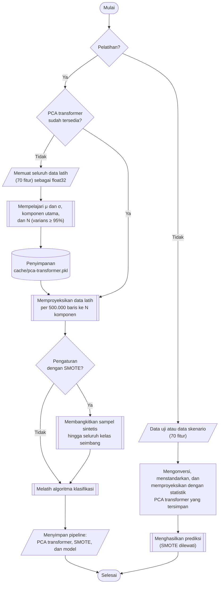

## **4.7 Rancangan *Pipeline* Praproses**

Tahap-tahap praproses pada Subbab 4.2 hingga 4.6 bersifat deterministik dan tidak mempelajari statistik apa pun dari data, sehingga dapat dilaksanakan sekali pada seluruh dataset. Sebaliknya, penskalaan fitur, reduksi dimensi, dan penyeimbangan kelas mempelajari statistik dari data, yaitu rata-rata dan simpangan baku setiap fitur, komponen utama, serta tetangga terdekat setiap sampel kelas minoritas. Apabila statistik tersebut dipelajari dari data yang juga digunakan untuk menilai model, informasi dari data penilaian akan bocor ke dalam proses pelatihan (*data leakage*) dan skor yang diperoleh menjadi terlalu optimis.

Untuk mencegah hal tersebut sekaligus menjamin bahwa seluruh model melihat data dengan karakteristik yang sama, ketiga tahap dipisahkan menurut jenis statistik yang dipelajarinya. Standardisasi dan PCA hanya mempelajari statistik fitur tanpa melibatkan label, sehingga keduanya disusun bersama konversi tipe data menjadi satu transformator praproses, yang selanjutnya disebut *PCA transformer*, menggunakan kelas `Pipeline` dari library `imbalanced-learn`. *PCA transformer* dilatih satu kali pada seluruh data latih, disimpan pada file `cache/pca-transformer.pkl`, kemudian digunakan untuk mentransformasikan data latih bagi kelima algoritma (Subbab 4.8), data uji, dan seluruh skenario gangguan (Subbab 4.9). Dengan rancangan ini, seluruh model dilatih pada komponen utama yang berasal dari transformasi yang sama, dan data uji maupun data uji yang diberi gangguan diproyeksikan ke ruang yang sama persis dengan ruang data latih, sehingga data pada sisi pelatihan dan sisi pengujian memiliki karakteristik yang identik. Data uji tidak pernah terlibat dalam pembelajaran statistik tersebut. Bagian validasi pada validasi silang (Subbab 4.8) ikut menyumbang rata-rata, simpangan baku, dan komponen utama, tetapi tidak menyumbang informasi label, dan pengaruhnya berlaku sama bagi seluruh algoritma.

Sebaliknya, SMOTE membangkitkan sampel berdasarkan label kelas, sehingga tetap disusun bersama algoritma klasifikasi dalam satu *pipeline* model. Ketika *pipeline* model dilatih, SMOTE hanya membangkitkan sampel dari data yang sedang digunakan untuk pelatihan, sehingga pada setiap lipatan validasi silang sampel sintetis tidak pernah dibentuk dari bagian validasi. Ketika *pipeline* digunakan untuk prediksi, SMOTE dilewati.

Praproses terdiri atas empat tahap yang dijalankan berurutan sebelum algoritma klasifikasi, yaitu konversi tipe data, standardisasi, dan reduksi dimensi dengan PCA pada *PCA transformer*, serta SMOTE yang bersifat opsional pada *pipeline* model.

### **4.7.1 Konversi Tipe Data**

Tahap pertama mengonversi seluruh fitur menjadi tipe `float32`. Konversi ini menjamin bahwa setiap data yang masuk ke *PCA transformer*, baik data latih, data uji, maupun data uji yang diberi gangguan, memiliki tipe data yang seragam, dan menjaga kebutuhan memori tetap setengah dari tipe `float64`. Data latih dengan 9.156.764 baris dan 70 fitur membutuhkan sekitar 2,6 GB memori dalam tipe `float32`.

### **4.7.2 Standardisasi Fitur**

Fitur pada dataset memiliki skala yang sangat berbeda. Perbedaan skala ini berdampak langsung pada algoritma yang bergantung pada jarak atau besaran nilai, yaitu *K Nearest-Neighbor*, *Support Vector Machine* dengan kernel RBF, *Logistic Regression*, serta PCA yang memaksimalkan varians sehingga fitur berskala besar akan mendominasi komponen utama. Oleh karena itu, setiap fitur distandarkan (*z-score*) menggunakan `StandardScaler` sehingga memiliki rata-rata nol dan simpangan baku satu.

$z_{ij}=\frac{x_{ij}-{\mu }_{j}}{{\sigma }_{j}}$ (4.6)

Persamaan 4.6 adalah persamaan standardisasi, dengan $x_{ij}$ adalah nilai fitur ke-$j$ pada baris ke-$i$, $z_{ij}$ adalah nilai setelah distandarkan, serta ${\mu }_{j}$ dan ${\sigma }_{j}$ adalah rata-rata dan simpangan baku fitur ke-$j$ yang dihitung dari data latih. Standardisasi dipilih dibandingkan penskalaan *min-max* karena fitur jaringan memuat nilai ekstrem, yang pada penskalaan *min-max* akan menekan sebagian besar nilai ke dalam rentang yang sangat sempit. Algoritma berbasis pohon, yaitu *Random Forest* dan *XGBoost*, tidak memerlukan standardisasi, tetapi tetap menggunakan *PCA transformer* yang sama sehingga kelima algoritma dilatih dan diuji pada masukan yang identik, sesuai kebutuhan sistem pada Subbab 3.3.3.

### **4.7.3 Reduksi Dimensi dengan PCA**

Analisis korelasi pada Subbab 4.2 menemukan 46 pasangan fitur dengan korelasi mutlak sedikitnya 0,95. Dimensi yang tinggi dan redundan menambah biaya komputasi, terutama pada algoritma berbasis jarak seperti *K Nearest-Neighbor* dan *Support Vector Machine*, tanpa memberikan tambahan informasi yang sebanding. Oleh karena itu, data terstandar diproyeksikan ke ruang berdimensi lebih rendah menggunakan *Principal Component Analysis* (PCA), yang membentuk komponen utama yang saling ortogonal dan terurut menurut besarnya varians data yang dijelaskan (Subbab 2.6). Jumlah komponen ditetapkan sebagai jumlah terkecil yang varians kumulatifnya mencapai ambang 95%.

$N=\min \left\{k:\sum _{i=1}^{k}{r}_{i}\ge 0{,}95\right\}$ (4.7)

Persamaan 4.7 adalah persamaan pemilihan jumlah komponen, dengan ${r}_{i}$ adalah rasio varians yang dijelaskan oleh komponen ke-$i$ dan $N$ adalah jumlah komponen yang digunakan. Ambang 95% dipilih sebagai batas yang lazim untuk mempertahankan sebagian besar informasi data sambil mereduksi dimensinya. Setiap baris kemudian diproyeksikan ke $N$ komponen utama.

$\mathbf{z}_{i}^{PCA}={\mathbf{W}}_{N}\left(\mathbf{z}_{i}-\bar{\mathbf{z}}\right)$ (4.8)

Persamaan 4.8 adalah persamaan proyeksi, dengan $\mathbf{z}_{i}$ adalah vektor 70 fitur terstandar pada baris ke-$i$, $\bar{\mathbf{z}}$ adalah vektor rata-rata data latih, ${\mathbf{W}}_{N}$ adalah matriks yang memuat $N$ komponen utama pertama, dan $\mathbf{z}_{i}^{PCA}$ adalah vektor hasil proyeksi berdimensi $N$. Berbeda dengan rancangan yang memproses data per file, data latih dalam tipe `float32` dapat dimuat seluruhnya ke memori, sehingga PCA dihitung secara langsung pada seluruh data latih tanpa memerlukan pendekatan inkremental. Pada seluruh data latih, ambang 95% tercapai pada 25 komponen dengan varians kumulatif 95,59%, sehingga dimensi data berkurang dari 70 menjadi 25 atau sekitar 64%. Karena PCA hanya dilatih satu kali, jumlah komponen tersebut berlaku sama bagi seluruh algoritma, seluruh lipatan validasi silang, dan seluruh skenario gangguan. Jumlah komponen dan varians yang dipertahankan juga dicatat bersama hasil prediksi setiap model (Subbab 4.10).

### **4.7.4 Penyeimbangan Kelas dengan SMOTE**

Distribusi kelas pada data latih sangat tidak seimbang, dengan kelas *Benign* sebesar 88,20% dan tiga kelas yang masing-masing hanya memiliki 42 hingga 67 baris (Subbab 4.5). Model yang dilatih pada distribusi ini cenderung berpihak pada kelas mayoritas. Ketidakseimbangan tersebut ditangani menggunakan *Synthetic Minority Oversampling Technique* (SMOTE) dari library `imbalanced-learn`, yang membentuk sampel sintetis kelas minoritas dengan menginterpolasi sebuah sampel dengan salah satu dari *k* tetangga terdekatnya pada kelas yang sama (Subbab 2.6).

$x_{sint}=x_{i}+\lambda \left(x_{nn}-x_{i}\right),\ \lambda \sim U\left(0,1\right)$ (4.9)

Persamaan 4.9 adalah persamaan pembentukan sampel sintetis, dengan $x_{i}$ adalah sampel kelas minoritas, $x_{nn}$ adalah salah satu dari *k* tetangga terdekat $x_{i}$ pada kelas yang sama, dan $\lambda$ adalah bilangan acak berdistribusi seragam pada rentang 0 hingga 1, sehingga $x_{sint}$ terletak pada garis lurus di antara kedua sampel. Setiap kelas minoritas ditambah hingga jumlahnya sama dengan kelas mayoritas, sesuai strategi bawaan SMOTE. Jumlah tetangga *k* tidak ditetapkan tetap, melainkan dicari bersama hyperparamater model dengan nilai 3, 5, dan 7, dan *random state* ditetapkan 42.

SMOTE ditempatkan sebagai tahap pertama *pipeline* model, sehingga bekerja pada keluaran *PCA transformer*. Penempatan di dalam *pipeline* menjamin bahwa sampel sintetis hanya dibangkitkan dari bagian latih setiap lipatan, dan tahap ini dilewati ketika *pipeline* digunakan untuk prediksi, sehingga data validasi, data uji, dan data uji yang diberi gangguan tetap berada pada distribusi aslinya. Penempatan setelah PCA membuat pencarian tetangga terdekat dilakukan pada ruang 25 komponen utama, yang jauh lebih efisien daripada pada ruang 70 fitur. Karena setiap kelas ditambah hingga sama dengan kelas *Benign*, ukuran data hasil penyeimbangan sekitar lima belas kali jumlah baris *Benign*. Pada model akhir yang dilatih pada seluruh data latih, kelas *Benign* berjumlah 8.076.122 baris sehingga data latih membesar menjadi sekitar 121 juta baris, sedangkan pada sampel pencarian grid berukuran 1.000.000 baris (Subbab 4.8.2), bagian latih setiap lipatan membesar dari 800.000 menjadi sekitar 10,6 juta baris. Pengaturan dengan SMOTE karenanya membutuhkan waktu dan memori yang jauh lebih besar daripada pengaturan tanpa SMOTE.

Untuk mengukur pengaruh SMOTE terhadap kinerja dan ketahanan model, setiap algoritma dilatih pada dua pengaturan, yaitu tanpa SMOTE (*wout-smote*) dan dengan SMOTE (*with-smote*). Kedua pengaturan menggunakan *PCA transformer* dan *pipeline* model yang sama, dengan perbedaan hanya pada keberadaan tahap SMOTE, dan hasil keduanya disimpan pada folder yang terpisah. Perbandingan kedua pengaturan dibahas pada Subbab 4.11.

### **4.7.5 Algoritma Pipeline Praproses**

Prosedur pembentukan *PCA transformer* serta pelatihan dan penggunaan *pipeline* model dilaksanakan melalui algoritma berikut:

1. **Pembentukan *PCA transformer***, Apabila *PCA transformer* belum tersedia, seluruh data latih dimuat ke dalam satu matriks `float32`, kemudian rata-rata dan simpangan baku setiap fitur dipelajari untuk Persamaan 4.6, dan komponen utama dipelajari dari data latih terstandar dengan jumlah komponen sesuai Persamaan 4.7.
2. **Penyimpanan *PCA transformer***, *PCA transformer* yang telah dilatih disimpan pada file `cache/pca-transformer.pkl`, sehingga seluruh tahap berikutnya memuat transformasi yang sama.
3. **Transformasi data latih**, Data latih dibaca per kelompok 500.000 baris, kemudian dikonversi, distandarkan, dan diproyeksikan dengan Persamaan 4.8 menggunakan *PCA transformer* yang tersimpan, sehingga diperoleh matriks komponen utama data latih yang digunakan oleh kelima algoritma.
4. **Penyeimbangan kelas**, Pada pengaturan dengan SMOTE, sampel sintetis dibangkitkan dengan Persamaan 4.9 hingga seluruh kelas seimbang. Tahap ini hanya dijalankan pada pelatihan.
5. **Pelatihan model**, Komponen utama hasil langkah 3 atau langkah 4 digunakan untuk melatih algoritma klasifikasi (Subbab 4.8).
6. **Penyimpanan *pipeline* model**, Tahap-tahap *PCA transformer* ditempatkan di depan SMOTE dan model yang telah dilatih, kemudian disimpan sebagai satu *pipeline*.
7. **Prediksi**, Data uji atau data skenario gangguan dikonversi, distandarkan, dan diproyeksikan dengan statistik *PCA transformer* yang tersimpan pada *pipeline*, kemudian diprediksi oleh model tanpa melewati SMOTE.

*Pipeline* model yang disimpan memuat tahap-tahap *PCA transformer*, SMOTE apabila digunakan, dan model klasifikasinya, sehingga setiap model dapat langsung menerima data dalam satuan aslinya. Karena tahap-tahap tersebut berasal dari file *PCA transformer* yang sama, seluruh model memproses data uji dan data uji yang diberi gangguan dengan statistik standardisasi dan komponen utama yang identik dengan data latihnya. Kesamaan *PCA transformer* pada setiap model diperiksa kembali sebelum pengujian (Subbab 4.10.1).
