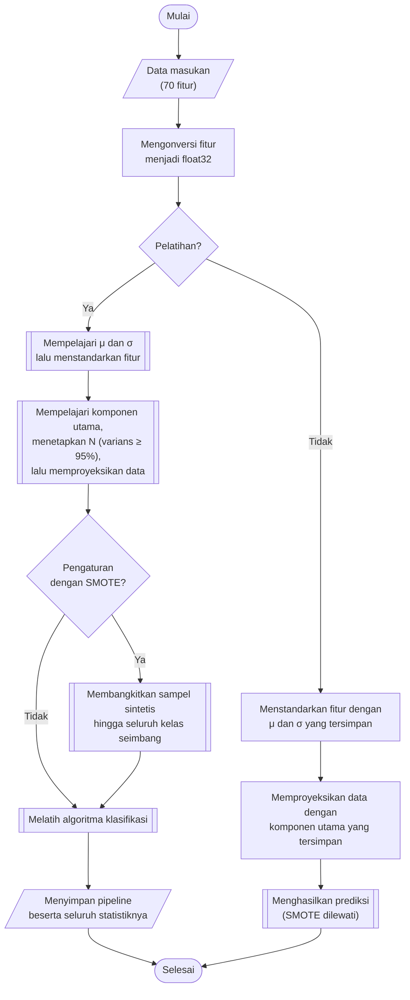

## **4.7 Rancangan *Pipeline* Praproses**

Tahap-tahap praproses pada Subbab 4.2 hingga 4.6 bersifat deterministik dan tidak mempelajari statistik apa pun dari data, sehingga dapat dilaksanakan sekali pada seluruh dataset. Sebaliknya, penskalaan fitur, reduksi dimensi, dan penyeimbangan kelas mempelajari statistik dari data, yaitu rata-rata dan simpangan baku setiap fitur, komponen utama, serta tetangga terdekat setiap sampel kelas minoritas. Apabila statistik tersebut dipelajari dari data yang juga digunakan untuk menilai model, informasi dari data penilaian akan bocor ke dalam proses pelatihan (*data leakage*) dan skor yang diperoleh menjadi terlalu optimis.

Untuk mencegah hal tersebut, ketiga tahap ini tidak dijalankan sebagai tahap terpisah yang menghasilkan berkas baru, melainkan disusun bersama algoritma klasifikasi menjadi satu *pipeline* menggunakan kelas `Pipeline` dari library `imbalanced-learn`. Ketika *pipeline* dilatih, setiap tahap mempelajari statistiknya hanya dari data yang sedang digunakan untuk pelatihan, kemudian meneruskan hasil transformasinya ke tahap berikutnya. Ketika *pipeline* digunakan untuk prediksi, setiap tahap hanya menerapkan statistik yang telah dipelajari tanpa menghitungnya ulang. Dengan rancangan ini, pada setiap lipatan validasi silang (Subbab 4.8) seluruh statistik praproses dipelajari hanya dari bagian latih lipatan tersebut, dan data validasi maupun data uji tidak pernah terlibat dalam pembelajaran statistik. Rancangan yang sama juga menjamin bahwa data uji dan data uji yang diberi gangguan (Subbab 4.14) diproses dengan statistik yang identik, karena *pipeline* yang telah dilatih disimpan secara utuh bersama modelnya.

*Pipeline* terdiri atas empat tahap praproses yang dijalankan berurutan sebelum algoritma klasifikasi, yaitu konversi tipe data, standardisasi, reduksi dimensi dengan PCA, dan SMOTE yang bersifat opsional.

### **4.7.1 Konversi Tipe Data**

Tahap pertama mengonversi seluruh fitur menjadi tipe `float32`. Konversi ini menjamin bahwa setiap data yang masuk ke *pipeline*, baik data latih, data uji, maupun data uji yang diberi gangguan, memiliki tipe data yang seragam, dan menjaga kebutuhan memori tetap setengah dari tipe `float64`. Data latih dengan 9.156.764 baris dan 70 fitur membutuhkan sekitar 2,6 GB memori dalam tipe `float32`.

### **4.7.2 Standardisasi Fitur**

Fitur pada dataset memiliki skala yang sangat berbeda. Pada data latih, durasi aliran (*flow_duration*) memiliki simpangan baku sekitar 4,54 × 10⁸, sedangkan nomor protokol (*protocol*) hanya memiliki simpangan baku sekitar 4,20. Perbedaan skala ini berdampak langsung pada algoritma yang bergantung pada jarak atau besaran nilai, yaitu *K Nearest-Neighbor*, *Support Vector Machine* dengan kernel RBF, *Logistic Regression*, serta PCA yang memaksimalkan varians sehingga fitur berskala besar akan mendominasi komponen utama. Oleh karena itu, setiap fitur distandarkan (*z-score*) menggunakan `StandardScaler` sehingga memiliki rata-rata nol dan simpangan baku satu.

$z_{ij}=\frac{x_{ij}-{\mu }_{j}}{{\sigma }_{j}}$ (4.3)

Persamaan 4.3 adalah persamaan standardisasi, dengan $x_{ij}$ adalah nilai fitur ke-$j$ pada baris ke-$i$, $z_{ij}$ adalah nilai setelah distandarkan, serta ${\mu }_{j}$ dan ${\sigma }_{j}$ adalah rata-rata dan simpangan baku fitur ke-$j$ yang dihitung dari data latih. Standardisasi dipilih dibandingkan penskalaan *min-max* karena fitur jaringan memuat nilai ekstrem, yang pada penskalaan *min-max* akan menekan sebagian besar nilai ke dalam rentang yang sangat sempit. Algoritma berbasis pohon, yaitu *Random Forest* dan *XGBoost*, tidak memerlukan standardisasi, tetapi tetap menggunakan *pipeline* yang sama sehingga kelima algoritma dilatih dan diuji pada masukan yang identik, sesuai kebutuhan sistem pada Subbab 3.3.3.

### **4.7.3 Reduksi Dimensi dengan *Principal Component Analysis* (PCA)**

Analisis korelasi pada Subbab 4.2 menemukan 46 pasangan fitur dengan korelasi mutlak sedikitnya 0,95. Dimensi yang tinggi dan redundan menambah biaya komputasi, terutama pada algoritma berbasis jarak seperti *K Nearest-Neighbor* dan *Support Vector Machine*, tanpa memberikan tambahan informasi yang sebanding. Oleh karena itu, data terstandar diproyeksikan ke ruang berdimensi lebih rendah menggunakan *Principal Component Analysis* (PCA), yang membentuk komponen utama yang saling ortogonal dan terurut menurut besarnya varians data yang dijelaskan (Subbab 2.6). Jumlah komponen ditetapkan sebagai jumlah terkecil yang varians kumulatifnya mencapai ambang 95%.

$N=\min \left\{k:\sum _{i=1}^{k}{r}_{i}\ge 0{,}95\right\}$ (4.4)

Persamaan 4.4 adalah persamaan pemilihan jumlah komponen, dengan ${r}_{i}$ adalah rasio varians yang dijelaskan oleh komponen ke-$i$ dan $N$ adalah jumlah komponen yang digunakan. Ambang 95% dipilih sebagai batas yang lazim untuk mempertahankan sebagian besar informasi data sambil mereduksi dimensinya. Setiap baris kemudian diproyeksikan ke $N$ komponen utama.

$\mathbf{z}_{i}^{PCA}={\mathbf{W}}_{N}\left(\mathbf{z}_{i}-\bar{\mathbf{z}}\right)$ (4.5)

Persamaan 4.5 adalah persamaan proyeksi, dengan $\mathbf{z}_{i}$ adalah vektor 70 fitur terstandar pada baris ke-$i$, $\bar{\mathbf{z}}$ adalah vektor rata-rata data latih, ${\mathbf{W}}_{N}$ adalah matriks yang memuat $N$ komponen utama pertama, dan $\mathbf{z}_{i}^{PCA}$ adalah vektor hasil proyeksi berdimensi $N$. Berbeda dengan rancangan yang memproses data per berkas, data latih dalam tipe `float32` dapat dimuat seluruhnya ke memori, sehingga PCA dihitung secara langsung pada seluruh data latih tanpa memerlukan pendekatan inkremental. Pemeriksaan pada seluruh data latih menunjukkan bahwa ambang 95% tercapai pada 25 komponen dengan varians kumulatif 95,59%, sehingga dimensi data berkurang dari 70 menjadi 25 atau sekitar 64%. Karena PCA dilatih ulang pada setiap lipatan validasi silang, jumlah komponen dapat sedikit berbeda antarlipatan, dan jumlah komponen pada setiap model yang disimpan dicatat bersama hasil prediksinya (Subbab 4.15).

### **4.7.4 Penyeimbangan Kelas dengan SMOTE**

Distribusi kelas pada data latih sangat tidak seimbang, dengan kelas *Benign* sebesar 88,20% dan tiga kelas yang masing-masing hanya memiliki 42 hingga 67 baris (Subbab 4.5). Model yang dilatih pada distribusi ini cenderung berpihak pada kelas mayoritas. Ketidakseimbangan tersebut ditangani menggunakan *Synthetic Minority Oversampling Technique* (SMOTE) dari library `imbalanced-learn`, yang membentuk sampel sintetis kelas minoritas dengan menginterpolasi sebuah sampel dengan salah satu dari *k* tetangga terdekatnya pada kelas yang sama (Subbab 2.6).

$x_{sint}=x_{i}+\lambda \left(x_{nn}-x_{i}\right),\ \lambda \sim U\left(0,1\right)$ (4.6)

Persamaan 4.6 adalah persamaan pembentukan sampel sintetis, dengan $x_{i}$ adalah sampel kelas minoritas, $x_{nn}$ adalah salah satu dari *k* tetangga terdekat $x_{i}$ pada kelas yang sama, dan $\lambda$ adalah bilangan acak berdistribusi seragam pada rentang 0 hingga 1, sehingga $x_{sint}$ terletak pada garis lurus di antara kedua sampel. Setiap kelas minoritas ditambah hingga jumlahnya sama dengan kelas mayoritas, sesuai strategi bawaan SMOTE. Jumlah tetangga *k* tidak ditetapkan tetap, melainkan dicari bersama hiperparameter model dengan nilai 3, 5, dan 7, dan *random state* ditetapkan 42.

SMOTE ditempatkan di dalam *pipeline* setelah PCA. Penempatan di dalam *pipeline* menjamin bahwa sampel sintetis hanya dibangkitkan dari bagian latih setiap lipatan, dan tahap ini dilewati ketika *pipeline* digunakan untuk prediksi, sehingga data validasi, data uji, dan data uji yang diberi gangguan tetap berada pada distribusi aslinya. Penempatan setelah PCA membuat pencarian tetangga terdekat dilakukan pada ruang 25 komponen utama, yang jauh lebih efisien daripada pada ruang 70 fitur. Karena kelas *Benign* pada bagian latih setiap lipatan berjumlah sekitar 6,46 juta baris, penyeimbangan seluruh kelas hingga jumlah tersebut memperbesar data latih menjadi sekitar 97 juta baris pada setiap pelatihan, sehingga pengaturan dengan SMOTE membutuhkan waktu dan memori yang jauh lebih besar daripada pengaturan tanpa SMOTE.

Untuk mengukur pengaruh SMOTE terhadap kinerja dan ketahanan model, setiap algoritma dilatih pada dua pengaturan, yaitu tanpa SMOTE (*wout-smote*) dan dengan SMOTE (*with-smote*). Kedua pengaturan menggunakan *pipeline* yang sama, dengan perbedaan hanya pada keberadaan tahap SMOTE, dan hasil keduanya disimpan pada folder yang terpisah. Perbandingan kedua pengaturan dibahas pada Subbab 4.16.

### **4.7.5 Alur *Pipeline***

Prosedur pelatihan dan penggunaan *pipeline* dilaksanakan melalui algoritma berikut:

1. **Konversi tipe data**, Seluruh fitur pada data masukan dikonversi menjadi tipe `float32`.
2. **Standardisasi**, Pada pelatihan, rata-rata dan simpangan baku setiap fitur dipelajari dari data latih, kemudian Persamaan 4.3 diterapkan. Pada prediksi, Persamaan 4.3 diterapkan dengan statistik yang telah dipelajari.
3. **Reduksi dimensi**, Pada pelatihan, komponen utama dipelajari dari data latih terstandar dan jumlah komponen ditetapkan dengan Persamaan 4.4. Data kemudian diproyeksikan dengan Persamaan 4.5, baik pada pelatihan maupun prediksi.
4. **Penyeimbangan kelas**, Pada pengaturan dengan SMOTE, sampel sintetis dibangkitkan dengan Persamaan 4.6 hingga seluruh kelas seimbang. Tahap ini hanya dijalankan pada pelatihan.
5. **Pelatihan atau prediksi model**, Data hasil praproses digunakan untuk melatih algoritma klasifikasi, atau untuk menghasilkan prediksi apabila *pipeline* telah dilatih.

*Pipeline* yang telah dilatih disimpan secara utuh, yaitu bersama statistik standardisasi, komponen utama, dan model klasifikasinya. Dengan demikian, tidak diperlukan berkas terpisah untuk menyimpan statistik praproses, dan setiap data yang diprediksi oleh suatu model pasti diproses dengan statistik yang sama dengan data latih model tersebut.
