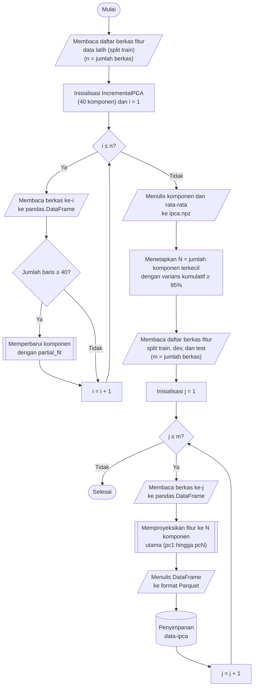

## **4.7 Reduksi Dimensi dengan *Incremental Principal Component Analysis* (IPCA)**

Setelah penskalaan, setiap baris data masih diwakili oleh 78 fitur. Sebagian besar fitur tersebut saling berkorelasi karena dihitung dari besaran yang sama, misalnya nilai minimum, maksimum, rata-rata, dan simpangan baku dari panjang paket atau selang waktu antarpaket, dan delapan di antaranya bernilai konstan (Subbab 4.6). Dimensi yang tinggi dan redundan menambah biaya komputasi, terutama pada algoritma berbasis jarak seperti *K Nearest-Neighbor* dan *Support Vector Machine*, tanpa memberikan tambahan informasi yang sebanding (Subbab 3.1). Oleh karena itu, data diproyeksikan ke ruang berdimensi lebih rendah menggunakan *Principal Component Analysis* (PCA), yang membentuk komponen utama (*principal component*) yang saling ortogonal dan terurut menurut besarnya varians data yang dijelaskan (Subbab 2.6).

Data latih berjumlah lebih dari 9,7 juta baris dengan 78 fitur, sehingga dekomposisi PCA pada seluruh data sekaligus mengharuskan seluruh matriks data berada di memori. Sebagai gantinya digunakan *Incremental PCA* (IPCA), yang memperbarui komponen utama secara bertahap dari kelompok data (*batch*) yang dibaca satu per satu. Dalam penelitian ini setiap berkas Parquet data latih diperlakukan sebagai satu *batch*, sehingga kebutuhan memori dibatasi oleh ukuran satu berkas. Sesuai dengan prinsip pencegahan kebocoran data (*data leakage*), IPCA dilatih hanya pada data latih yang telah distandarkan (Subbab 4.6). Penskalaan mendahului PCA karena PCA memaksimalkan varians, sehingga fitur berskala besar akan mendominasi komponen utama apabila data belum distandarkan.

Jumlah komponen dipilih berdasarkan varians kumulatif. IPCA dilatih satu kali dengan jumlah komponen maksimum 40, kemudian jumlah komponen *N* ditetapkan sebagai bilangan terkecil yang varians kumulatifnya mencapai ambang 95%.

$N=\min \left\{k:\sum _{i=1}^{k}{r}_{i}\ge 0{,}95\right\}$ (4.2)

Persamaan 4.2 adalah persamaan pemilihan jumlah komponen, dengan ${r}_{i}$ adalah rasio varians yang dijelaskan oleh komponen ke-$i$. Ambang 95% dipilih sebagai batas yang lazim untuk mempertahankan sebagian besar informasi data sambil mereduksi dimensinya. Pada data latih, ambang tersebut tercapai pada *N* = 24 komponen dengan varians kumulatif 95,53%, sehingga dimensi data berkurang dari 78 menjadi 24 fitur atau sekitar 69%. Apabila 40 komponen tidak mencapai ambang, proses dihentikan dengan galat yang menyarankan peningkatan jumlah komponen maksimum atau penurunan ambang. Pelatihan satu kali dengan 40 komponen lebih efisien dibandingkan melatih ulang IPCA untuk setiap kandidat jumlah komponen, karena *N* komponen pertama dari solusi 40 komponen dapat langsung digunakan. Kurva varians kumulatif divisualisasikan bersama garis ambang dan titik terpilih untuk pemeriksaan visual.

Proyeksi dihitung secara eksplisit dari parameter yang tersimpan, bukan dengan memanggil objek IPCA.

$\mathbf{z}_{i}=\mathbf{W}_{N}\left(\mathbf{x}_{i}-\bar{\mathbf{x}}\right)$ (4.3)

Persamaan 4.3 adalah persamaan proyeksi, dengan $\mathbf{x}_{i}$ adalah vektor 78 fitur terstandar pada baris ke-$i$, $\bar{\mathbf{x}}$ adalah vektor rata-rata data latih yang dipelajari oleh IPCA, ${\mathbf{W}}_{N}$ adalah matriks yang memuat *N* komponen pertama, dan $\mathbf{z}_{i}$ adalah vektor hasil proyeksi berdimensi *N*. Komponen, rata-rata, varians terjelaskan, rasio varians, dan urutan nama fitur disimpan pada berkas *cache/ipca.npz* dalam format NumPy, sehingga proyeksi tidak bergantung pada versi pustaka yang menyimpan objek dan jumlah komponen dapat dipilih setelah pelatihan. Kolom hasil proyeksi dinamai *pc1* hingga *pcN* dan disimpan sebagai *float32*.

Prosedur reduksi dimensi dilaksanakan melalui algoritma berikut:

1. **Memuat daftar berkas fitur data latih.** Seluruh berkas Parquet pada folder *data-scaled/train* didaftar dan diurutkan secara alfabetis, dengan jumlah berkas dinyatakan sebagai *n*.

2. **Melatih IPCA secara inkremental.** Objek *IncrementalPCA* dengan 40 komponen dibentuk, kemudian setiap berkas dibaca ke dalam *pandas.DataFrame* dan diteruskan ke fungsi *partial_fit*. Berkas dengan jumlah baris kurang dari 40 dilewati karena setiap *batch* pada *partial_fit* harus memuat baris sedikitnya sebanyak jumlah komponen, dan proses dihentikan dengan galat apabila tidak ada berkas yang memenuhi syarat tersebut.

3. **Menyimpan proyeksi.** Parameter hasil pelatihan disimpan pada berkas *cache/ipca.npz* menggunakan fungsi *numpy.savez*.

4. **Memilih jumlah komponen.** Rasio varians terjelaskan dijumlahkan secara kumulatif dan *N* ditetapkan sesuai Persamaan 4.2.

5. **Membaca berkas fitur terskala ke dalam struktur data tabular.** Untuk masing-masing dari ketiga himpunan, yaitu *train*, *dev*, dan *test*, setiap berkas Parquet dari folder *data-scaled* dibaca ke dalam *pandas.DataFrame*. Folder tujuan *data-ipca* beserta subfolder *train*, *dev*, dan *test* dibuat apabila belum tersedia.

6. **Memproyeksikan fitur ke komponen utama.** Kesesuaian kolom berkas dengan kolom yang dipelajari oleh IPCA diperiksa, baik nama maupun urutannya, dan proses dihentikan dengan galat apabila berbeda. Selanjutnya Persamaan 4.3 diterapkan pada seluruh baris menggunakan *N* komponen pertama, dan hasilnya dikonversi ke tipe *float32*.

7. **Menyimpan hasil ke format Parquet.** *DataFrame* hasil proyeksi ditulis ke folder *data-ipca* dengan nama berkas yang identik dengan berkas sumber, menggunakan konfigurasi penulisan yang sama seperti pada tahap sebelumnya, yaitu *PyArrow*, kompresi Snappy, dan tanpa indeks baris. Langkah 5 hingga 7 diulang hingga seluruh berkas pada ketiga himpunan selesai diproses.

Penerapan proyeksi dilaksanakan pada tingkat berkas dan setiap berkas diproses secara independen, sehingga ketiga himpunan diproses secara berurutan sedangkan berkas di dalam satu himpunan diproses secara paralel menggunakan pustaka *joblib* dengan konfigurasi yang sama seperti pada Subbab 4.1. Tahap pelatihan IPCA berlangsung secara sekuensial karena komponen diperbarui secara berurutan dari satu berkas ke berkas berikutnya. Data hasil proyeksi inilah yang digunakan sebagai masukan seluruh algoritma klasifikasi, sedangkan penyeimbangan kelas pada data latih (Subbab 4.8) dilaksanakan pada ruang komponen utama tersebut.

Keberhasilan proyeksi diverifikasi dengan mengukur, pada setiap himpunan, varians setiap komponen dan rata-rata setiap komponen menggunakan pustaka *Polars* dalam mode *streaming*. Total varians yang dibawa oleh seluruh komponen dibandingkan dengan varians yang diprediksi oleh pelatihan IPCA, yaitu jumlah varians terjelaskan pada *N* komponen pertama, sedangkan rata-rata komponen diharapkan mendekati nol. Pada data latih, kedua nilai varians diharapkan hampir identik karena proyeksi dilatih pada himpunan tersebut. Pada data validasi dan data uji, varians yang terukur dapat berbeda dari prediksi karena proyeksi tidak dilatih ulang pada kedua himpunan tersebut, sehingga perbedaan ini menegaskan bahwa tidak terjadi kebocoran data.
