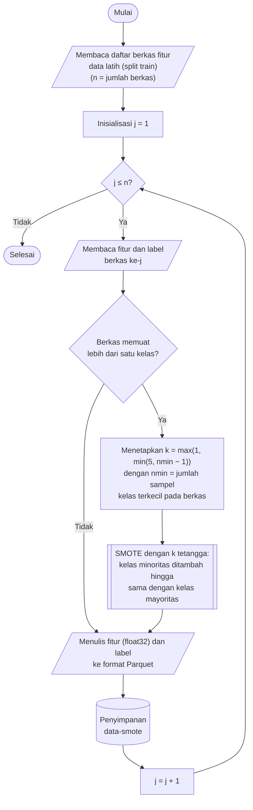

## **4.8 Penyeimbangan Kelas dengan *Synthetic Minority Oversampling Technique* (SMOTE)**

Distribusi kelas pada dataset CSE-CIC-IDS2018 sangat tidak seimbang (Subbab 4.5). Kelas *Benign* menyusun sekitar 83% data, sedangkan sejumlah kelas serangan hanya memiliki puluhan hingga ratusan baris pada data latih, misalnya *SQL Injection* (52 baris), *Brute Force -XSS* (138 baris), dan *Brute Force -Web* (367 baris). Apabila model dilatih pada distribusi ini, model cenderung berpihak pada kelas mayoritas dan gagal mengenali kelas minoritas, padahal pengenalan serangan yang langka justru menjadi tujuan utama sistem deteksi intrusi (Subbab 2.6).

Ketidakseimbangan tersebut ditangani menggunakan *Synthetic Minority Oversampling Technique* (SMOTE), yang membentuk sampel sintetis kelas minoritas dengan menginterpolasi sebuah sampel dengan salah satu dari *k* tetangga terdekatnya pada kelas yang sama (Subbab 2.6).

$x_{sint}=x_{i}+\lambda \left(x_{nn}-x_{i}\right),\ \lambda \sim U\left(0,1\right)$ (4.4)

Persamaan 4.4 adalah persamaan pembentukan sampel sintetis, dengan $x_{i}$ adalah sampel kelas minoritas, $x_{nn}$ adalah salah satu dari *k* tetangga terdekat $x_{i}$ pada kelas yang sama, dan $\lambda$ adalah bilangan acak berdistribusi seragam pada rentang 0 hingga 1, sehingga $x_{sint}$ terletak pada garis lurus di antara kedua sampel. SMOTE dipilih dibandingkan penggandaan sampel secara acak (*random oversampling*) yang mendorong model menghafal sampel yang sama, dan dibandingkan pengurangan sampel kelas mayoritas (*undersampling*) yang akan membuang sebagian besar dari sekitar 8,09 juta baris *Benign* pada data latih. Jumlah tetangga ditetapkan *k* = 5 dan *random state* ditetapkan 42 agar hasilnya dapat direproduksi.

SMOTE hanya diterapkan pada data latih. Data validasi dan data uji dibiarkan pada distribusi aslinya karena keduanya berfungsi merepresentasikan lalu lintas nyata yang belum pernah diamati. Penambahan sampel sintetis pada kedua himpunan tersebut akan mengubah distribusi kelas yang dievaluasi, sehingga metrik tidak lagi mencerminkan kinerja model pada lalu lintas sebenarnya. Tahap ini juga dilaksanakan setelah pembagian dataset (Subbab 4.3) agar sampel sintetis tidak pernah dibangkitkan dari, atau bercampur dengan, data validasi dan data uji, yang akan menimbulkan kebocoran data (*data leakage*).

SMOTE dilaksanakan setelah reduksi dimensi (Subbab 4.7), sehingga pencarian tetangga terdekat dan interpolasi dilakukan pada ruang komponen utama yang berdimensi rendah dan berasal dari data yang telah distandarkan. Pencarian tetangga pada dimensi yang lebih rendah lebih efisien, dan karena proyeksi PCA bersifat linear, sampel yang diinterpolasi pada ruang komponen utama sama dengan hasil proyeksi dari sampel yang diinterpolasi pada ruang fitur terstandar. Perbedaan hanya terletak pada pemilihan tetangga, karena jarak pada ruang komponen utama merupakan pendekatan dari jarak pada ruang fitur terstandar.

Selain itu, SMOTE dilaksanakan per berkas, bukan pada seluruh data latih sekaligus, agar kebutuhan memori dan waktu pemrosesan tetap terkendali. Konsekuensinya, sampel sintetis dibangkitkan hanya dari tetangga pada berkas yang sama, dan keseimbangan kelas tercapai pada tingkat berkas: setiap kelas minoritas yang terdapat pada suatu berkas ditambah hingga jumlahnya sama dengan kelas mayoritas pada berkas tersebut, sesuai strategi bawaan *auto* pada SMOTE. Kelas yang tidak terdapat pada suatu berkas tidak dibentuk pada berkas tersebut.

Prosedur penyeimbangan kelas dilaksanakan melalui algoritma berikut:

1. **Memuat daftar berkas data latih.** Seluruh berkas Parquet pada folder *data-ipca/train* didaftar dan diurutkan secara alfabetis, dengan jumlah berkas dinyatakan sebagai *n*. Folder tujuan *data-smote/train* dibuat apabila belum tersedia. Hanya himpunan *train* yang diproses.

2. **Membaca fitur dan label.** Fitur berkas ke-*j* dibaca dari folder *data-ipca/train* dan labelnya dari folder *data-encoded-label/train* ke dalam *pandas.DataFrame*. Kedua berkas memiliki nama yang sama sehingga barisnya berpasangan.

3. **Memeriksa jumlah kelas pada berkas.** Apabila berkas hanya memuat satu kelas, tidak terdapat kelas minoritas yang dapat ditambah sehingga fitur dan label diteruskan tanpa perubahan ke langkah 6.

4. **Menyesuaikan jumlah tetangga.** SMOTE memerlukan jumlah tetangga yang lebih kecil daripada jumlah sampel pada kelas terkecil. Oleh karena itu, nilai *k* = 5 diturunkan apabila berkas memuat kelas dengan sampel sangat sedikit, sehingga $k=\max \left(1,\min \left(5,{n}_{\min }-1\right)\right)$, dengan ${n}_{\min }$ adalah jumlah sampel pada kelas terkecil di berkas tersebut.

5. **Membangkitkan sampel sintetis.** Fungsi *fit_resample* dari kelas *SMOTE* pustaka *imbalanced-learn* dijalankan dengan *k* tetangga dan *random state* 42. Sampel sintetis dibangkitkan menurut Persamaan 4.4 hingga setiap kelas minoritas pada berkas tersebut memiliki jumlah sampel yang sama dengan kelas mayoritas.

6. **Menyimpan hasil ke format Parquet.** Fitur hasil *resampling* dikonversi ke tipe *float32*, digabung dengan kolom label, dan ditulis ke folder *data-smote/train* dengan nama berkas yang identik dengan berkas sumber, menggunakan konfigurasi penulisan yang sama seperti pada tahap sebelumnya, yaitu *PyArrow*, kompresi Snappy, dan tanpa indeks baris. Berbeda dari tahap-tahap sebelumnya, label disimpan pada berkas yang sama dengan fitur karena jumlah baris setelah *resampling* tidak lagi sama dengan jumlah baris berkas label pada folder *data-encoded-label*. Langkah 2 hingga 6 diulang hingga seluruh berkas selesai diproses.

Penyeimbangan dilaksanakan pada tingkat berkas dan setiap berkas diproses secara independen. Oleh karena itu, berkas data latih diproses secara paralel menggunakan pustaka *joblib* dengan konfigurasi yang sama seperti pada Subbab 4.1. Karena keseimbangan hanya dijamin pada tingkat berkas, distribusi kelas pada gabungan seluruh berkas setelah SMOTE tidak seragam secara sempurna, tetapi ketimpangannya jauh berkurang.

Keberhasilan penyeimbangan diverifikasi dengan membandingkan jumlah baris pada setiap kelas sebelum SMOTE, yang dihitung dari folder *data-encoded-label/train*, dan sesudah SMOTE, yang dihitung dari folder *data-smote/train*. Perbandingan ini menampilkan jumlah baris sintetis pada setiap kelas, yaitu selisih antara jumlah sesudah dan sebelum, serta persentase setiap kelas terhadap seluruh data latih setelah SMOTE, dan divisualisasikan dalam skala logaritmik. Data validasi dan data uji tidak diperiksa karena tidak diubah oleh tahap ini.
