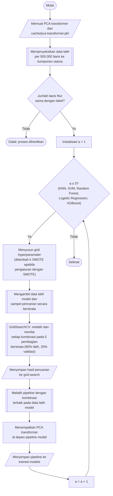

## **4.8 Rancangan Pelatihan dan Pemilihan Model**

### **4.8.1 Protokol dan Implementasi**

Kelima algoritma klasifikasi, yaitu *K Nearest-Neighbor*, *Support Vector Machine*, *Random Forest*, *Logistic Regression*, dan *XGBoost*, dilatih dan dipilih hyperparamaternya menggunakan protokol yang sama. Setiap algoritma ditempatkan sebagai tahap terakhir pada *pipeline* model (Subbab 4.7), sehingga kelima algoritma menerima komponen utama dari *PCA transformer* yang sama dan prosedur pemilihan yang identik. Data latih setiap algoritma adalah seluruh data latih, kecuali *Support Vector Machine* yang dilatih pada sampel berstrata dari data latih yang sama (Subbab 4.8.2). Keseragaman protokol ini diperlukan agar perbedaan kinerja yang teramati dapat dikaitkan dengan karakteristik algoritma, bukan dengan perbedaan data atau prosedur pengujian (Subbab 3.3.3).

Algoritma *K Nearest-Neighbor*, *Support Vector Machine*, *Random Forest*, dan *Logistic Regression* menggunakan implementasi dari library `scikit-learn`, sedangkan *XGBoost* menggunakan library `xgboost`. Seluruh pelatihan dijalankan pada CPU dengan proses paralel pada algoritma yang mendukungnya, sehingga pelatihan tidak bergantung pada ketersediaan maupun kapasitas memori GPU. Satu-satunya pengecualian adalah *XGBoost*, yang dijalankan pada GPU apabila tersedia dan pada CPU apabila tidak.

### **4.8.2 Pencarian Hyperparamater dengan Validasi Silang**

Hyperparamater setiap algoritma ditentukan melalui pencarian grid (*grid search*) menggunakan `GridSearchCV` dari library `scikit-learn`. Setiap kombinasi hyperparamater dinilai dengan validasi silang menggunakan `StratifiedShuffleSplit`, yang membentuk lima pembagian (*split*) acak dengan proporsi 80% untuk bagian latih dan 20% untuk bagian validasi, dengan *random state* 42.

Pencarian grid pada seluruh 9.156.764 baris data latih tidak dapat diselesaikan dalam waktu yang wajar, terutama pada *K Nearest-Neighbor* yang membandingkan setiap baris validasi dengan seluruh baris latih dan pada *Support Vector Machine* yang biaya pelatihannya meningkat lebih cepat daripada pertambahan jumlah baris. Oleh karena itu, setiap algoritma memiliki dua ukuran data sebagaimana disajikan pada Tabel 4.2. Ukuran pertama adalah data latih model, yaitu baris yang digunakan untuk melatih model akhir (Subbab 4.8.3). Seluruh algoritma menggunakan seluruh data latih, kecuali *Support Vector Machine* yang menggunakan sampel 1.000.000 baris. Ukuran kedua adalah sampel pencarian grid, yaitu baris yang diambil dari data latih model untuk pencarian hyperparamater. Sampel pencarian *Support Vector Machine* dengan demikian merupakan bagian dari sampel data latihnya sendiri.

Kedua sampel diambil secara berstrata dengan prosedur yang sama. Jumlah baris setiap kelas ditetapkan sebanding dengan proporsinya pada data asal, kemudian dibulatkan. Pembulatan dapat membuat kelas yang sangat langka memperoleh nol baris, sehingga setiap kelas dijamin memperoleh sedikitnya 20 baris, atau seluruh barisnya apabila kurang dari 20. Selisih jumlah baris akibat pembulatan dan jaminan minimum tersebut dibebankan pada kelas terbesar, yaitu *Benign*, sehingga ukuran sampel tepat sama dengan ukuran yang ditetapkan. Baris setiap kelas dipilih secara acak tanpa pengembalian dengan *random state* 42 dari matriks komponen utama data latih (Subbab 4.7), sehingga *Random Forest*, *Logistic Regression*, dan *XGBoost* memperoleh sampel pencarian yang identik. Pada sampel 1.000.000 baris, setiap pembagian terdiri atas 800.000 baris bagian latih dan 200.000 baris bagian validasi, sedangkan pada *K Nearest-Neighbor* dan *Support Vector Machine* masing-masing terdiri atas 200.000 dan 50.000 baris serta 160.000 dan 40.000 baris. Proporsi validasi 20% dipilih agar sama dengan proporsi data uji (Subbab 4.5), sedangkan stratifikasi menjamin setiap kelas tetap terwakili pada setiap bagian validasi. Kelima pembagian yang sama digunakan untuk seluruh kombinasi hyperparamater pada satu algoritma, sehingga skor antarkombinasi dapat dibandingkan secara adil.

Pada setiap pembagian, *pipeline* model dilatih pada bagian latih, kemudian dinilai pada bagian validasi menggunakan sepuluh metrik, yaitu presisi, *recall*, dan F1-*score* rata-rata makro dan rata-rata tertimbang, akurasi, akurasi seimbang, MCC, dan *Cohen's kappa*, sama dengan metrik kinerja klasifikasi pada pengujian ketahanan (Tabel 4.4). Kelas yang tidak pernah diprediksi diberi nilai presisi dan F1-*score* nol (*zero_division* = 0). Selain kesepuluh metrik tersebut, matriks konfusi lima belas kelas dicatat untuk setiap pelatihan. Karena `GridSearchCV` hanya menyimpan skor berupa bilangan, setiap sel matriks konfusi dikembalikan sebagai skor tersendiri, kemudian disusun kembali menjadi matriks konfusi dan laporan per kelas setelah pencarian selesai, sehingga kinerja setiap kelas pada setiap kombinasi dan pembagian dapat ditelusuri tanpa pelatihan ulang. F1-*score* rata-rata makro digunakan sebagai kriteria pemilihan.

$F{1}_{makro}=\frac{1}{K}\sum _{k=1}^{K}F{1}_{k}$ (4.10)

Persamaan 4.10 adalah F1-*score* rata-rata makro, dengan $F{1}_{k}$ adalah F1-*score* kelas ke-$k$ sesuai Persamaan 2.11 dan $K$ adalah jumlah kelas. Rata-rata makro memberikan bobot yang sama kepada setiap kelas, sehingga kelas yang hanya memiliki beberapa baris pada bagian validasi berkontribusi sama besar dengan kelas *Benign*. Akurasi tidak digunakan sebagai kriteria karena menyesatkan pada data yang tidak seimbang, yaitu model yang selalu memprediksi *Benign* sudah memperoleh akurasi sekitar 88% (Subbab 2.8.1). Kombinasi hyperparamater terbaik adalah kombinasi dengan rata-rata F1-*score* makro tertinggi pada kelima bagian validasi. Kombinasi yang gagal dilatih tidak memperoleh skor dan dicatat sebagai kegagalan, sehingga satu kegagalan tidak menghentikan seluruh pencarian dan kombinasi tersebut tidak ikut terpilih.

Pada pengaturan dengan SMOTE (Subbab 4.7.4), grid hyperparamater setiap algoritma ditambah dengan jumlah tetangga SMOTE, yaitu 3, 5, dan 7, sehingga jumlah kombinasi menjadi tiga kali lipat. Ukuran data, jumlah kombinasi hyperparamater setiap algoritma, dan jumlah pelatihan yang dibutuhkan dirangkum pada Tabel 4.2.

Tabel 4.2 Ukuran Data, Jumlah Kombinasi Hyperparamater, dan Jumlah Pelatihan pada Pencarian Grid

| Algoritma | Data latih model | Sampel pencarian grid | Jumlah kombinasi | Pelatihan tanpa SMOTE | Pelatihan dengan SMOTE |
| :--- | :---: | :---: | :---: | :---: | :---: |
| *K Nearest-Neighbor* | 9.156.764 | 250.000 | 21 | 105 | 315 |
| *Support Vector Machine* | 1.000.000 | 200.000 | 9 | 45 | 135 |
| *Random Forest* | 9.156.764 | 1.000.000 | 12 | 60 | 180 |
| *Logistic Regression* | 9.156.764 | 1.000.000 | 8 | 40 | 120 |
| *XGBoost* | 9.156.764 | 1.000.000 | 24 | 120 | 360 |
| **Total** | | | **74** | **370** | **1.110** |

### **4.8.3 Pembentukan Model Akhir**

Pencarian grid tidak melatih ulang model terbaik secara otomatis. Sebagai gantinya, hasil pencarian disimpan lebih dahulu, kemudian *pipeline* model dengan kombinasi terbaik dilatih ulang pada seluruh data latih model tersebut, yaitu seluruh data latih untuk *K Nearest-Neighbor*, *Random Forest*, *Logistic Regression*, dan *XGBoost*, serta sampel 1.000.000 baris untuk *Support Vector Machine*. Rancangan ini memiliki tiga alasan. Pertama, model akhir memanfaatkan seluruh baris yang tersedia baginya, bukan hanya bagian latih dari salah satu pembagian, sedangkan pembagian pada pencarian dibentuk dari sampel sehingga nomor barisnya tidak dapat digunakan kembali pada data latih model. Kedua, hasil pencarian telah disimpan sebelum model akhir dilatih, sehingga kegagalan pada pelatihan akhir tidak menghilangkan hasil pencarian yang membutuhkan waktu lama. Ketiga, data uji tetap tidak dilibatkan sama sekali, karena pemilihan kombinasi hanya menggunakan skor validasi. Setelah dilatih, tahap-tahap *PCA transformer* ditempatkan di depan *pipeline* model, sehingga *pipeline* yang disimpan menerima fitur dalam satuan aslinya seperti data uji dan data skenario gangguan (Subbab 4.7.5).

Hasil pencarian setiap algoritma disimpan sebagai file CSV yang memuat seluruh kombinasi beserta skor setiap metrik pada setiap pembagian, rata-rata dan simpangan baku skor, peringkat, serta waktu pelatihan. Matriks konfusi dan laporan per kelas, yaitu presisi, *recall*, F1-*score*, dan jumlah baris setiap kelas beserta rata-ratanya, untuk setiap kombinasi dan pembagian disimpan pada dua file CSV terpisah. Distribusi kelas sampel pencarian dibandingkan dengan data latih juga disimpan sebagai file CSV, sedangkan kombinasi terbaik beserta ukuran sampel pencarian disimpan sebagai file JSON. Model akhir disimpan sebagai file *pickle* yang memuat seluruh *pipeline*, termasuk *PCA transformer* (Subbab 4.7). Seluruh hasil disimpan pada folder `scikit-learn`, yaitu subfolder `grid-search` untuk hasil pencarian dan subfolder `trained-models` untuk model akhir, masing-masing dipisahkan menurut pengaturan `wout-smote` dan `with-smote`.

Prosedur pelatihan dan pemilihan model dilaksanakan melalui algoritma berikut:

1. **Pemuatan data latih**, *PCA transformer* dimuat dari file `cache/pca-transformer.pkl`, kemudian data latih dibaca per kelompok 500.000 baris dan diproyeksikan ke komponen utama, label dimuat, dan kesesuaian jumlah barisnya diperiksa.
2. **Penyusunan grid**, Grid hyperparamater algoritma disusun, dan pada pengaturan dengan SMOTE ditambah jumlah tetangga SMOTE.
3. **Pengambilan sampel**, Data latih model diambil sesuai Tabel 4.2, kemudian sampel pencarian grid diambil secara berstrata dari data latih model tersebut.
4. **Pencarian hyperparamater**, Setiap kombinasi dilatih dan dinilai pada lima pembagian berstrata dari sampel pencarian, kemudian hasilnya diurutkan menurut rata-rata F1-*score* makro.
5. **Penyimpanan hasil pencarian**, Hasil pencarian, matriks konfusi, laporan per kelas, distribusi kelas sampel, dan kombinasi terbaik disimpan pada folder `scikit-learn/grid-search`.
6. **Pelatihan model akhir**, *Pipeline* model dengan kombinasi terbaik dilatih pada seluruh data latih model.
7. **Penyimpanan model**, Tahap-tahap *PCA transformer* ditempatkan di depan *pipeline* model, kemudian *pipeline* disimpan pada folder `scikit-learn/trained-models` sesuai pengaturan SMOTE. Langkah 2 hingga 7 diulang untuk kelima algoritma dan untuk kedua pengaturan SMOTE.

Pencarian grid menjalankan delapan pelatihan secara bersamaan menggunakan `joblib` dengan backend `loky`, dan algoritma yang mendukung paralelisme internal juga dijalankan dengan delapan proses. Beberapa pelatihan dapat dijalankan bersamaan karena setiap pelatihan hanya memuat bagian latih dari sampel pencarian, yaitu paling banyak 800.000 baris dengan 25 komponen utama, dan bukan seluruh data latih. Kemajuan pencarian ditampilkan sebagai jumlah pelatihan yang telah selesai, jumlah pelatihan yang gagal, dan perkiraan sisa waktu. Pengaturan tanpa SMOTE dan dengan SMOTE dijalankan secara terpisah, dan kesepuluh model akhir yang dihasilkan, yaitu lima algoritma pada dua pengaturan, menjadi model yang diuji ketahanannya pada Subbab 4.10.
