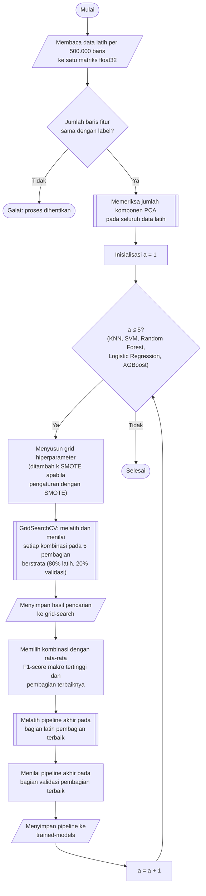

## **4.8 Rancangan Pelatihan dan Pemilihan Model**

Kelima algoritma klasifikasi, yaitu *K Nearest-Neighbor* (Subbab 4.9), *Support Vector Machine* (Subbab 4.10), *Random Forest* (Subbab 4.11), *Logistic Regression* (Subbab 4.12), dan *XGBoost* (Subbab 4.13), dilatih dan dipilih hiperparameternya menggunakan protokol yang sama. Setiap algoritma ditempatkan sebagai tahap terakhir pada *pipeline* praproses (Subbab 4.7), sehingga kelima algoritma menerima data latih, praproses, dan prosedur pemilihan yang identik. Keseragaman protokol ini diperlukan agar perbedaan kinerja yang teramati dapat dikaitkan dengan karakteristik algoritma, bukan dengan perbedaan data atau prosedur pengujian (Subbab 3.3.3).

Algoritma *K Nearest-Neighbor*, *Support Vector Machine*, *Random Forest*, dan *Logistic Regression* menggunakan implementasi dari library `scikit-learn`, sedangkan *XGBoost* menggunakan library `xgboost`. Seluruh pelatihan dijalankan pada CPU dengan delapan proses paralel (`n_jobs = 8`) pada algoritma yang mendukungnya, sehingga pelatihan tidak bergantung pada ketersediaan maupun kapasitas memori GPU. Satu-satunya pengecualian adalah *XGBoost*, yang dijalankan pada GPU (`cuda`) apabila tersedia dan pada CPU apabila tidak.

### **4.8.1 Pemuatan Data Latih**

Pencarian hiperparameter dan pelatihan model memerlukan seluruh data latih berada di memori sebagai satu matriks, karena validasi silang memilih baris secara acak dari seluruh data latih. Agar puncak penggunaan memori tidak berlipat ganda, data latih tidak dimuat sekaligus, melainkan dibaca secara *lazy* per kelompok (*batch*) sebanyak 500.000 baris menggunakan `Polars`, kemudian setiap kelompok disalin ke dalam satu matriks `float32` yang telah dialokasikan sebelumnya. Dengan cara ini, memori yang dibutuhkan hanya sebesar matriks akhir, yaitu sekitar 2,6 GB, ditambah satu kelompok data. Label dimuat dari file `encoded-labels.parquet` (Subbab 4.6), dan jumlah baris fitur dan label diperiksa harus sama.

### **4.8.2 Pencarian Hiperparameter dengan Validasi Silang**

Hiperparameter setiap algoritma ditentukan melalui pencarian grid (*grid search*) menggunakan `GridSearchCV` dari library `scikit-learn`. Setiap kombinasi hiperparameter dinilai dengan validasi silang menggunakan `StratifiedShuffleSplit`, yang membentuk lima pembagian (*split*) acak berstrata dari data latih dengan proporsi 80% untuk bagian latih dan 20% untuk bagian validasi, dengan *random state* 42. Setiap pembagian terdiri atas sekitar 7.325.411 baris bagian latih dan 1.831.353 baris bagian validasi. Proporsi validasi 20% dipilih agar sama dengan proporsi data uji (Subbab 4.5), sedangkan stratifikasi menjamin setiap kelas, termasuk kelas yang hanya memiliki 42 baris, tetap terwakili pada setiap bagian validasi. Kelima pembagian yang sama digunakan untuk seluruh kombinasi hiperparameter dan seluruh algoritma, sehingga skor antarkombinasi dapat dibandingkan secara adil.

Pada setiap pembagian, *pipeline* dilatih pada bagian latih, kemudian dinilai pada bagian validasi menggunakan empat metrik, yaitu F1-*score*, presisi, dan *recall* rata-rata makro, serta akurasi. Kelas yang tidak pernah diprediksi diberi nilai presisi dan F1-*score* nol (*zero_division* = 0). F1-*score* rata-rata makro digunakan sebagai kriteria pemilihan.

$F{1}_{makro}=\frac{1}{K}\sum _{k=1}^{K}F{1}_{k}$ (4.7)

Persamaan 4.7 adalah F1-*score* rata-rata makro, dengan $F{1}_{k}$ adalah F1-*score* kelas ke-$k$ sesuai Persamaan 2.11 dan $K$ adalah jumlah kelas. Rata-rata makro memberikan bobot yang sama kepada setiap kelas, sehingga kelas yang hanya memiliki belasan baris berkontribusi sama besar dengan kelas *Benign*. Akurasi tidak digunakan sebagai kriteria karena menyesatkan pada data yang tidak seimbang, yaitu model yang selalu memprediksi *Benign* sudah memperoleh akurasi sekitar 88% (Subbab 2.8.1). Kombinasi hiperparameter terbaik adalah kombinasi dengan rata-rata F1-*score* makro tertinggi pada kelima bagian validasi. Kombinasi yang gagal dilatih tidak memperoleh skor dan dicatat sebagai kegagalan, sehingga satu kegagalan tidak menghentikan seluruh pencarian dan kombinasi tersebut tidak ikut terpilih.

Pada pengaturan dengan SMOTE (Subbab 4.7.4), grid hiperparameter setiap algoritma ditambah dengan jumlah tetangga SMOTE, yaitu 3, 5, dan 7, sehingga jumlah kombinasi menjadi tiga kali lipat. Ruang pencarian setiap algoritma diuraikan pada Subbab 4.9 hingga 4.13 dan jumlah pelatihan yang dibutuhkan dirangkum pada Tabel 4.6.

Tabel 4.6 Jumlah Kombinasi Hiperparameter dan Pelatihan pada Pencarian Grid

| Algoritma | Jumlah kombinasi | Pelatihan tanpa SMOTE | Pelatihan dengan SMOTE |
| :--- | :---: | :---: | :---: |
| *K Nearest-Neighbor* | 21 | 105 | 315 |
| *Support Vector Machine* | 9 | 45 | 135 |
| *Random Forest* | 12 | 60 | 180 |
| *Logistic Regression* | 8 | 40 | 120 |
| *XGBoost* | 24 | 120 | 360 |
| **Total** | **74** | **370** | **1.110** |

### **4.8.3 Pembentukan Model Akhir**

Pencarian grid tidak melatih ulang model terbaik pada seluruh data latih secara otomatis. Sebagai gantinya, model akhir dibentuk dari pembagian terbaik (*best fold model*). Dari kelima pembagian milik kombinasi terbaik, dipilih pembagian dengan F1-*score* makro tertinggi, kemudian *pipeline* dengan kombinasi terbaik dilatih ulang pada bagian latih pembagian tersebut dan dinilai kembali pada bagian validasinya. Rancangan ini memiliki tiga alasan. Pertama, model akhir dilatih pada jumlah data dan konfigurasi yang sama persis dengan yang dinilai pada pencarian, sehingga skor validasi model akhir dapat dibandingkan langsung dengan skor pencarian sebagai pemeriksaan konsistensi. Kedua, hasil pencarian telah disimpan sebelum model akhir dilatih, sehingga kegagalan pada pelatihan akhir tidak menghilangkan hasil pencarian yang membutuhkan waktu lama. Ketiga, data uji tetap tidak dilibatkan sama sekali, karena pemilihan pembagian terbaik hanya menggunakan skor validasi.

Hasil pencarian setiap algoritma disimpan sebagai file CSV yang memuat seluruh kombinasi beserta skor pada setiap pembagian, rata-rata dan simpangan baku skor, peringkat, serta waktu pelatihan, dan kombinasi terbaiknya disimpan sebagai file JSON. Model akhir disimpan sebagai file *pickle* yang memuat seluruh *pipeline*, termasuk statistik praproses (Subbab 4.7). Seluruh hasil disimpan pada folder `scikit-learn`, yaitu subfolder `grid-search` untuk hasil pencarian dan subfolder `trained-models` untuk model akhir, masing-masing dipisahkan menurut pengaturan `wout-smote` dan `with-smote`.

Prosedur pelatihan dan pemilihan model dilaksanakan melalui algoritma berikut:

1. **Pemuatan data latih**, Fitur data latih dibaca per kelompok 500.000 baris ke dalam satu matriks `float32`, label dimuat, dan kesesuaian jumlah barisnya diperiksa.
2. **Pemeriksaan komponen utama**, Standardisasi dan PCA dilatih satu kali pada seluruh data latih untuk memeriksa jumlah komponen dan varians kumulatif yang dicapai (Subbab 4.7.3).
3. **Penyusunan grid**, Grid hiperparameter algoritma disusun, dan pada pengaturan dengan SMOTE ditambah jumlah tetangga SMOTE.
4. **Pencarian hiperparameter**, Setiap kombinasi dilatih dan dinilai pada lima pembagian validasi silang berstrata, kemudian hasilnya diurutkan menurut rata-rata F1-*score* makro dan disimpan.
5. **Pemilihan pembagian terbaik**, Pembagian dengan F1-*score* makro tertinggi pada kombinasi terbaik dipilih.
6. **Pelatihan model akhir**, *Pipeline* dengan kombinasi terbaik dilatih pada bagian latih pembagian terbaik dan dinilai pada bagian validasinya.
7. **Penyimpanan model**, *Pipeline* yang telah dilatih disimpan pada folder `scikit-learn/trained-models` sesuai pengaturan SMOTE. Langkah 3 hingga 7 diulang untuk kelima algoritma dan untuk kedua pengaturan SMOTE.

Setiap pelatihan pada pencarian grid dijalankan secara berurutan, sedangkan paralelisme dimanfaatkan di dalam algoritma dengan delapan proses. Menjalankan beberapa pelatihan secara bersamaan tidak dipilih karena setiap pelatihan membutuhkan salinan bagian latih sendiri yang berukuran jutaan baris, dan jumlah proses aktif akan melebihi jumlah inti CPU. Kemajuan pencarian ditampilkan sebagai jumlah pelatihan yang telah selesai, jumlah pelatihan yang gagal, dan perkiraan sisa waktu. Pengaturan tanpa SMOTE dan dengan SMOTE dijalankan secara terpisah, dan kesepuluh model akhir yang dihasilkan, yaitu lima algoritma pada dua pengaturan, menjadi model yang diuji ketahanannya pada Subbab 4.15.
