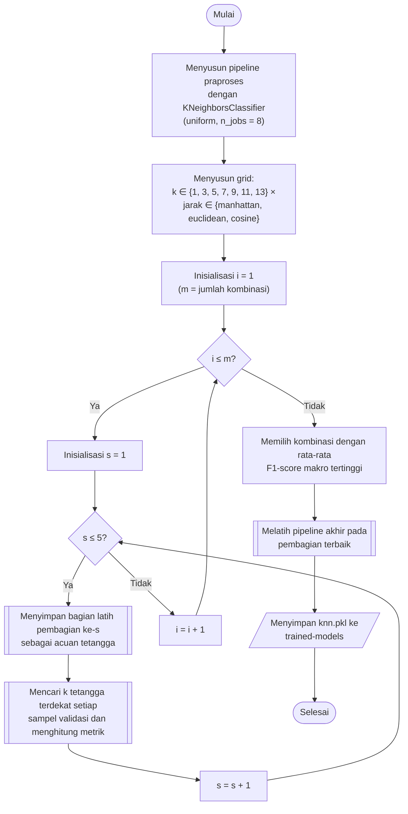

## **4.9 *K Nearest-Neighbor* (KNN)**

*K Nearest-Neighbor* (KNN) mengklasifikasikan sebuah sampel berdasarkan kelas dari *k* sampel latih yang paling dekat dengannya di ruang fitur (Subbab 2.4.1). Algoritma ini tidak mempelajari parameter secara eksplisit. Tahap pelatihan hanya menyimpan data latih, sedangkan seluruh komputasi klasifikasi, yaitu pencarian tetangga terdekat dan pemungutan suara, dilakukan pada saat prediksi. KNN diimplementasikan menggunakan `KNeighborsClassifier` dari library `scikit-learn` dan menerima data hasil *pipeline* praproses, yaitu data terstandar yang telah diproyeksikan ke komponen utama (Subbab 4.7).

Prediksi dihasilkan melalui pemungutan suara dengan bobot yang sama (*uniform*) untuk setiap tetangga. Peluang setiap kelas dihitung sebagai proporsi tetangga yang termasuk kelas tersebut.

$P\left(y=c\mid x\right)=\frac{1}{k}\sum _{i\in {N}_{k}\left(x\right)}\mathbb{1}\left({y}_{i}=c\right)$ (4.8)

Persamaan 4.8 adalah peluang kelas pada KNN, dengan ${N}_{k}\left(x\right)$ adalah himpunan *k* tetangga terdekat sampel $x$, ${y}_{i}$ adalah kelas tetangga ke-$i$, dan $\mathbb{1}\left(\cdot \right)$ bernilai satu apabila kondisinya terpenuhi dan nol apabila tidak. Kelas dengan peluang terbesar ditetapkan sebagai prediksi, dan peluang terbesar tersebut digunakan sebagai tingkat kepercayaan (*confidence*) model pada analisis ketahanan (Subbab 4.15).

Hiperparameter yang dicari adalah jumlah tetangga dan ukuran jarak. Jumlah tetangga *k* bernilai 1, 3, 5, 7, 9, 11, dan 13, yaitu bilangan ganjil untuk mengurangi kemungkinan suara imbang. Ukuran jarak yang dibandingkan adalah *manhattan*, yaitu jumlah selisih mutlak antarfitur, *euclidean*, yaitu akar jumlah kuadrat selisih antarfitur, dan *cosine*, yaitu jarak berdasarkan sudut antara dua vektor fitur. Kedua hiperparameter membentuk 7 × 3 = 21 kombinasi. Skema pembobotan ditetapkan *uniform* dan tidak dicari, untuk membatasi jumlah kombinasi pada algoritma yang biaya prediksinya paling besar ini.

Biaya komputasi KNN terletak pada tahap prediksi. Dengan 25 komponen utama, `scikit-learn` melakukan pencarian tetangga secara menyeluruh (*brute force*), yaitu menghitung jarak antara setiap sampel yang diprediksi dan seluruh sampel latih. Pada setiap penilaian dalam validasi silang, sekitar 1,83 juta sampel validasi dibandingkan dengan sekitar 7,33 juta sampel latih. Pencarian tetangga dijalankan dengan delapan proses paralel (`n_jobs = 8`) dan dilakukan per bagian data sehingga matriks jarak tidak perlu disimpan seluruhnya di memori. Ukuran model KNN juga sebanding dengan jumlah data latih, karena seluruh data latih disimpan sebagai acuan.

Prosedur pemilihan dan pembentukan model KNN dilaksanakan melalui algoritma berikut:

1. **Pembentukan *pipeline***, *Pipeline* praproses (Subbab 4.7) disusun dengan `KNeighborsClassifier` sebagai tahap terakhir, dengan pembobotan *uniform* dan delapan proses paralel.
2. **Penyusunan grid**, Grid hiperparameter disusun dari tujuh nilai *k* dan tiga ukuran jarak, sehingga terdapat 21 kombinasi, atau 63 kombinasi apabila ditambah jumlah tetangga SMOTE.
3. **Pencarian hiperparameter**, Setiap kombinasi dinilai pada lima pembagian validasi silang sesuai Subbab 4.8, dan hasilnya disimpan pada folder `scikit-learn/grid-search`.
4. **Pembentukan model akhir**, *Pipeline* dengan kombinasi terbaik dilatih pada bagian latih pembagian terbaik, dinilai pada bagian validasinya, dan disimpan pada folder `scikit-learn/trained-models` dengan nama `knn.pkl`.

Karena KNN menyimpan seluruh data latih sebagai acuan, waktu prediksi model akhir sebanding dengan jumlah sampel latih, dan biaya ini menjadi kelemahan utama algoritma ini pada himpunan data yang besar (Subbab 2.4.1). Pada nilai *k* = 1, peluang pada Persamaan 4.8 selalu bernilai satu untuk kelas tetangga terdekat, sehingga tingkat kepercayaan model tidak bervariasi dan perlu ditafsirkan dengan hati-hati pada analisis kepercayaan (Subbab 4.16).
