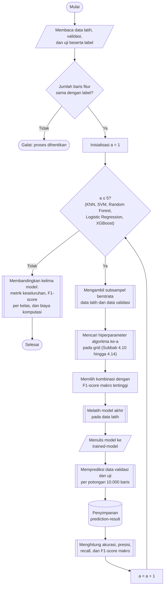

## **4.9 Rancangan Pelatihan dan Evaluasi Model**

Setelah seluruh praproses selesai, tersedia tiga himpunan data yang siap digunakan, yaitu data latih hasil SMOTE (Subbab 4.8), serta data validasi dan data uji hasil proyeksi IPCA (Subbab 4.7) beserta label yang telah dikodekan (Subbab 4.5). Kelima algoritma klasifikasi, yaitu *K Nearest-Neighbor* (Subbab 4.10), *Support Vector Machine* (Subbab 4.11), *Random Forest* (Subbab 4.12), *Logistic Regression* atau *softmax regression* (Subbab 4.13), dan *XGBoost* (Subbab 4.14), dilatih dan dievaluasi menggunakan protokol yang sama. Keseragaman protokol diperlukan agar perbedaan kinerja yang teramati dapat dikaitkan dengan karakteristik algoritma, bukan dengan perbedaan data atau prosedur pengujian (Subbab 3.3.3).

Data latih dibaca dari folder *data-smote/train*, tempat fitur dan label tersimpan pada berkas yang sama, kemudian dipisahkan menjadi fitur dan label. Fitur data validasi dan data uji dibaca dari folder *data-ipca*, sedangkan labelnya dibaca dari folder *data-encoded-label*. Seluruh berkas dalam satu himpunan dibaca menggunakan pustaka *Polars* dalam mode *streaming* dan digabung menjadi satu tabel bertipe *float32* di memori. Pada data validasi dan data uji, yang fitur dan labelnya dibaca dari folder berbeda, jumlah baris fitur dan label diperiksa harus sama, dan proses dihentikan dengan galat apabila keduanya tidak lagi berpasangan baris demi baris.

Hiperparameter setiap algoritma ditentukan melalui pencarian grid (*grid search*) menggunakan data validasi. Setiap kombinasi hiperparameter dilatih pada subsampel data latih dan dinilai pada subsampel data validasi, kemudian kombinasi dengan F1-*score* rata-rata makro tertinggi dipilih untuk melatih model akhir. Subsampel digunakan karena melatih seluruh kombinasi pada lebih dari 11 juta baris tidak praktis, terutama pada algoritma dengan kompleksitas komputasi tinggi. Ukuran subsampel karenanya disesuaikan dengan biaya komputasi setiap algoritma, sebagaimana dirangkum pada Tabel 4.1.

Tabel 4.1 Konfigurasi Pencarian Hiperparameter dan Pelatihan Model Akhir

| Algoritma | Jumlah kombinasi | Subsampel latih | Subsampel validasi | Data pelatihan model akhir |
| :--- | :---: | :---: | :---: | :--- |
| *K Nearest-Neighbor* | 42 | 500.000 | 200.000 | Seluruh data latih |
| *Support Vector Machine* | 9 | 50.000 | 100.000 | 300.000 baris subsampel berstrata |
| *Random Forest* | 12 | 1.000.000 | 200.000 | Seluruh data latih |
| *Logistic Regression* | 12 | 1.000.000 | 200.000 | Seluruh data latih |
| *XGBoost* | 12 | 1.000.000 | 200.000 | Seluruh data latih |

Subsampel diambil secara berstrata berdasarkan kelas, tanpa pengembalian, dengan *random state* 42. Kuota setiap kelas sebanding dengan proporsinya pada himpunan asal, dan subsampel data latih menjamin setiap kelas terwakili sedikitnya satu baris. Khusus subsampel data validasi, kuota setiap kelas dijamin sedikitnya 200 baris, atau seluruh baris apabila kelas tersebut memiliki kurang dari 200 baris, agar kelas yang sangat langka memiliki cukup sampel untuk menghitung F1-*score* per kelas. Konsekuensinya, distribusi kelas pada subsampel validasi lebih seimbang daripada distribusi sesungguhnya, sehingga skor pada subsampel hanya digunakan untuk membandingkan kombinasi hiperparameter dan bukan sebagai ukuran kinerja model.

F1-*score* rata-rata makro (*macro F1-score*) dipilih sebagai kriteria pemilihan karena akurasi menyesatkan pada data yang tidak seimbang: model yang selalu memprediksi *Benign* sudah memperoleh akurasi sekitar 83% (Subbab 2.8.1). Rata-rata makro menghitung F1-*score* setiap kelas terlebih dahulu kemudian merata-ratakannya tanpa pembobotan, sehingga kelas langka berkontribusi sama besar dengan kelas *Benign* (Subbab 2.8.4). Selain F1-*score*, dicatat pula akurasi serta presisi dan *recall* rata-rata makro. Perhitungan menggunakan parameter *zero_division=0* sehingga kelas yang tidak pernah diprediksi bernilai nol, dan mencakup seluruh kelas yang muncul pada label sebenarnya maupun pada prediksi.

Setiap model akhir disimpan pada folder *trained-model* dengan nama berkas yang memuat hiperparameternya, misalnya *knn-k-11-m-manhattan-w-uniform.pkl*. Format penyimpanan mengikuti pustaka masing-masing, yaitu *joblib* untuk *K Nearest-Neighbor*, *Support Vector Machine*, dan *Random Forest*, format *.keras* untuk *Logistic Regression*, dan format JSON asli untuk *XGBoost*. Model ditulis terlebih dahulu ke berkas sementara kemudian diganti namanya secara atomik, sehingga berkas yang setengah tertulis tidak pernah terbaca sebagai model yang valid. Hasil pencarian hiperparameter setiap algoritma disimpan sebagai berkas CSV pada folder *hyperparameter-search*.

Prediksi dilaksanakan per potongan (*chunk*) sebanyak 10.000 baris. Hasil prediksi setiap potongan disimpan sebagai berkas NumPy (*.npy*) pada folder *prediction-result* yang dikelompokkan menurut model dan himpunan data, dan potongan yang berkasnya sudah ada tidak dihitung ulang. Rancangan ini membatasi penggunaan memori, khususnya pada algoritma berbasis GPU, dan memungkinkan proses yang terputus dilanjutkan tanpa mengulang prediksi. Akibatnya, apabila suatu model dilatih ulang, folder prediksi model tersebut harus dihapus agar prediksi lama tidak dilaporkan sebagai prediksi model baru. Seluruh potongan kemudian digabung sesuai urutannya dan jumlah barisnya dibandingkan dengan jumlah label sebelum metrik dihitung.

Untuk mempercepat pelatihan dan prediksi, algoritma *K Nearest-Neighbor*, *Support Vector Machine*, dan *Random Forest* dijalankan menggunakan implementasi GPU dari pustaka *cuML* (RAPIDS), *XGBoost* dijalankan pada perangkat *cuda*, dan *Logistic Regression* dibangun dengan *Keras* di atas *TensorFlow*. Apabila GPU tidak tersedia, implementasi *scikit-learn* dengan antarmuka yang sama digunakan sebagai pengganti, dan *XGBoost* dijalankan pada CPU. Memori GPU dibebaskan pada awal pencarian, setelah setiap kombinasi dinilai, dan setelah setiap prediksi.

Prosedur pelatihan dan evaluasi model dilaksanakan melalui algoritma berikut:

1. **Memuat data latih, validasi, dan uji.** Fitur dan label setiap himpunan dibaca sebagaimana diuraikan di atas, kemudian kesesuaian jumlah baris fitur dan label pada data validasi dan data uji diperiksa.

2. **Mengambil subsampel berstrata.** Subsampel data latih dan data validasi untuk pencarian hiperparameter diambil sesuai ukuran pada Tabel 4.1.

3. **Mencari hiperparameter.** Setiap kombinasi pada grid dilatih pada subsampel latih dan dinilai pada subsampel validasi menggunakan ukuran F1-*score* rata-rata makro. Kombinasi yang gagal dijalankan dicatat bersama pesan galatnya kemudian dilewati, dan tidak dianggap berskor rendah, sehingga satu kegagalan tidak menghentikan seluruh pencarian. Hasil diurutkan menurut F1-*score* rata-rata makro dan disimpan.

4. **Memilih konfigurasi terbaik.** Kombinasi dengan F1-*score* rata-rata makro tertinggi dipilih.

5. **Melatih model akhir.** Model dilatih menggunakan konfigurasi terpilih pada data latih, seluruhnya atau subsampel sesuai Tabel 4.1.

6. **Menyimpan model.** Model ditulis ke folder *trained-model* sebagaimana diuraikan di atas.

7. **Memprediksi data validasi dan data uji.** Prediksi dilaksanakan per potongan 10.000 baris dan disimpan ke folder *prediction-result*.

8. **Menghitung metrik evaluasi.** Prediksi dibandingkan dengan label untuk menghitung akurasi serta presisi, *recall*, dan F1-*score* rata-rata makro. Laporan klasifikasi per kelas (presisi, *recall*, F1-*score*, dan jumlah sampel) serta *confusion matrix* juga disusun dari prediksi data uji.

9. **Membandingkan kelima model.** Setelah seluruh algoritma selesai, kinerja pada data bersih dibandingkan dari tiga sudut pandang, yaitu metrik keseluruhan pada data validasi dan data uji, F1-*score* per kelas pada data uji untuk melihat kelas yang sulit dikenali oleh masing-masing model, dan biaya komputasi kombinasi terbaik, yang mencakup waktu pelatihan, waktu prediksi, serta jumlah *support vector*, pohon, atau *epoch*.

Pencarian, pelatihan, dan prediksi dilaksanakan secara berurutan untuk setiap algoritma, dan rincian pada langkah 3 hingga 5 yang bersifat khusus algoritma diuraikan pada Subbab 4.10 hingga 4.14. Seluruh proses acak, yaitu pengambilan subsampel, inisialisasi model, dan pembangunan pohon, menggunakan *random state* 42 sehingga hasil dapat direproduksi. Kinerja kelima model pada data uji yang tidak dimodifikasi ini selanjutnya menjadi acuan (*baseline*) kondisi bersih (*clean*) pada pengujian ketahanan (Subbab 4.16).
