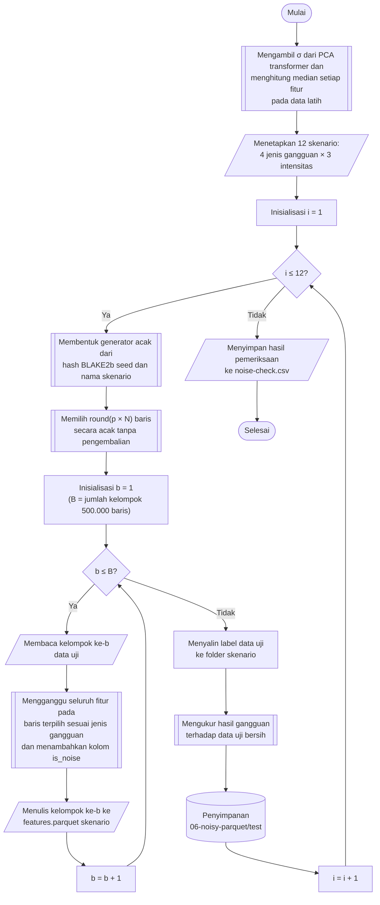

## **4.9 Simulasi Injeksi *Feature Noise* pada Data Uji**

Tujuan penelitian ini adalah mengukur ketahanan kelima model terhadap data yang tidak ideal. Oleh karena itu, model dilatih pada data bersih (Subbab 4.8), kemudian gangguan disisipkan secara terkontrol hanya pada data uji, sejalan dengan pendekatan injeksi *noise* pada tahap pengujian yang dijelaskan pada Subbab 2.7. Data latih tidak diubah, dan model yang diuji adalah model akhir yang sama dengan model yang dievaluasi pada data bersih, tanpa pelatihan ulang. Rancangan ini memenuhi kebutuhan simulasi *feature noise* yang terkontrol dan bertingkat pada Subbab 3.3.2.

Gangguan yang disimulasikan terdiri atas empat jenis. Tiga jenis pertama adalah *feature noise* pada Subbab 2.7, yaitu *gaussian noise*, *uniform noise*, dan *multiplicative noise*. Jenis keempat adalah data tidak lengkap (*missing*), yang ditambahkan karena praktisi keamanan siber pada Subbab 3.1 mencatat bahwa data tidak lengkap lebih sering dijumpai pada lalu lintas jaringan operasional dibandingkan *noise* murni. Setiap jenis gangguan diterapkan pada tiga tingkat intensitas, yaitu 10%, 20%, dan 30%, sesuai Subbab 2.9, sehingga terdapat 4 × 3 = 12 skenario. Setiap skenario dinamai dengan format jenis dan intensitas, misalnya `gaussian-20` untuk *gaussian noise* dengan intensitas 20%.

Intensitas menyatakan persentase baris data uji yang terganggu, bukan besar gangguannya. Pada skenario `gaussian-20`, satu dari lima baris data uji diganggu, sedangkan seberapa besar baris tersebut diganggu ditetapkan oleh parameter besaran gangguan yang bernilai sama pada ketiga intensitas. Pada baris yang terpilih, seluruh 70 fitur diganggu. Pemisahan antara jumlah baris yang terganggu dan besar gangguan dilakukan agar pengaruh peningkatan intensitas dapat dikaitkan semata-mata dengan bertambahnya baris yang terganggu, dan agar analisis pada Subbab 4.10 dan Subbab 4.11 dapat memisahkan baris yang terganggu dari baris yang tidak terganggu. Jumlah baris yang terganggu ditetapkan tepat sebanyak pembulatan hasil kali intensitas dengan jumlah baris data uji, yaitu 228.919, 457.838, dan 686.757 baris dari 2.289.191 baris untuk intensitas 10%, 20%, dan 30%. Baris tersebut dipilih secara acak tanpa pengembalian dari seluruh data uji, sehingga persentase baris terganggu sama persis dengan intensitas.

Besar gangguan ditetapkan relatif terhadap variabilitas alami setiap fitur, yaitu simpangan baku ${\sigma }_{j}$ fitur ke-$j$ pada data latih. Penetapan relatif ini diperlukan karena fitur memiliki satuan dan skala yang sangat berbeda (Subbab 4.7.2). Gangguan dengan besar mutlak yang sama pada seluruh fitur akan menghancurkan fitur berskala kecil dan hampir tidak memengaruhi fitur berskala besar. Simpangan baku tersebut tidak dihitung ulang, melainkan diambil langsung dari statistik standardisasi pada *PCA transformer* (Subbab 4.7), yang dihitung dari seluruh data latih dengan pembagi $n$. Dengan demikian, gangguan sebesar ${\sigma }_{j}$ tepat setara dengan pergeseran satu satuan pada data terstandar yang dilihat oleh seluruh model. Dengan $x_{ij}$ adalah nilai fitur ke-$j$ pada baris ke-$i$ dan $x_{ij}^{\prime }$ adalah nilai setelah diganggu, keempat jenis gangguan dirumuskan sesuai Persamaan 2.4 hingga 2.7 pada Subbab 2.7 sebagai berikut.

$x_{ij}^{\prime }=x_{ij}+{\eta }_{ij},\ \ {\eta }_{ij}\sim \mathcal{N}\left(0,{\left({m}_{g}{\sigma }_{j}\right)}^{2}\right)$ (4.11)

$x_{ij}^{\prime }=x_{ij}+{\eta }_{ij},\ \ {\eta }_{ij}\sim U\left(-{a}_{j},{a}_{j}\right),\ \ {a}_{j}={m}_{u}{\sigma }_{j}\sqrt{3}$ (4.12)

$x_{ij}^{\prime }=x_{ij}\cdot {\eta }_{ij},\ \ {\eta }_{ij}\sim \mathcal{N}\left(1,{m}_{x}^{2}\right)$ (4.13)

$x_{ij}^{\prime }={\tilde{x}}_{j}$ (4.14)

Keempat persamaan tersebut berlaku pada seluruh fitur baris yang terpilih, sedangkan nilai pada baris yang tidak terpilih tidak berubah ($x_{ij}^{\prime }=x_{ij}$). Persamaan 4.11 adalah *gaussian noise* yang bersifat aditif dengan rata-rata nol sehingga tidak memperkenalkan bias sistematis, dengan simpangan baku ${m}_{g}{\sigma }_{j}$ dan ${m}_{g}$ = 1,0. Persamaan 4.12 adalah *uniform noise* yang juga bersifat aditif dengan rentang simetris $-{a}_{j}$ hingga ${a}_{j}$. Faktor $\sqrt{3}$ pada ${a}_{j}$ menyamakan varians *uniform noise*, yaitu ${a}_{j}^{2}/3$, dengan varians *gaussian noise* pada Persamaan 4.11, sehingga kedua jenis ini hanya berbeda pada bentuk distribusinya dan tidak pada dayanya, dengan ${m}_{u}$ = 1,0. Persamaan 4.13 adalah *multiplicative noise*, dengan faktor pengali berdistribusi normal dengan rata-rata satu dan simpangan baku ${m}_{x}$ = 0,5, sehingga rata-rata nilai tidak berubah dan setiap nilai terdistorsi secara proporsional dengan simpangan baku 50% dari nilai aslinya. Karena berupa perkalian, nilai nol tidak berubah oleh *multiplicative noise*. Persamaan 4.14 adalah data tidak lengkap, dengan ${\tilde{x}}_{j}$ adalah median fitur ke-$j$ pada data latih. Nilai pada baris yang terpilih dianggap hilang, kemudian langsung diisi dengan median data latih, karena *pipeline* praproses (Subbab 4.7) tidak dapat menerima nilai hilang. Ringkasan jenis gangguan disajikan pada Tabel 4.3.

Tabel 4.3 Jenis Gangguan dan Parameter Simulasi pada Data Uji

| Jenis gangguan | Mekanisme | Parameter besaran | Kondisi nyata yang direpresentasikan |
| :--- | :--- | :---: | :--- |
| *Gaussian* | Penambahan bilangan acak berdistribusi normal dengan rata-rata nol | ${m}_{g}$ = 1,0 | Kesalahan pengukuran akibat keterbatasan presisi perangkat keras |
| *Uniform* | Penambahan bilangan acak berdistribusi seragam dengan varians yang sama dengan *gaussian* | ${m}_{u}$ = 1,0 | Ketidakpastian kuantisasi atau pembulatan pada pencatatan |
| *Multiplicative* | Perkalian dengan bilangan acak berdistribusi normal dengan rata-rata satu | ${m}_{x}$ = 0,5 | Degradasi proporsional akibat hambatan jaringan atau manipulasi penyerang |
| *Missing* | Nilai dianggap hilang, kemudian diisi median data latih | Tidak ada | Data tidak lengkap akibat penghilangan informasi |

Gangguan disisipkan pada fitur data uji dalam satuan aslinya, yaitu data pada folder `data-pipeline/04-splitted-parquet/test` sebelum standardisasi. Data yang telah terganggu kemudian diprediksi melalui *pipeline* yang sama dengan data bersih, sehingga melewati standardisasi dan proyeksi PCA dari *PCA transformer* yang sama dengan data latih seluruh model (Subbab 4.7). Rancangan ini meniru kondisi operasional, yaitu pengukuran jaringan yang terganggu pada sumbernya kemudian diproses oleh alur praproses yang tetap, dan bukan gangguan yang disisipkan pada data yang telah diproyeksikan.

Bilangan acak setiap skenario dibangkitkan dari generator yang *seed*-nya dibentuk dari hasil *hash* BLAKE2b sepanjang 8 *byte* atas teks yang memuat *seed* dasar 42 dan nama skenario. Dengan cara ini, setiap skenario memperoleh aliran bilangan acak yang berbeda tetapi selalu sama pada setiap pelaksanaan, dan hasil suatu skenario tidak bergantung pada urutan pembentukan skenario lainnya. Data uji diproses per kelompok 500.000 baris agar tidak dimuat seluruhnya ke memori. Pemilihan baris yang terganggu dilakukan sekali untuk seluruh data uji sebelum kelompok pertama diproses, kemudian setiap kelompok menggunakan generator yang sama secara berurutan, sehingga hasilnya identik dengan pembangkitan gangguan pada seluruh data uji sekaligus.

Prosedur pembentukan skenario gangguan dilaksanakan melalui algoritma berikut:

1. **Penyiapan statistik data latih**, Simpangan baku setiap fitur diambil dari *PCA transformer*, sedangkan median setiap fitur dihitung dari data latih, satu fitur pada setiap perhitungan. Susunan fitur pada data latih diperiksa harus sama dengan susunan fitur pada *PCA transformer*.
2. **Penetapan daftar skenario**, Empat jenis gangguan dan tiga intensitas disusun menjadi 12 skenario, dinyatakan sebagai *i* = 1 hingga 12, dengan intensitas skenario ke-*i* dinyatakan sebagai *p*.
3. **Pembentukan generator bilangan acak**, Generator skenario ke-*i* dibentuk dari *seed* hasil *hash* BLAKE2b atas *seed* dasar dan nama skenario.
4. **Pemilihan baris yang terganggu**, Sebanyak $\mathrm{round}\left(p\times N\right)$ baris, dengan *N* adalah jumlah baris data uji, dipilih secara acak tanpa pengembalian dan ditandai sebagai baris terganggu.
5. **Pemberian gangguan per kelompok**, Data uji dibaca per kelompok 500.000 baris. Pada baris terganggu di setiap kelompok, seluruh fitur diganti dengan nilai hasil Persamaan 4.11, 4.12, 4.13, atau 4.14 sesuai jenis gangguan, sedangkan baris lainnya tidak diubah. Hasilnya dikonversi ke tipe `float32` dan diberi kolom penanda `is_noise` yang bernilai benar pada baris terganggu.
6. **Penyimpanan skenario**, Setiap kelompok ditulis secara berurutan ke file `features.parquet` pada folder `data-pipeline/06-noisy-parquet/test` dengan subfolder sesuai nama skenario, dan file label data uji disalin ke folder yang sama.
7. **Pemeriksaan gangguan**, Data uji bersih dan data skenario dibaca kembali per kelompok secara berpasangan untuk mengukur hasil gangguan. Langkah 3 hingga 7 diulang untuk kedua belas skenario.

Penanda `is_noise` disimpan bersama fitur, sehingga baris yang terganggu tidak perlu dipulihkan kembali dari data pada tahap analisis (Subbab 4.10 dan Subbab 4.11). Setiap skenario menjadi himpunan data uji yang lengkap dan independen, yang terdiri atas fitur terganggu, penanda baris terganggu, dan label yang sama dengan data uji bersih. Pada skenario data tidak lengkap, setiap baris terdampak berubah menjadi vektor median yang identik, sehingga setelah standardisasi dan proyeksi seluruh baris tersebut menempati satu titik yang sama pada ruang komponen utama. Skenario ini dengan demikian merepresentasikan hilangnya seluruh informasi pada baris terdampak, bukan hilangnya sebagian fitur.

Keberhasilan pembentukan skenario diverifikasi dengan membandingkan data uji bersih dan data skenario baris demi baris. Lima besaran diukur, yaitu (1) persentase baris yang ditandai terganggu, yang harus sama dengan intensitas, (2) persentase baris yang berubah, (3) persentase sel yang berubah, (4) jumlah baris tidak terganggu yang berubah, yang harus bernilai nol, dan (5) besar gangguan yang teramati. Besar gangguan yang teramati adalah simpangan baku selisih nilai pada sel yang berubah, yang dinyatakan dalam satuan ${\sigma }_{j}$ pada *gaussian noise* dan *uniform noise*, atau sebagai perubahan relatif terhadap nilai asli pada *multiplicative noise*, dan diharapkan mendekati nilai rancangan, yaitu 1,0 dan 0,5. Besar gangguan tidak diukur pada data tidak lengkap. Persentase sel yang berubah pada *multiplicative noise* dan data tidak lengkap diharapkan lebih rendah daripada intensitas, karena nilai nol tidak berubah oleh perkalian dan nilai yang kebetulan sama dengan median tidak berubah ketika diganti dengan median, sedangkan 22 dari 70 fitur memiliki median nol pada data latih. Hasil pemeriksaan disimpan pada file `noise-evaluation/noise-check.csv`.
