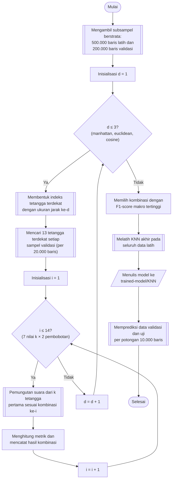

## **4.10 *K Nearest-Neighbor* (KNN)**

*K Nearest-Neighbor* (KNN) mengklasifikasikan sebuah sampel berdasarkan kelas dari *k* sampel latih yang paling dekat dengannya di ruang fitur (Subbab 2.4.1). Algoritma ini tidak mempelajari parameter secara eksplisit. Tahap pelatihan hanya menyimpan data latih dan membentuk struktur pencarian tetangga, sedangkan seluruh komputasi klasifikasi dilakukan pada saat prediksi. Efektivitas KNN sangat dipengaruhi oleh tiga hiperparameter, yaitu jumlah tetangga *k*, ukuran jarak, dan skema pembobotan suara tetangga (Subbab 2.4.1).

Ruang pencarian ditetapkan sebagai berikut. Jumlah tetangga *k* bernilai 1, 3, 5, 7, 9, 11, dan 13, yaitu bilangan ganjil untuk mengurangi kemungkinan suara imbang. Ukuran jarak yang dibandingkan adalah *manhattan* (jumlah selisih mutlak antarfitur), *euclidean* (akar jumlah kuadrat selisih antarfitur), dan *cosine* (sudut antara dua vektor fitur). Skema pembobotan yang dibandingkan adalah *uniform*, yaitu setiap tetangga memiliki suara yang sama, dan *distance*, yaitu suara setiap tetangga berbanding terbalik dengan jaraknya. Ketiga hiperparameter membentuk 7 × 3 × 2 = 42 kombinasi.

Mengevaluasi 42 kombinasi secara terpisah, dengan masing-masing memerlukan pencarian tetangga untuk seluruh sampel validasi, sangat mahal secara komputasi. Oleh karena itu, pencarian dirancang tanpa pelatihan ulang (*searching without refitting*). Untuk setiap ukuran jarak, indeks tetangga terdekat dibentuk satu kali dan 13 tetangga terdekat, yaitu nilai *k* terbesar, dicari untuk setiap sampel validasi. Daftar tetangga tersebut terurut menurut jarak, sehingga *k* tetangga terdekat untuk nilai *k* yang lebih kecil adalah *k* elemen pertama dari daftar yang sama. Prediksi untuk seluruh nilai *k* dan kedua skema pembobotan dapat dihitung dari satu daftar tetangga, sehingga 42 kombinasi hanya memerlukan tiga kali pembentukan indeks dan tiga kali pencarian tetangga.

Prediksi dihasilkan melalui pemungutan suara: setiap tetangga menyumbang bobot pada kelasnya, kemudian kelas dengan total bobot terbesar dipilih. Pada pembobotan *uniform*, bobot setiap tetangga adalah satu, sedangkan pada pembobotan *distance*, bobot adalah kebalikan dari jarak. Apabila sebuah sampel memiliki tetangga berjarak nol, yaitu sampel latih yang bernilai identik, bobot kebalikan jarak menjadi tak hingga sehingga hanya tetangga berjarak nol yang diberi suara dan tetangga lainnya diabaikan. Kondisi ini dapat terjadi pada data lalu lintas jaringan karena adanya aliran yang bernilai identik.

Pencarian dilakukan pada 500.000 baris data latih dan 200.000 baris data validasi hasil subsampel berstrata (Subbab 4.9), karena biaya pencarian tetangga secara menyeluruh (*brute force*) sebanding dengan hasil kali jumlah sampel validasi dan jumlah sampel latih. Pencarian tetangga dilaksanakan per potongan 20.000 baris sampel validasi untuk membatasi penggunaan memori. Kombinasi dengan F1-*score* rata-rata makro tertinggi pada pencarian ini adalah *k* = 11, ukuran jarak *manhattan*, dan pembobotan *uniform*, yang selanjutnya digunakan untuk membentuk model akhir. Model akhir dibentuk dari seluruh data latih hasil SMOTE sehingga jumlah sampel acuannya jauh lebih besar daripada subsampel pencarian. Oleh karena itu, konfigurasi terbaik pada subsampel dipandang sebagai pendekatan atas konfigurasi terbaik pada data penuh.

Prosedur pemilihan dan pembentukan model KNN dilaksanakan melalui algoritma berikut:

1. **Menyiapkan subsampel pencarian.** Subsampel berstrata sebanyak 500.000 baris data latih dan 200.000 baris data validasi diambil sesuai Subbab 4.9.

2. **Membentuk indeks tetangga terdekat.** Untuk setiap ukuran jarak, yaitu *manhattan*, *euclidean*, dan *cosine*, objek *NearestNeighbors* dengan 13 tetangga dibentuk dan dilatih pada subsampel latih.

3. **Mencari tetangga terdekat.** Untuk seluruh subsampel validasi, 13 tetangga terdekat dicari per potongan 20.000 baris. Hasilnya berupa jarak dan indeks setiap tetangga, dan label setiap tetangga diambil dari subsampel latih berdasarkan indeksnya.

4. **Menghitung prediksi setiap kombinasi.** Untuk setiap nilai *k* dan skema pembobotan, yaitu 14 kombinasi pada setiap ukuran jarak, *k* tetangga pertama dari daftar yang sama digunakan pada pemungutan suara sesuai skema pembobotan, dan kelas dengan total bobot terbesar ditetapkan sebagai prediksi.

5. **Menilai kombinasi.** Prediksi dibandingkan dengan label subsampel validasi, kemudian akurasi serta presisi, *recall*, dan F1-*score* rata-rata makro dicatat bersama hiperparameternya.

6. **Memilih konfigurasi terbaik.** Ke-42 hasil diurutkan menurut F1-*score* rata-rata makro dan disimpan pada berkas *hyperparameter-search/knn-search.csv*, kemudian kombinasi teratas dipilih.

7. **Melatih model akhir.** Objek *KNeighborsClassifier* dibentuk dengan konfigurasi terpilih dan dilatih pada seluruh data latih hasil SMOTE, yang bertipe *float32* untuk fitur dan bilangan bulat untuk label, sehingga tahap pelatihan berupa pembentukan indeks pada seluruh data latih. Model disimpan pada folder *trained-model/KNN* dengan nama yang memuat hiperparameternya.

8. **Memprediksi data validasi dan data uji.** Model dimuat kembali, kemudian prediksi dilaksanakan per potongan 10.000 baris dan disimpan sebagaimana diuraikan pada Subbab 4.9.

Karena KNN menyimpan seluruh data latih sebagai acuan, ukuran model dan waktu prediksi sebanding dengan jumlah sampel latih, dan biaya ini menjadi kelemahan utama algoritma ini pada himpunan data yang besar (Subbab 2.4.1). Prediksi per potongan pada Subbab 4.9 membatasi kebutuhan memori pada tahap ini. Pencarian tetangga pada tahap pencarian hiperparameter dan pada tahap prediksi dijalankan menggunakan implementasi GPU dari pustaka *cuML* apabila tersedia, dengan implementasi *scikit-learn* sebagai pengganti.
