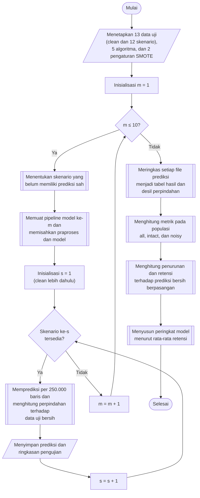

## **4.10 Pengujian dan Pengukuran Ketahanan Model**

Setelah 12 skenario gangguan terbentuk (Subbab 4.9), setiap model akhir diuji pada data uji bersih (*clean*) dan pada setiap skenario tanpa dilatih ulang. Model yang diuji berjumlah sepuluh, yaitu lima algoritma pada pengaturan tanpa SMOTE dan dengan SMOTE (Subbab 4.8), sedangkan data uji berjumlah 13 himpunan, yaitu data uji bersih dan 12 skenario gangguan, sehingga terdapat 130 pengujian. Kinerja model pada data uji bersih digunakan sebagai acuan (*baseline*) untuk mengukur penurunan kinerja akibat gangguan.

### **4.10.1 Prediksi pada Setiap Skenario**

Setiap model memprediksi data uji per kelompok 250.000 baris, sehingga 2.289.191 baris data uji terbagi menjadi sepuluh kelompok. Pada setiap kelompok, baris skenario dan baris data uji bersih yang bersesuaian dibaca bersamaan, kemudian keduanya dilewatkan melalui tahap praproses dari *pipeline* model, yaitu konversi tipe data, standardisasi, dan proyeksi PCA, tanpa tahap SMOTE. Data skenario kemudian diprediksi oleh model. Apabila model menyediakan peluang kelas, satu kali perhitungan peluang menghasilkan kelas prediksi, yaitu kelas dengan peluang terbesar, tingkat kepercayaan (*confidence*), yaitu peluang terbesar tersebut, dan peluang kelas sebenarnya. Apabila model tidak menyediakan peluang, yaitu SVM, hanya kelas prediksi yang dicatat. Perpindahan (*displacement*) setiap baris akibat gangguan diukur pada ruang komponen utama.

${d}_{i}={\left\Vert {\mathbf{z}}_{i}^{s}-{\mathbf{z}}_{i}^{clean}\right\Vert }_{2}$ (4.15)

Persamaan 4.15 adalah perpindahan baris ke-$i$, dengan ${\mathbf{z}}_{i}^{s}$ dan ${\mathbf{z}}_{i}^{clean}$ adalah vektor komponen utama baris tersebut pada skenario *s* dan pada data uji bersih. Perpindahan bernilai nol pada baris yang tidak terganggu dan menggambarkan seberapa jauh gangguan menggeser baris pada ruang yang dilihat oleh model.

Setiap pengujian menghasilkan satu file prediksi yang memuat, untuk setiap baris, label sebenarnya, prediksi model pada skenario, prediksi model yang sama pada baris bersihnya (*clean prediction*), penanda `is_noise`, tingkat kepercayaan, peluang kelas sebenarnya, dan perpindahan. Prediksi pada baris bersih diambil dari hasil pengujian model tersebut pada data uji bersih, sehingga setiap baris skenario dapat dibandingkan langsung dengan dirinya sendiri sebelum diganggu. Batas kelompok yang sama digunakan pada seluruh skenario, karena hasil perhitungan matriks dalam tipe `float32` dapat berbeda pada digit terakhir apabila susunan kelompoknya berbeda. Dengan batas kelompok yang sama, baris yang tidak terganggu menghasilkan komponen utama dan prediksi yang identik dengan data uji bersih, sehingga perbedaan prediksi hanya dapat berasal dari gangguan.

file prediksi disimpan dalam format Parquet pada folder `scikit-learn/predictions`, dengan subfolder menurut pengaturan SMOTE, model, dan skenario. Bersama prediksi disimpan pula ringkasan pengujian, yaitu jumlah baris, jumlah baris terganggu, waktu praproses dan waktu prediksi, keberadaan tingkat kepercayaan, sidik jari file data skenario, ukuran kelompok, serta pengaturan *pipeline*, yaitu nama algoritma, jumlah komponen utama, varians yang dipertahankan, dan jumlah tetangga SMOTE. file ditulis terlebih dahulu dengan nama sementara kemudian diganti namanya, sehingga pengujian yang terputus tidak pernah meninggalkan file yang tampak lengkap.

Pengujian pada seluruh skenario memerlukan waktu yang lama, sehingga dirancang agar dapat dilanjutkan apabila terputus. Sebuah pengujian dilewati apabila file prediksinya sudah ada, model belum dilatih ulang sejak prediksi dibuat, ukuran kelompoknya sama, dan sidik jari data skenarionya sama, yaitu hasil *hash* BLAKE2b atas isi file data. Apabila pengujian pada data uji bersih harus diulang, seluruh skenario model tersebut juga diulang, karena prediksi bersih menjadi pembanding bagi seluruh skenario. Data uji bersih selalu diprediksi lebih dahulu daripada skenario gangguan.

### **4.10.2 Populasi dan Metrik Evaluasi**

Pada setiap skenario, hanya sebagian baris data uji yang diganggu (Subbab 4.9). Oleh karena itu, setiap pengujian dinilai pada tiga populasi, yaitu seluruh baris (*all*), baris utuh (*intact*) yang tidak diganggu, dan baris terganggu (*noisy*). Skor pada seluruh baris menggambarkan kinerja model pada lalu lintas yang sebagian terganggu, sedangkan skor pada baris terganggu memperlihatkan dampak gangguan secara langsung tanpa tercampur baris yang tidak berubah.

file prediksi berisi lebih dari dua juta baris, sedangkan banyak metrik perlu dihitung pada tiga populasi. Agar file prediksi tidak perlu dimuat berulang kali, setiap file diringkas satu kali menjadi tabel hasil (*outcome counts*) dengan mengelompokkan baris menurut penanda `is_noise`, label, prediksi bersih, dan prediksi pada skenario. Untuk setiap kelompok dicatat jumlah baris, jumlah tingkat kepercayaan, jumlah baris dengan tingkat kepercayaan sedikitnya 0,9, jumlah *log loss*, dan jumlah perpindahan. Tabel ini hanya berisi ratusan baris, tetapi memuat seluruh informasi yang dibutuhkan, karena setiap metrik dapat dihitung dengan menggunakan jumlah baris setiap kelompok sebagai bobot sampel. Pengelompokan dilakukan secara *streaming* menggunakan `Polars`. Selain itu, baris terganggu dibagi menjadi sepuluh kelompok desil menurut perpindahannya, dan untuk setiap desil dicatat rata-rata perpindahan, proporsi prediksi yang berubah, dan proporsi kesalahan.

Metrik yang dihitung pada setiap pengujian dan populasi dikelompokkan menjadi empat jenis sebagaimana disajikan pada Tabel 4.4. Metrik kinerja klasifikasi menggunakan definisi pada Subbab 2.8, dengan rata-rata makro dihitung pada kelas yang muncul pada label sebenarnya maupun prediksi di populasi tersebut. Pembatasan ini diperlukan karena kelas yang sangat langka dapat tidak muncul pada populasi baris terganggu, dan mengikutsertakan kelas tersebut akan menambahkan F1-*score* bernilai nol ke dalam rata-rata. Metrik deteksi serangan memperlakukan seluruh kelas selain *Benign* sebagai serangan, sehingga mengukur kemampuan model membedakan lalu lintas normal dan serangan tanpa memperhatikan jenis serangannya.

Tabel 4.4 Metrik Evaluasi Pengujian Ketahanan

| Jenis | Metrik | Keterangan |
| :--- | :--- | :--- |
| Kinerja klasifikasi | Akurasi, akurasi seimbang (*balanced accuracy*), presisi, *recall*, dan F1-*score* rata-rata makro dan rata-rata tertimbang, *Matthews Correlation Coefficient* (MCC), dan *Cohen's kappa* | Kesesuaian prediksi dengan label sebenarnya pada lima belas kelas |
| Deteksi serangan | Laju deteksi serangan (*detection rate*), presisi alarm, F1-*score* serangan, dan laju alarm palsu (*false alarm rate*) | Kemampuan membedakan *Benign* dari serangan |
| Stabilitas prediksi | Laju perubahan prediksi (*flip rate*), laju rusak (*broken rate*), laju pulih (*fixed rate*), laju lolos serangan (*evasion rate*), dan laju alarm palsu baru | Perubahan prediksi dibandingkan prediksi pada baris bersihnya |
| Kepercayaan | Rata-rata tingkat kepercayaan, rata-rata tingkat kepercayaan pada kesalahan, proporsi kesalahan yakin (*confident error*), *log loss*, dan rata-rata perpindahan | Keyakinan model terhadap prediksinya dan besar gangguan yang diterima |

Laju perubahan prediksi adalah proporsi baris yang prediksinya berbeda dari prediksi pada baris bersihnya. Laju rusak adalah proporsi baris yang benar pada data bersih tetapi salah setelah diganggu, sedangkan laju pulih adalah kebalikannya. Laju lolos serangan adalah proporsi serangan yang terdeteksi pada data bersih tetapi diprediksi sebagai *Benign* setelah diganggu, sedangkan laju alarm palsu baru adalah proporsi lalu lintas *Benign* yang diprediksi *Benign* pada data bersih tetapi diprediksi sebagai serangan setelah diganggu. Kesalahan yakin adalah kesalahan dengan tingkat kepercayaan sedikitnya 0,9, sedangkan *log loss* dihitung dari peluang kelas sebenarnya dengan batas bawah 10⁻⁷ agar logaritma tetap terdefinisi. Metrik kepercayaan tidak tersedia pada SVM.

### **4.10.3 Penurunan Kinerja dan Peringkat Ketahanan**

Penurunan kinerja diukur secara berpasangan, yaitu dengan membandingkan metrik prediksi pada skenario dengan metrik prediksi bersih pada baris yang sama. Untuk model *m*, skenario *s*, populasi tertentu, dan metrik *M*, penurunan mutlak (*drop*) dan retensi (*retention*) didefinisikan sebagai berikut.

${\Delta }_{m,s}={M}_{m,s}^{clean}-{M}_{m,s}$ (4.16)

${R}_{m,s}=\frac{{M}_{m,s}}{{M}_{m,s}^{clean}}$ (4.17)

Persamaan 4.16 adalah penurunan mutlak, sedangkan Persamaan 4.17 adalah retensi, yaitu proporsi skor bersih yang dipertahankan pada skenario *s*. ${M}_{m,s}^{clean}$ adalah metrik yang dihitung dari prediksi bersih pada baris yang sama dengan ${M}_{m,s}$. Pada populasi seluruh baris, nilai ini sama dengan skor model pada data uji bersih, sedangkan pada populasi baris terganggu, nilai ini adalah skor model pada baris-baris tersebut sebelum diganggu. Perbandingan berpasangan memastikan bahwa penurunan yang terukur hanya disebabkan oleh gangguan dan bukan oleh perbedaan komposisi kelas antarpopulasi. Retensi digunakan sebagai dasar pembandingan karena skor bersih setiap model berbeda, sehingga model dinilai berdasarkan bagian kinerjanya sendiri yang dipertahankan. Apabila skor bersih bernilai nol, retensi tidak terdefinisi dan tidak diikutsertakan.

Penurunan dan retensi dihitung untuk sepuluh metrik ketahanan, yaitu akurasi, akurasi seimbang, presisi, *recall*, dan F1-*score* rata-rata makro, F1-*score* rata-rata tertimbang, MCC, *Cohen's kappa*, laju deteksi serangan, dan F1-*score* serangan, dengan F1-*score* rata-rata makro sebagai metrik utama. Ketahanan setiap model dirangkum sebagai rata-rata retensi pada seluruh 12 skenario.

${\bar{R}}_{m}=\frac{1}{12}\sum _{s=1}^{12}{R}_{m,s}$ (4.18)

Persamaan 4.18 adalah rata-rata retensi model *m*, yang memberikan bobot yang sama kepada setiap jenis gangguan dan setiap intensitas. Selain rata-rata retensi, dicatat pula retensi terburuk beserta skenario tempat retensi tersebut terjadi, rata-rata dan nilai terbesar penurunan mutlak, serta rata-rata retensi untuk setiap jenis gangguan, sehingga kerentanan model terhadap satu skenario tertentu tidak tersembunyi oleh rata-rata. Peringkat ketahanan disusun dengan mengurutkan model menurut rata-rata retensi, baik di dalam setiap pengaturan SMOTE maupun pada gabungan kedua pengaturan. Model dengan rata-rata retensi tertinggi dinyatakan sebagai model yang paling tahan.

Prosedur pengujian dan pengukuran ketahanan dilaksanakan melalui algoritma berikut:

1. **Penetapan skenario dan model**, Data uji bersih dan 12 skenario gangguan, lima algoritma, serta dua pengaturan SMOTE ditetapkan.
2. **Pemeriksaan skenario yang perlu diprediksi**, Untuk setiap model, skenario yang belum memiliki file prediksi yang sah ditentukan berdasarkan keberadaan file, waktu pelatihan model, ukuran kelompok, dan sidik jari data.
3. **Pemuatan model**, *Pipeline* model dimuat dari folder `scikit-learn/trained-models` dan dipisahkan menjadi tahap praproses tanpa SMOTE dan model klasifikasi. Model yang belum dilatih dilewati dengan pemberitahuan.
4. **Prediksi per kelompok**, Data skenario dan data uji bersih dibaca per kelompok 250.000 baris, ditransformasikan dengan tahap praproses yang sama, kemudian diprediksi, dan perpindahan setiap baris dihitung dengan Persamaan 4.15.
5. **Penyimpanan prediksi**, Prediksi seluruh kelompok digabung bersama label, prediksi bersih, penanda baris terganggu, dan ringkasan pengujian, kemudian disimpan pada folder `scikit-learn/predictions`. Langkah 4 dan 5 diulang untuk setiap skenario, dan langkah 2 hingga 5 diulang untuk kesepuluh model.
6. **Peringkasan hasil prediksi**, Setiap file prediksi diringkas menjadi tabel hasil dan desil perpindahan.
7. **Penghitungan metrik**, Metrik pada Tabel 4.4 dihitung untuk setiap pengujian dan setiap populasi, bersama metrik prediksi bersih pada baris yang sama.
8. **Penghitungan penurunan dan retensi**, Penurunan mutlak dan retensi sepuluh metrik ketahanan dihitung dengan Persamaan 4.16 dan 4.17.
9. **Penyusunan peringkat ketahanan**, Rata-rata retensi dihitung dengan Persamaan 4.18 bersama retensi terburuk, skenario terburuk, penurunan rata-rata, penurunan terbesar, dan retensi per jenis gangguan, kemudian model diurutkan menurut rata-rata retensi.

Hasil pengujian disajikan dalam empat bentuk. Bentuk pertama adalah grafik batang akurasi, presisi, *recall*, dan F1-*score* rata-rata makro setiap model pada data uji bersih untuk kedua pengaturan SMOTE. Bentuk kedua adalah grafik garis metrik terhadap intensitas untuk setiap jenis gangguan, dengan skor data bersih sebagai titik pada intensitas 0%, antara lain F1-*score* makro pada seluruh baris dan baris terganggu, akurasi, MCC, laju deteksi serangan, laju alarm palsu, laju perubahan prediksi, dan rata-rata tingkat kepercayaan. Bentuk ketiga adalah peta panas retensi F1-*score* makro untuk setiap pasangan model dan skenario pada seluruh baris dan baris terganggu. Bentuk keempat adalah tabel dan grafik peringkat ketahanan berdasarkan rata-rata dan retensi terburuk. Seluruh tabel hasil disimpan pada folder `scikit-learn/evaluation`. Penyajian ini memenuhi kebutuhan komparasi sistematis dan penyajian hasil evaluasi pada Subbab 3.3.4 dan Subbab 3.3.5.
