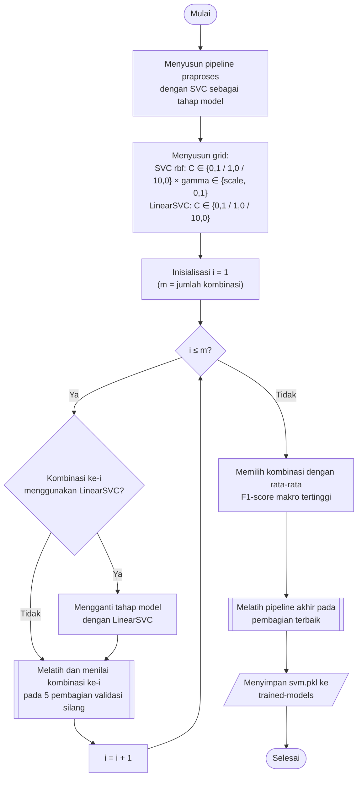

## **4.10 *Support Vector Machine* (SVM)**

*Support Vector Machine* (SVM) mencari bidang pemisah dengan margin terbesar antarkelas dan, melalui fungsi kernel, mampu memisahkan data yang tidak dapat dipisahkan secara linear (Subbab 2.4.2). SVM pada dasarnya merupakan pengklasifikasi dua kelas, sehingga klasifikasi lima belas kelas dilakukan dengan menggabungkan beberapa pengklasifikasi dua kelas. Kelemahan utama SVM adalah kompleksitas komputasi pelatihan yang tumbuh cepat terhadap jumlah sampel latih (Subbab 2.4.2), sehingga algoritma ini memiliki biaya pelatihan terbesar di antara kelima algoritma.

Ruang pencarian SVM terdiri atas dua jenis model. Jenis pertama adalah SVM dengan kernel *rbf* menggunakan `SVC` dari library `scikit-learn`, yang memetakan data ke ruang berdimensi tinggi sehingga mampu membentuk batas keputusan non-linear. Klasifikasi multikelas pada `SVC` menggunakan pendekatan *one-vs-one*, yaitu satu pengklasifikasi untuk setiap pasangan kelas. Hiperparameter yang dicari adalah parameter regularisasi *C* dengan nilai 0,1, 1,0, dan 10,0, yang mengatur keseimbangan antara lebar margin dan toleransi terhadap kesalahan klasifikasi, serta parameter *gamma* dengan nilai *scale* dan 0,1, yang mengatur jangkauan pengaruh satu sampel latih pada kernel. Nilai *scale* menetapkan *gamma* secara otomatis dari jumlah fitur dan varians data. Jenis ini membentuk 3 × 2 = 6 kombinasi.

Jenis kedua adalah SVM linear menggunakan `LinearSVC` dengan fungsi *loss hinge*, yang membentuk batas keputusan berupa bidang datar pada ruang komponen utama. SVM linear diimplementasikan dengan `LinearSVC`, bukan dengan `SVC` berkernel *linear*, karena `LinearSVC` menggunakan pustaka *liblinear* yang biaya pelatihannya tumbuh secara linear terhadap jumlah sampel, sedangkan `SVC` berkernel *linear* memiliki biaya yang sama besarnya dengan kernel *rbf*. Klasifikasi multikelas pada `LinearSVC` menggunakan pendekatan *one-vs-rest*, yaitu satu pengklasifikasi untuk setiap kelas terhadap seluruh kelas lainnya. Hiperparameter yang dicari hanya parameter *C* dengan nilai 0,1, 1,0, dan 10,0, karena model linear tidak memiliki parameter *gamma*, sehingga terdapat 3 kombinasi. Pada grid, `LinearSVC` menggantikan seluruh tahap model pada *pipeline*, sehingga kedua jenis model dinilai pada data hasil praproses yang sama. Ruang pencarian dengan demikian terdiri atas 6 + 3 = 9 kombinasi.

Pengaturan lain menggunakan nilai bawaan library, yaitu toleransi konvergensi 10⁻³ dan jumlah iterasi yang tidak dibatasi pada `SVC`, serta *random state* 42 pada `LinearSVC`. Kedua jenis model dilatih tanpa estimasi peluang (*probability* = *False*), karena estimasi peluang pada SVM memerlukan validasi silang internal tambahan yang melipatgandakan biaya pelatihan. Akibatnya, prediksi SVM hanya berupa kelas tanpa tingkat kepercayaan, sehingga SVM tidak diikutsertakan pada analisis kepercayaan model (Subbab 4.16). Pelatihan `SVC` dan `LinearSVC` tidak mendukung pemrosesan paralel, sehingga setiap pelatihan berjalan pada satu inti CPU.

Prosedur pemilihan dan pembentukan model SVM dilaksanakan melalui algoritma berikut:

1. **Pembentukan *pipeline***, *Pipeline* praproses (Subbab 4.7) disusun dengan `SVC` sebagai tahap terakhir.
2. **Penyusunan grid**, Grid disusun dari dua bagian, yaitu enam kombinasi `SVC` berkernel *rbf* dengan nilai *C* dan *gamma*, serta tiga kombinasi `LinearSVC` dengan nilai *C*, sehingga terdapat 9 kombinasi, atau 27 kombinasi apabila ditambah jumlah tetangga SMOTE.
3. **Pencarian hiperparameter**, Setiap kombinasi dinilai pada lima pembagian validasi silang sesuai Subbab 4.8, dan hasilnya disimpan pada folder `scikit-learn/grid-search`.
4. **Pembentukan model akhir**, *Pipeline* dengan kombinasi terbaik, baik `SVC` maupun `LinearSVC`, dilatih pada bagian latih pembagian terbaik, dinilai pada bagian validasinya, dan disimpan pada folder `scikit-learn/trained-models` dengan nama `svm.pkl`.

Waktu pelatihan `SVC` tumbuh sedikitnya secara kuadratik terhadap jumlah sampel, dan setiap pelatihan pada validasi silang menggunakan sekitar 7,33 juta sampel. Oleh karena itu, pencarian SVM membutuhkan waktu yang jauh lebih lama dibandingkan keempat algoritma lainnya, terutama pada pengaturan dengan SMOTE yang memperbesar data latih (Subbab 4.7.4). Waktu prediksi `SVC` juga bergantung pada jumlah *support vector*, yaitu sampel latih yang menentukan bidang pemisah, sehingga biaya prediksi SVM dicatat dan dibandingkan pada analisis biaya prediksi (Subbab 4.16).
