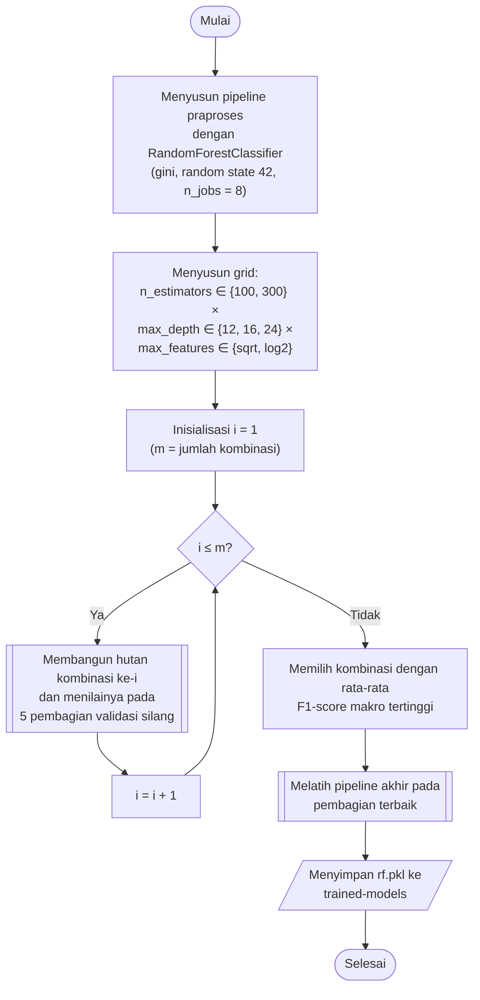

## **4.11 *Random Forest* (RF)**

*Random Forest* (RF) membangun sejumlah pohon keputusan yang masing-masing dilatih pada sampel acak data latih dengan pengembalian (*bootstrap*) dan hanya mempertimbangkan sebagian fitur yang dipilih secara acak pada setiap percabangan, kemudian menggabungkan prediksi seluruh pohon (Subbab 2.4.5). Pengacakan tersebut membuat setiap pohon memiliki karakteristik yang berbeda, sehingga hasil gabungannya lebih stabil daripada satu pohon tunggal. *Random Forest* diimplementasikan menggunakan `RandomForestClassifier` dari library `scikit-learn`, dengan kriteria pemisahan *gini* dan *random state* 42.

Prediksi *Random Forest* dihasilkan dengan merata-ratakan peluang kelas dari seluruh pohon. Peluang kelas pada setiap pohon adalah proporsi kelas tersebut pada daun tempat sampel berakhir, dan kelas dengan rata-rata peluang terbesar ditetapkan sebagai prediksi. Rata-rata peluang terbesar tersebut digunakan sebagai tingkat kepercayaan model pada analisis ketahanan (Subbab 4.15).

Hiperparameter yang dicari adalah jumlah pohon, kedalaman maksimum pohon, dan jumlah fitur yang dipertimbangkan pada setiap percabangan. Jumlah pohon (*n_estimators*) bernilai 100 dan 300. Kedalaman maksimum pohon (*max_depth*) bernilai 12, 16, dan 24, yang membatasi kompleksitas setiap pohon serta ukuran model pada data latih yang berukuran jutaan baris. Jumlah fitur pada setiap percabangan (*max_features*) bernilai *sqrt* dan *log2*, yaitu akar kuadrat dan logaritma basis dua dari jumlah komponen utama. Ketiga hiperparameter membentuk 2 × 3 × 2 = 12 kombinasi.

Pembangunan pohon pada *Random Forest* bersifat independen antarpohon, sehingga pelatihan dan prediksi dijalankan secara paralel dengan delapan proses (`n_jobs = 8`). Waktu pelatihan *Random Forest* tumbuh jauh lebih landai terhadap jumlah sampel dibandingkan *Support Vector Machine*, tetapi ukuran model bertambah seiring jumlah dan kedalaman pohon. Pohon dengan kedalaman 24 dapat memiliki jutaan simpul, sehingga kombinasi dengan 300 pohon dan kedalaman 24 membutuhkan memori yang paling besar di antara seluruh kombinasi.

Prosedur pemilihan dan pembentukan model *Random Forest* dilaksanakan melalui algoritma berikut:

1. **Pembentukan *pipeline***, *Pipeline* praproses (Subbab 4.7) disusun dengan `RandomForestClassifier` sebagai tahap terakhir, dengan *random state* 42 dan delapan proses paralel.
2. **Penyusunan grid**, Seluruh kombinasi jumlah pohon, kedalaman maksimum, dan jumlah fitur per percabangan disusun sebagai hasil kali kartesian, sehingga terdapat 12 kombinasi, atau 36 kombinasi apabila ditambah jumlah tetangga SMOTE.
3. **Pencarian hiperparameter**, Setiap kombinasi dinilai pada lima pembagian validasi silang sesuai Subbab 4.8, dan hasilnya disimpan pada folder `scikit-learn/grid-search`.
4. **Pembentukan model akhir**, *Pipeline* dengan kombinasi terbaik dilatih pada bagian latih pembagian terbaik, dinilai pada bagian validasinya, dan disimpan pada folder `scikit-learn/trained-models` dengan nama `rf.pkl`.

Sebagai algoritma berbasis pohon, *Random Forest* tidak memerlukan standardisasi fitur karena percabangan pohon hanya bergantung pada urutan nilai, bukan pada skalanya. Algoritma ini tetap dilatih pada data hasil *pipeline* praproses yang sama dengan keempat algoritma lainnya, sehingga seluruh algoritma menerima masukan yang identik dan perbedaan ketahanannya dapat dikaitkan dengan karakteristik algoritma (Subbab 4.8).
