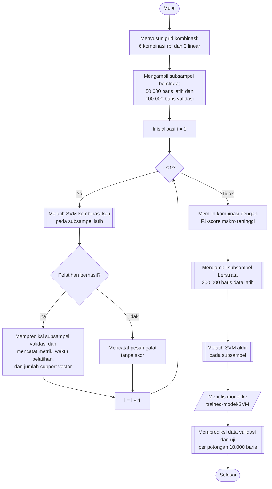

## **4.11 *Support Vector Machine* (SVM)**

*Support Vector Machine* (SVM) mencari bidang pemisah dengan margin terbesar antarkelas dan, melalui fungsi kernel, mampu memisahkan data yang tidak dapat dipisahkan secara linear (Subbab 2.4.2). Kelemahan utama SVM adalah kompleksitas komputasi yang tumbuh cepat terhadap jumlah sampel latih (Subbab 2.4.2), sehingga kelemahan ini membatasi rancangan pelatihan pada algoritma ini dibandingkan keempat algoritma lainnya.

Hiperparameter yang dicari adalah jenis kernel, parameter regularisasi *C*, dan parameter *gamma*. Kernel yang dibandingkan adalah *rbf*, yang memetakan data ke ruang berdimensi tinggi sehingga mampu membentuk batas keputusan non-linear, dan *linear*, yang membentuk batas keputusan berupa bidang datar pada ruang fitur asal. Parameter *C* bernilai 0,1, 1,0, dan 10,0, dan mengatur keseimbangan antara lebar margin dan toleransi terhadap kesalahan klasifikasi pada data latih. Parameter *gamma* bernilai *scale* dan 0,1, dan mengatur jangkauan pengaruh satu sampel latih pada kernel *rbf*, dengan nilai *scale* menetapkan *gamma* secara otomatis dari jumlah fitur dan varians data. Kernel *linear* tidak memiliki parameter *gamma*, sehingga untuk setiap nilai *C* kernel ini hanya dipasangkan satu kali dengan nilai *scale*. Ruang pencarian dengan demikian terdiri atas 3 × 2 = 6 kombinasi kernel *rbf* dan 3 kombinasi kernel *linear*, yaitu 9 kombinasi.

Pencarian dilakukan pada 50.000 baris data latih dan 100.000 baris data validasi hasil subsampel berstrata (Subbab 4.9). Model akhir dilatih pada 300.000 baris subsampel berstrata dari data latih hasil SMOTE, bukan pada seluruh data, karena waktu dan memori pelatihan SVM meningkat jauh lebih cepat daripada jumlah sampel. Ukuran ini ditetapkan sebagai kompromi antara cakupan data dan biaya pelatihan, yaitu enam kali lebih besar daripada subsampel pencarian namun hanya sekitar 3% dari seluruh data latih. Pada seluruh pelatihan, ukuran *kernel cache* ditetapkan 2.048 MB, toleransi konvergensi 10⁻³, dan jumlah iterasi tidak dibatasi (*max_iter* = −1).

Sebuah kombinasi dapat gagal dijalankan karena galat pada pustaka yang digunakan. Kombinasi yang gagal dicatat bersama pesan galatnya dan dilewati sehingga pencarian tetap berlanjut. Kombinasi tersebut tidak diikutsertakan dalam pemeringkatan karena baris yang tidak memiliki skor menandakan kombinasi yang tidak pernah dinilai, bukan kombinasi yang berskor buruk. Pada pencarian ini, dua kombinasi dengan *C* = 10,0, yaitu kernel *rbf* dengan *gamma* = *scale* dan kernel *linear*, mengalami galat *runtime* pada pustaka *cuML* sehingga tidak dinilai. Untuk setiap kombinasi yang berhasil dijalankan, dicatat pula waktu pelatihan dan jumlah *support vector*, yaitu sampel latih yang menentukan bidang pemisah, karena jumlah tersebut menentukan biaya prediksi. Kombinasi dengan F1-*score* rata-rata makro tertinggi adalah kernel *rbf* dengan *C* = 10,0 dan *gamma* = 0,1, yang selanjutnya digunakan untuk melatih model akhir.

Prosedur pemilihan dan pelatihan model SVM dilaksanakan melalui algoritma berikut:

1. **Menyusun grid kombinasi.** Kombinasi hiperparameter disusun sebagai pasangan (kernel, *C*, *gamma*), dengan kernel *rbf* dipasangkan dengan setiap nilai *gamma* dan kernel *linear* hanya dengan nilai *scale*, sehingga terdapat sembilan kombinasi.

2. **Menyiapkan subsampel pencarian.** Subsampel berstrata sebanyak 50.000 baris data latih dan 100.000 baris data validasi diambil sesuai Subbab 4.9.

3. **Melatih SVM pada subsampel latih.** Untuk setiap kombinasi, objek *SVC* dibentuk dengan kernel, *C*, dan *gamma* yang bersangkutan, *cache_size* 2.048, *tol* 10⁻³, dan *max_iter* −1, kemudian dilatih pada subsampel latih.

4. **Menilai kombinasi.** Subsampel validasi diprediksi menggunakan model hasil pelatihan, kemudian akurasi serta presisi, *recall*, dan F1-*score* rata-rata makro dicatat bersama waktu pelatihan dan jumlah *support vector*. Apabila pelatihan gagal, pesan galat dicatat tanpa skor dan kombinasi berikutnya diproses.

5. **Memilih konfigurasi terbaik.** Hasil kombinasi yang dinilai diurutkan menurut F1-*score* rata-rata makro dan disimpan pada berkas *hyperparameter-search/svm-search.csv*, kemudian kombinasi teratas dipilih.

6. **Melatih model akhir.** Subsampel berstrata sebanyak 300.000 baris diambil dari data latih hasil SMOTE, kemudian objek *SVC* dengan konfigurasi terpilih dilatih pada subsampel tersebut.

7. **Menyimpan model.** Model disimpan pada folder *trained-model/SVM* dengan nama yang memuat hiperparameternya.

8. **Memprediksi data validasi dan data uji.** Model dimuat kembali, kemudian prediksi dilaksanakan per potongan 10.000 baris dan disimpan sebagaimana diuraikan pada Subbab 4.9.

Penggunaan subsampel pada pelatihan akhir merupakan keterbatasan rancangan yang perlu diperhatikan dalam membandingkan SVM dengan keempat algoritma lainnya, yang dilatih pada seluruh data latih. Kelas yang sangat langka tetap terwakili pada subsampel karena pengambilan sampel berstrata menjamin setiap kelas memiliki sedikitnya satu baris. Waktu prediksi SVM bergantung pada jumlah *support vector* pada model akhir, dan jumlah tersebut dicatat pada saat model dimuat untuk prediksi.
