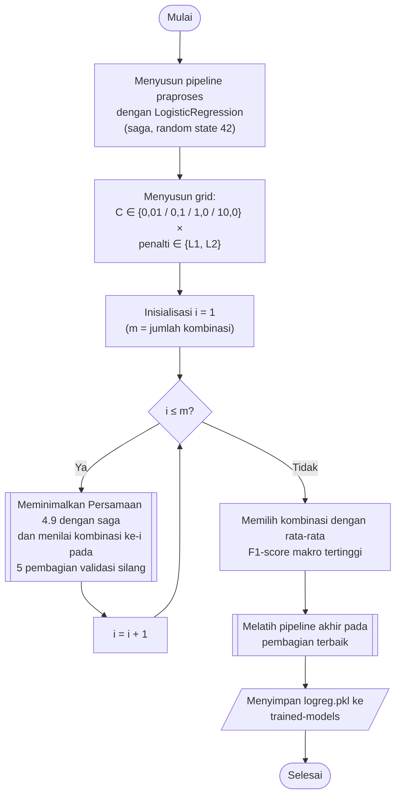

## **4.12 *Logistic Regression* (*Softmax Regression*)**

*Logistic Regression* multikelas atau *softmax regression* memodelkan peluang setiap kelas sebagai fungsi *softmax* dari kombinasi linear fitur (Persamaan 2.2), dan parameternya dipelajari dengan memaksimalkan *log-likelihood* data latih (Persamaan 2.3), sebagaimana diuraikan pada Subbab 2.4.3. Model ini diimplementasikan menggunakan `LogisticRegression` dari library `scikit-learn`. Untuk lima belas kelas, `LogisticRegression` mempelajari satu vektor bobot dan satu bias untuk setiap kelas secara bersamaan (*multinomial*), sehingga peluang seluruh kelas selalu berjumlah satu.

Untuk mencegah bobot yang terlalu besar, fungsi tujuan dilengkapi dengan regularisasi. Parameter model dipelajari dengan meminimalkan fungsi berikut.

$\min_{W,b}\ C\sum _{i=1}^{n}-\log P\left(y={y}_{i}\mid {x}_{i}\right)+R\left(W\right)$ (4.9)

Persamaan 4.9 adalah fungsi tujuan *Logistic Regression* teregularisasi, dengan $P\left(y={y}_{i}\mid {x}_{i}\right)$ adalah peluang kelas sebenarnya pada baris ke-$i$ menurut Persamaan 2.2, $W$ dan $b$ adalah bobot dan bias seluruh kelas, $C$ adalah kebalikan dari kekuatan regularisasi, dan $R\left(W\right)$ adalah penalti regularisasi. Penalti L1, yaitu jumlah nilai mutlak bobot, mendorong sebagian bobot bernilai tepat nol sehingga model hanya menggunakan sebagian komponen utama, sedangkan penalti L2, yaitu setengah jumlah kuadrat bobot, mengecilkan seluruh bobot secara merata. Nilai *C* yang kecil berarti regularisasi yang kuat.

Hiperparameter yang dicari adalah parameter *C* dengan nilai 0,01, 0,1, 1,0, dan 10,0, serta jenis penalti, yaitu L1 dan L2, sehingga terdapat 4 × 2 = 8 kombinasi. Optimasi menggunakan algoritma *saga*, yaitu varian penurunan gradien stokastik yang mendukung penalti L1 maupun L2 pada model multinomial dan cocok untuk data berjumlah besar. Pengaturan lainnya menggunakan nilai bawaan library, yaitu jumlah iterasi maksimum 100 dan toleransi konvergensi 10⁻⁴, dengan *random state* 42 untuk menjaga reprodusibilitas urutan pengambilan sampel pada *saga*. Pelatihan model multinomial berjalan pada satu inti CPU, karena pemrosesan paralel pada `LogisticRegression` hanya berlaku pada pendekatan *one-vs-rest*.

Pada prediksi, peluang setiap kelas dihitung dengan fungsi *softmax*, kelas dengan peluang terbesar ditetapkan sebagai prediksi, dan peluang terbesar tersebut digunakan sebagai tingkat kepercayaan model pada analisis ketahanan (Subbab 4.15).

Prosedur pemilihan dan pembentukan model *Logistic Regression* dilaksanakan melalui algoritma berikut:

1. **Pembentukan *pipeline***, *Pipeline* praproses (Subbab 4.7) disusun dengan `LogisticRegression` sebagai tahap terakhir, dengan optimasi *saga* dan *random state* 42.
2. **Penyusunan grid**, Seluruh kombinasi nilai *C* dan jenis penalti disusun sebagai hasil kali kartesian, sehingga terdapat 8 kombinasi, atau 24 kombinasi apabila ditambah jumlah tetangga SMOTE.
3. **Pencarian hiperparameter**, Setiap kombinasi dinilai pada lima pembagian validasi silang sesuai Subbab 4.8, dan hasilnya disimpan pada folder `scikit-learn/grid-search`.
4. **Pembentukan model akhir**, *Pipeline* dengan kombinasi terbaik dilatih pada bagian latih pembagian terbaik, dinilai pada bagian validasinya, dan disimpan pada folder `scikit-learn/trained-models` dengan nama `logreg.pkl`.

Karena model hanya mempelajari kombinasi linear dari komponen utama, batas keputusan antarkelas berupa bidang datar pada ruang komponen utama. Sifat ini membuat *Logistic Regression* menjadi model paling sederhana di antara kelima algoritma dan menjadi pembanding bagi algoritma yang mampu membentuk batas keputusan non-linear. Apabila optimasi belum konvergen dalam 100 iterasi, library menampilkan peringatan konvergensi, tetapi model tetap dinilai menggunakan bobot terakhir yang diperoleh.
