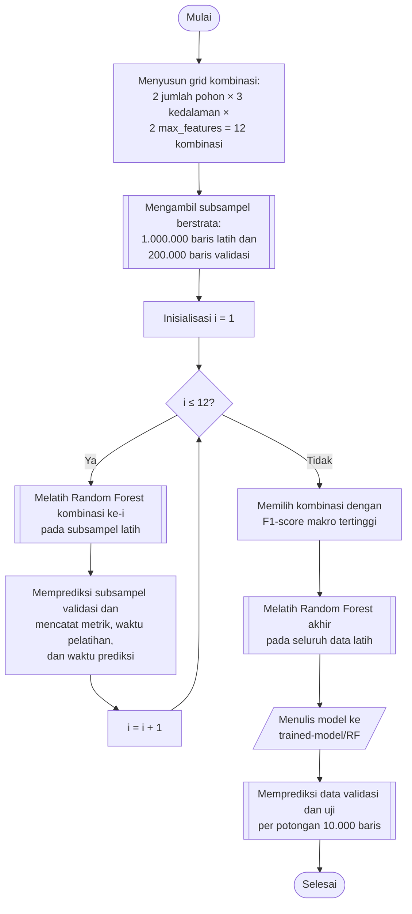

## **4.12 *Random Forest* (RF)**

*Random Forest* (RF) membangun sejumlah pohon keputusan yang masing-masing dilatih pada subset data dan subset fitur yang dipilih secara acak, kemudian menggabungkan prediksi seluruh pohon melalui pemungutan suara (Subbab 2.4.5). Pengacakan tersebut membuat setiap pohon memiliki karakteristik yang berbeda sehingga hasil gabungannya lebih stabil daripada satu pohon tunggal.

Hiperparameter yang dicari adalah jumlah pohon, kedalaman maksimum pohon, dan jumlah fitur yang dipertimbangkan pada setiap percabangan. Jumlah pohon (*n_estimators*) bernilai 100 dan 300. Kedalaman maksimum pohon (*max_depth*) bernilai 12, 16, dan 24, yang membatasi kompleksitas setiap pohon serta penggunaan memori pada data latih yang berukuran lebih dari 11 juta baris. Jumlah fitur pada setiap percabangan (*max_features*) bernilai *sqrt* dan *log2*, yaitu akar kuadrat dan logaritma basis dua dari jumlah fitur. Ketiga hiperparameter membentuk 2 × 3 × 2 = 12 kombinasi.

Pengaturan yang tetap untuk seluruh kombinasi adalah kriteria pemisahan *gini* dan *random state* 42. Pada implementasi GPU dari pustaka *cuML* ditetapkan pula jumlah *bin* histogram sebanyak 128, yang membatasi kandidat ambang pemisahan pada setiap fitur, dan jumlah *CUDA stream* sebanyak 4, yang memungkinkan beberapa pohon dibangun secara bersamaan. Pada implementasi CPU dari pustaka *scikit-learn*, kriteria pemisahan dan *random state* yang sama digunakan dengan seluruh inti CPU (*n_jobs* = −1).

Pencarian dilakukan pada 1.000.000 baris data latih dan 200.000 baris data validasi hasil subsampel berstrata (Subbab 4.9). Berbeda dari KNN dan SVM, model akhir dilatih pada seluruh data latih hasil SMOTE tanpa subsampel, karena biaya pelatihan *Random Forest* meningkat jauh lebih landai terhadap jumlah sampel dibandingkan SVM. Kombinasi dengan F1-*score* rata-rata makro tertinggi pada pencarian adalah 300 pohon, kedalaman maksimum 24, dan *max_features* *log2*, yang selanjutnya digunakan untuk melatih model akhir. Waktu pelatihan dan waktu prediksi setiap kombinasi dicatat sebagai bagian dari perbandingan biaya komputasi antaralgoritma (Subbab 4.9).

Prosedur pemilihan dan pelatihan model *Random Forest* dilaksanakan melalui algoritma berikut:

1. **Menyusun grid kombinasi.** Seluruh kombinasi jumlah pohon, kedalaman maksimum, dan jumlah fitur per percabangan disusun sebagai hasil kali kartesian, sehingga terdapat 12 kombinasi.

2. **Menyiapkan subsampel pencarian.** Subsampel berstrata sebanyak 1.000.000 baris data latih dan 200.000 baris data validasi diambil sesuai Subbab 4.9.

3. **Melatih hutan pada subsampel latih.** Untuk setiap kombinasi, objek *RandomForestClassifier* dibentuk dengan jumlah pohon, kedalaman maksimum, dan *max_features* yang bersangkutan, kemudian dilatih pada subsampel latih.

4. **Menilai kombinasi.** Subsampel validasi diprediksi menggunakan model hasil pelatihan, kemudian akurasi serta presisi, *recall*, dan F1-*score* rata-rata makro dicatat bersama waktu pelatihan dan waktu prediksi. Kombinasi yang gagal dijalankan dicatat bersama pesan galatnya dan dilewati, sebagaimana diuraikan pada Subbab 4.9.

5. **Memilih konfigurasi terbaik.** Hasil diurutkan menurut F1-*score* rata-rata makro dan disimpan pada berkas *hyperparameter-search/rf-search.csv*, kemudian kombinasi teratas dipilih.

6. **Melatih model akhir.** Objek *RandomForestClassifier* dengan konfigurasi terpilih dilatih pada seluruh data latih hasil SMOTE.

7. **Menyimpan model.** Model disimpan pada folder *trained-model/RF* dengan nama yang memuat hiperparameternya.

8. **Memprediksi data validasi dan data uji.** Model dimuat kembali, kemudian prediksi dilaksanakan per potongan 10.000 baris dan disimpan sebagaimana diuraikan pada Subbab 4.9.

Kriteria pemisahan dan seluruh pengaturan implementasi yang tidak dicari, yaitu jumlah *bin* dan jumlah *CUDA stream*, ditetapkan tetap agar seluruh kombinasi dibandingkan pada kondisi yang sama. Mengingat *Random Forest* merupakan algoritma berbasis pohon, algoritma ini tidak memerlukan penskalaan fitur, tetapi tetap dilatih pada data hasil proyeksi IPCA yang sama dengan keempat algoritma lainnya (Subbab 4.9).
