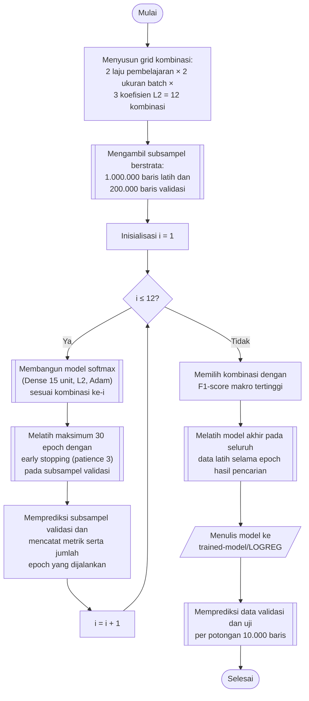

## **4.13 *Logistic Regression* (*Softmax Regression*)**

*Logistic Regression* multikelas atau *softmax regression* memodelkan peluang setiap kelas sebagai fungsi *softmax* dari kombinasi linear fitur (Persamaan 2.2), dan parameternya dipelajari dengan memaksimalkan *log-likelihood* data latih (Persamaan 2.3), sebagaimana diuraikan pada Subbab 2.4.3. Model ini diimplementasikan menggunakan pustaka *Keras* sebagai jaringan berlapis tunggal (*Sequential*) yang hanya berisi satu lapisan *Dense* dengan 15 unit keluaran, yaitu satu unit untuk setiap kelas, dan fungsi aktivasi *softmax*. Dengan rancangan ini, jumlah parameter model sama dengan jumlah fitur dikalikan 15 ditambah 15 bias. Penggunaan *Keras* memungkinkan pelatihan secara bertahap dengan *mini-batch* pada lebih dari 11 juta baris serta pemanfaatan GPU.

Fungsi *loss* yang digunakan adalah *sparse categorical cross-entropy*, yang ekuivalen dengan negatif *log-likelihood* pada Persamaan 2.3 dan menerima label berupa bilangan bulat (Subbab 4.5). Optimasi menggunakan algoritma *Adam*. Regularisasi L2 pada bobot dengan koefisien λ diterapkan apabila λ lebih besar dari nol untuk mencegah bobot yang terlalu besar. *Random seed* ditetapkan 42 untuk menjaga reprodusibilitas inisialisasi bobot dan pengacakan data.

Hiperparameter yang dicari adalah laju pembelajaran (*learning rate*), ukuran *batch*, dan koefisien regularisasi L2. Laju pembelajaran bernilai 0,01 dan 0,001, ukuran *batch* bernilai 2.048 dan 8.192, dan koefisien L2 bernilai 0, 0,00001, dan 0,0001. Ketiga hiperparameter membentuk 2 × 2 × 3 = 12 kombinasi. Setiap kombinasi dilatih pada 1.000.000 baris subsampel latih selama maksimum 30 *epoch* dengan penghentian dini (*early stopping*) yang memantau *validation loss* pada subsampel validasi sebanyak 200.000 baris, dengan kesabaran (*patience*) 3 *epoch* dan pemulihan bobot terbaik (*restore_best_weights*). Jumlah *epoch* yang benar-benar dijalankan dicatat sebagai *epochs_run* untuk setiap kombinasi.

Kombinasi dengan F1-*score* rata-rata makro tertinggi adalah laju pembelajaran 0,01, ukuran *batch* 2.048, dan koefisien L2 0,0001, dengan pelatihan yang berhenti pada 22 *epoch*. Model akhir dilatih pada seluruh data latih hasil SMOTE dengan konfigurasi tersebut selama tepat 22 *epoch*, yaitu jumlah *epoch* yang dijalankan pada pencarian, tanpa data validasi dan tanpa penghentian dini. Pelatihan akhir tidak melibatkan data validasi karena jumlah *epoch* telah ditetapkan dari pencarian. Pada prediksi, kelas ditetapkan sebagai kelas dengan peluang *softmax* terbesar, dan peluang dihitung per *batch* sebanyak 8.192 baris di dalam setiap potongan prediksi.

Prosedur pemilihan dan pelatihan model *Logistic Regression* dilaksanakan melalui algoritma berikut:

1. **Menyusun grid kombinasi.** Seluruh kombinasi laju pembelajaran, ukuran *batch*, dan koefisien L2 disusun sebagai hasil kali kartesian, sehingga terdapat 12 kombinasi.

2. **Menyiapkan subsampel pencarian.** Subsampel berstrata sebanyak 1.000.000 baris data latih dan 200.000 baris data validasi diambil sesuai Subbab 4.9.

3. **Membangun model *softmax*.** Untuk setiap kombinasi, model *Sequential* dengan satu lapisan *Dense* 15 unit beraktivasi *softmax* dibentuk dengan regularisasi L2 sesuai koefisien kombinasi, dikompilasi dengan optimasi *Adam* pada laju pembelajaran kombinasi tersebut dan *loss* *sparse categorical cross-entropy*, dengan *random seed* 42.

4. **Melatih model dengan penghentian dini.** Model dilatih pada subsampel latih dengan ukuran *batch* kombinasi tersebut selama maksimum 30 *epoch*. Pelatihan dihentikan apabila *validation loss* pada subsampel validasi tidak membaik selama 3 *epoch* berturut-turut, dan bobot dengan *validation loss* terbaik dipulihkan.

5. **Menilai kombinasi.** Subsampel validasi diprediksi, kemudian akurasi serta presisi, *recall*, dan F1-*score* rata-rata makro dicatat bersama jumlah *epoch* yang dijalankan serta waktu pelatihan dan waktu prediksi.

6. **Memilih konfigurasi terbaik.** Hasil diurutkan menurut F1-*score* rata-rata makro dan disimpan pada berkas *hyperparameter-search/logreg-search.csv*, kemudian kombinasi teratas dan jumlah *epoch*-nya dipilih.

7. **Melatih model akhir.** Model dengan konfigurasi terpilih dilatih pada seluruh data latih hasil SMOTE selama sejumlah *epoch* hasil pencarian, tanpa data validasi dan tanpa penghentian dini.

8. **Menyimpan model.** Model disimpan dalam format *.keras* pada folder *trained-model/LOGREG* dengan nama yang memuat hiperparameternya.

9. **Memprediksi data validasi dan data uji.** Model dimuat kembali, kemudian prediksi dilaksanakan per potongan 10.000 baris dengan kelas ditetapkan menurut peluang *softmax* terbesar, dan hasilnya disimpan sebagaimana diuraikan pada Subbab 4.9.

Karena model hanya memiliki satu lapisan tanpa aktivasi non-linear pada fitur, batas keputusan antarkelas berupa bidang datar pada ruang komponen utama. Sifat ini membuat *Logistic Regression* menjadi model paling sederhana di antara kelima algoritma, dan menjadi pembanding bagi algoritma yang mampu membentuk batas keputusan non-linear. Pada tahap pencarian, data validasi digunakan baik untuk penghentian dini maupun untuk pemilihan kombinasi, sedangkan data uji tidak dilibatkan pada tahap apa pun dari pemilihan hiperparameter.
