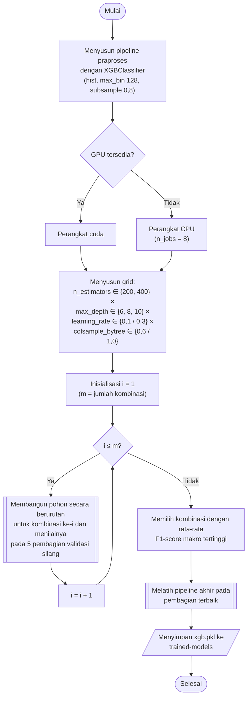

## **4.13 *XGBoost***

*Extreme Gradient Boosting* (*XGBoost*) membangun pohon keputusan secara berurutan, dengan setiap pohon baru dilatih untuk memperbaiki kesalahan (*residual*) dari ensambel pohon sebelumnya, dan dilengkapi regularisasi, *shrinkage*, serta *subsampling* untuk mengurangi risiko *overfitting* (Subbab 2.4.4). *XGBoost* diimplementasikan menggunakan `XGBClassifier` dari library `xgboost`, yang memiliki antarmuka yang sama dengan `scikit-learn` sehingga dapat ditempatkan sebagai tahap terakhir pada *pipeline* praproses (Subbab 4.7). Untuk klasifikasi lima belas kelas digunakan fungsi objektif *multi:softprob*, yang membangun satu pohon untuk setiap kelas pada setiap putaran (*boosting round*) dan menghasilkan peluang setiap kelas melalui fungsi *softmax*.

Pengaturan yang tetap untuk seluruh kombinasi adalah sebagai berikut. Pohon dibangun dengan metode berbasis histogram (*hist*) dengan 128 *bin* (*max_bin*), yang mempercepat pencarian titik pemisahan pada data yang besar. Setiap pohon dibangun dari 80% baris data latih yang dipilih secara acak (*subsample* = 0,8), dan *random state* ditetapkan 42. Pelatihan dijalankan pada GPU (`cuda`) apabila tersedia dan pada CPU dengan delapan proses paralel apabila tidak.

Hiperparameter yang dicari adalah jumlah pohon, kedalaman maksimum pohon, laju pembelajaran, dan proporsi fitur yang dipilih untuk setiap pohon. Jumlah pohon (*n_estimators*) bernilai 200 dan 400, kedalaman maksimum (*max_depth*) bernilai 6, 8, dan 10, laju pembelajaran (*learning_rate*) bernilai 0,1 dan 0,3, dan proporsi fitur per pohon (*colsample_bytree*) bernilai 0,6 dan 1,0. Keempat hiperparameter membentuk 2 × 3 × 2 × 2 = 24 kombinasi. Jumlah pohon dijadikan hiperparameter yang dicari, bukan ditentukan melalui penghentian dini (*early stopping*), karena `GridSearchCV` tidak menyediakan data validasi di dalam proses pelatihan setiap kombinasi. Penggunaan data validasi dari luar untuk penghentian dini akan membuat bagian validasi ikut menentukan model, sehingga skor validasinya tidak lagi independen.

Pada prediksi, peluang setiap kelas dihitung dari jumlah keluaran seluruh pohon melalui fungsi *softmax*, kelas dengan peluang terbesar ditetapkan sebagai prediksi, dan peluang terbesar tersebut digunakan sebagai tingkat kepercayaan model pada analisis ketahanan (Subbab 4.15).

Prosedur pemilihan dan pembentukan model *XGBoost* dilaksanakan melalui algoritma berikut:

1. **Pembentukan *pipeline***, *Pipeline* praproses (Subbab 4.7) disusun dengan `XGBClassifier` sebagai tahap terakhir, dengan metode *hist*, 128 *bin*, *subsample* 0,8, *random state* 42, serta perangkat `cuda` atau CPU.
2. **Penyusunan grid**, Seluruh kombinasi jumlah pohon, kedalaman maksimum, laju pembelajaran, dan proporsi fitur per pohon disusun sebagai hasil kali kartesian, sehingga terdapat 24 kombinasi, atau 72 kombinasi apabila ditambah jumlah tetangga SMOTE.
3. **Pencarian hiperparameter**, Setiap kombinasi dinilai pada lima pembagian validasi silang sesuai Subbab 4.8, dan hasilnya disimpan pada folder `scikit-learn/grid-search`.
4. **Pembentukan model akhir**, *Pipeline* dengan kombinasi terbaik dilatih pada bagian latih pembagian terbaik, dinilai pada bagian validasinya, dan disimpan pada folder `scikit-learn/trained-models` dengan nama `xgb.pkl`.

Sama seperti *Random Forest*, *XGBoost* merupakan algoritma berbasis pohon yang tidak memerlukan standardisasi fitur, tetapi tetap dilatih pada data hasil *pipeline* praproses yang sama dengan keempat algoritma lainnya (Subbab 4.8). Karena satu putaran membangun lima belas pohon, model dengan 400 putaran memuat 6.000 pohon, sehingga jumlah pohon dan kedalaman maksimum menentukan waktu pelatihan maupun waktu prediksi model ini.
