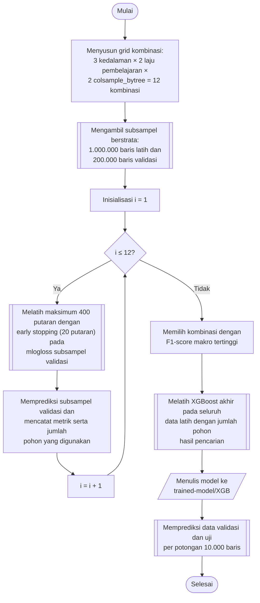

## **4.14 *XGBoost***

*Extreme Gradient Boosting* (*XGBoost*) membangun pohon keputusan secara berurutan, dengan setiap pohon baru dilatih untuk memperbaiki kesalahan (*residual*) dari ensambel pohon sebelumnya, dan dilengkapi regularisasi, *shrinkage*, serta *subsampling* untuk mengurangi risiko *overfitting* (Subbab 2.4.4). Untuk klasifikasi 15 kelas digunakan fungsi objektif *multi:softprob*, yang menghasilkan peluang untuk setiap kelas, dan *multi-class log-loss* (*mlogloss*) sebagai metrik evaluasi internal.

Pengaturan yang tetap untuk seluruh kombinasi adalah sebagai berikut. Pohon dibangun dengan metode berbasis histogram (*hist*) dengan 128 *bin* (*max_bin*), yang mempercepat pencarian titik pemisahan pada data yang besar. Perangkat komputasi adalah *cuda* (GPU) apabila tersedia dan *cpu* apabila tidak. Setiap pohon dibangun dari 80% baris data yang dipilih secara acak (*subsample* = 0,8), bobot minimum pada setiap simpul anak (*min_child_weight*) bernilai 1,0, dan *random state* ditetapkan 42.

Hiperparameter yang dicari adalah kedalaman maksimum pohon, laju pembelajaran, dan proporsi fitur yang dipilih untuk setiap pohon. Kedalaman maksimum (*max_depth*) bernilai 6, 8, dan 10, laju pembelajaran (*learning_rate*) bernilai 0,1 dan 0,3, dan proporsi fitur per pohon (*colsample_bytree*) bernilai 0,6 dan 1,0. Ketiga hiperparameter membentuk 3 × 2 × 2 = 12 kombinasi. Jumlah pohon tidak dijadikan hiperparameter yang dicari, tetapi ditentukan secara otomatis melalui penghentian dini: pelatihan dijalankan hingga maksimum 400 putaran (*boosting round*) dan dihentikan apabila *mlogloss* pada subsampel validasi tidak membaik selama 20 putaran berturut-turut. Jumlah pohon yang digunakan (*n_trees_used*), yaitu putaran terbaik ditambah satu, dicatat untuk setiap kombinasi. Pencarian dilakukan pada 1.000.000 baris data latih dan 200.000 baris data validasi hasil subsampel berstrata (Subbab 4.9).

Kombinasi dengan F1-*score* rata-rata makro tertinggi adalah kedalaman maksimum 6, laju pembelajaran 0,1, dan *colsample_bytree* 0,6 dengan 343 pohon. Model akhir dilatih pada seluruh data latih hasil SMOTE dengan konfigurasi tersebut dan jumlah pohon yang sama, yaitu 343, tanpa data validasi dan tanpa penghentian dini. Model kemudian disimpan dalam format JSON asli *XGBoost*. Pada prediksi, fitur dikonversi ke larik GPU (*CuPy*) apabila GPU digunakan, sehingga komputasi prediksi berlangsung sepenuhnya pada GPU.

Prosedur pemilihan dan pelatihan model *XGBoost* dilaksanakan melalui algoritma berikut:

1. **Menyusun grid kombinasi.** Seluruh kombinasi kedalaman maksimum, laju pembelajaran, dan proporsi fitur per pohon disusun sebagai hasil kali kartesian, sehingga terdapat 12 kombinasi.

2. **Menyiapkan subsampel pencarian.** Subsampel berstrata sebanyak 1.000.000 baris data latih dan 200.000 baris data validasi diambil sesuai Subbab 4.9.

3. **Melatih *booster* dengan penghentian dini.** Untuk setiap kombinasi, objek *XGBClassifier* dibentuk dengan pengaturan tetap di atas dan dilatih pada subsampel latih hingga maksimum 400 putaran. Pelatihan dihentikan apabila *mlogloss* pada subsampel validasi tidak membaik selama 20 putaran berturut-turut.

4. **Menilai kombinasi.** Subsampel validasi diprediksi menggunakan model hasil pelatihan, kemudian akurasi serta presisi, *recall*, dan F1-*score* rata-rata makro dicatat bersama jumlah pohon yang digunakan serta waktu pelatihan dan waktu prediksi.

5. **Memilih konfigurasi terbaik.** Hasil diurutkan menurut F1-*score* rata-rata makro dan disimpan pada berkas *hyperparameter-search/xgb-search.csv*, kemudian kombinasi teratas dan jumlah pohonnya dipilih.

6. **Melatih model akhir.** Objek *XGBClassifier* dengan konfigurasi terpilih dan jumlah pohon hasil pencarian dilatih pada seluruh data latih hasil SMOTE.

7. **Menyimpan model.** Model disimpan dalam format JSON pada folder *trained-model/XGB* dengan nama yang memuat hiperparameternya.

8. **Memprediksi data validasi dan data uji.** Model dimuat kembali, kemudian prediksi dilaksanakan per potongan 10.000 baris dan disimpan sebagaimana diuraikan pada Subbab 4.9.

Penghentian dini pada pencarian menggunakan data validasi, sehingga jumlah pohon pada setiap kombinasi ditentukan tanpa melibatkan data uji. Sama seperti *Random Forest*, *XGBoost* merupakan algoritma berbasis pohon yang tidak memerlukan penskalaan fitur, tetapi tetap dilatih pada data hasil proyeksi IPCA yang sama dengan keempat algoritma lainnya (Subbab 4.9).
