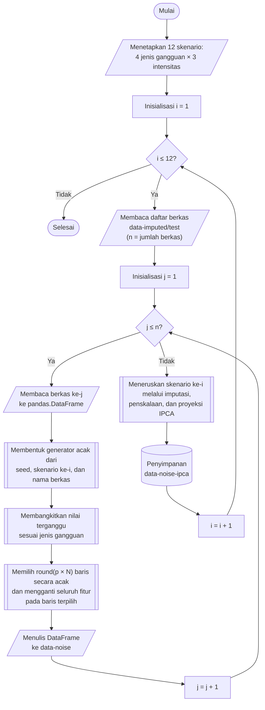

## **4.15 Simulasi Injeksi *Feature Noise* pada Data Uji**

Tujuan penelitian ini adalah mengukur ketahanan kelima model terhadap data yang tidak ideal. Oleh karena itu, model dilatih pada data bersih (Subbab 4.9), kemudian gangguan disisipkan secara terkontrol hanya pada data uji, sejalan dengan pendekatan injeksi *noise* pada tahap pengujian yang dijelaskan pada Subbab 2.7. Data latih dan data validasi tidak diubah, dan model yang diuji adalah model akhir yang sama dengan yang dievaluasi pada data bersih, tanpa pelatihan ulang. Rancangan ini memenuhi kebutuhan simulasi *feature noise* yang terkontrol dan bertingkat pada Subbab 3.3.2.

Gangguan yang disimulasikan terdiri atas empat jenis. Tiga jenis pertama adalah *feature noise* pada Subbab 2.7, yaitu *gaussian noise*, *uniform noise*, dan *multiplicative noise*. Jenis keempat adalah data tidak lengkap (*missing*), yang ditambahkan karena praktisi keamanan siber pada Subbab 3.1 mencatat bahwa data tidak lengkap lebih sering dijumpai pada lalu lintas jaringan operasional dibandingkan *noise* murni. Setiap jenis gangguan diterapkan pada tiga tingkat intensitas, yaitu 10%, 20%, dan 30%, sesuai Subbab 2.9, sehingga terdapat 4 × 3 = 12 skenario. Setiap skenario dinamai dengan format jenis dan intensitas, misalnya *gaussian-20* untuk *gaussian noise* dengan intensitas 20%.

Intensitas menyatakan persentase baris data uji yang terganggu, bukan besar gangguannya. Pada skenario *gaussian-20*, satu dari lima baris data uji diganggu, sedangkan seberapa besar baris tersebut diganggu ditetapkan oleh parameter besaran gangguan yang bernilai sama pada intensitas 10%, 20%, dan 30%. Pada baris yang terpilih, seluruh 78 fitur diganggu. Pemisahan antara jumlah baris yang terganggu dan besar gangguan dilakukan agar pengaruh peningkatan intensitas dapat dikaitkan semata-mata dengan bertambahnya baris yang terganggu, dan agar analisis pada Subbab 4.17 dapat memisahkan baris yang terganggu dari baris yang tidak terganggu. Pada setiap berkas, jumlah baris yang terganggu tepat sebanyak pembulatan hasil kali intensitas dengan jumlah baris berkas, yang dipilih secara acak tanpa pengembalian, sehingga persentase baris terganggu sama dengan intensitas dan tidak berfluktuasi seperti pada pemilihan acak per baris. Rancangan juga menyediakan cakupan per sel (*cell*), yang memilih sel individual dan bukan seluruh baris, tetapi cakupan ini tidak digunakan dalam penelitian ini.

Besar gangguan ditetapkan relatif terhadap variabilitas alami setiap fitur, yaitu simpangan baku ${\sigma }_{j}$ fitur ke-$j$ pada data latih yang dipelajari pada Subbab 4.6. Penetapan relatif ini diperlukan karena fitur memiliki satuan dan skala yang sangat berbeda (Subbab 4.6). Gangguan dengan besar mutlak yang sama pada seluruh fitur akan menghancurkan fitur berskala kecil dan hampir tidak memengaruhi fitur berskala besar. Dengan $x_{ij}$ adalah nilai fitur ke-$j$ pada baris ke-$i$ dan $x_{ij}^{\prime }$ adalah nilai setelah diganggu, tiga jenis pertama dirumuskan sesuai Persamaan 2.4 hingga 2.7 pada Subbab 2.7 sebagai berikut.

$x_{ij}^{\prime }=x_{ij}+{\eta }_{ij},\ \ {\eta }_{ij}\sim \mathcal{N}\left(0,{\left({m}_{g}{\sigma }_{j}\right)}^{2}\right)$ (4.5)

$x_{ij}^{\prime }=x_{ij}+{\eta }_{ij},\ \ {\eta }_{ij}\sim U\left(-{a}_{j},{a}_{j}\right),\ \ {a}_{j}={m}_{u}{\sigma }_{j}\sqrt{3}$ (4.6)

$x_{ij}^{\prime }=x_{ij}\cdot {\eta }_{ij},\ \ {\eta }_{ij}\sim \mathcal{N}\left(1,{s}^{2}\right)$ (4.7)

Ketiga persamaan tersebut berlaku pada seluruh fitur baris yang terpilih, sedangkan nilai pada baris yang tidak terpilih tidak berubah ($x_{ij}^{\prime }=x_{ij}$). Persamaan 4.5 adalah *gaussian noise* yang bersifat aditif dengan rata-rata nol sehingga tidak memperkenalkan bias sistematis, dan simpangan bakunya sebesar ${m}_{g}{\sigma }_{j}$ dengan ${m}_{g}$ = 1,0. Persamaan 4.6 adalah *uniform noise* yang juga bersifat aditif dengan rentang simetris $-{a}_{j}$ hingga ${a}_{j}$. Faktor $\sqrt{3}$ pada ${a}_{j}$ menyamakan varians *uniform noise*, yaitu ${a}_{j}^{2}/3$, dengan varians *gaussian noise* pada Persamaan 4.5, sehingga kedua jenis ini berbeda pada bentuk distribusi gangguannya dan tidak pada dayanya, dengan ${m}_{u}$ = 1,0. Persamaan 4.7 adalah *multiplicative noise*, dengan faktor pengali ${\eta }_{ij}$ berdistribusi normal dengan rata-rata satu dan simpangan baku *s* = 0,5, sehingga rata-rata nilai tidak berubah dan setiap nilai terdistorsi secara proporsional dengan simpangan baku 50% dari nilai aslinya. Karena berupa perkalian, nilai nol tidak berubah oleh *multiplicative noise*. Jenis keempat, yaitu data tidak lengkap, dilaksanakan dengan mengosongkan nilai fitur menjadi *NaN*, yang selanjutnya diisi dengan median data latih menggunakan pengimputasi yang sama dengan Subbab 4.4. Ringkasan jenis gangguan, parameter, dan kondisi nyata yang direpresentasikan disajikan pada Tabel 4.2.

Tabel 4.2 Jenis Gangguan dan Parameter Simulasi pada Data Uji

| Jenis gangguan | Mekanisme | Parameter besaran | Kondisi nyata yang direpresentasikan |
| :--- | :--- | :---: | :--- |
| *Gaussian* | Penambahan bilangan acak berdistribusi normal dengan rata-rata nol | ${m}_{g}$ = 1,0 | Kesalahan pengukuran akibat keterbatasan presisi perangkat keras |
| *Uniform* | Penambahan bilangan acak berdistribusi seragam dengan varians yang sama dengan *gaussian* | ${m}_{u}$ = 1,0 | Ketidakpastian kuantisasi atau pembulatan pada pencatatan |
| *Multiplicative* | Perkalian dengan bilangan acak berdistribusi normal dengan rata-rata satu | *s* = 0,5 | Degradasi proporsional akibat hambatan jaringan atau manipulasi penyerang |
| *Missing* | Nilai dikosongkan, kemudian diisi median data latih | Tidak ada | Data tidak lengkap akibat penghilangan informasi |

Gangguan disisipkan pada data uji hasil imputasi (*data-imputed/test*), yaitu data dengan satuan asli fitur sebelum penskalaan. Data yang telah terganggu kemudian dilewatkan melalui tahapan praproses yang sama dengan data bersih, yaitu imputasi median (Subbab 4.4), standardisasi (Subbab 4.6), dan proyeksi IPCA (Subbab 4.7), dengan seluruh statistik dipelajari dari data latih dan tidak dihitung ulang. Rancangan ini meniru kondisi operasional, yaitu pengukuran jaringan yang terganggu pada sumbernya kemudian diproses oleh alur praproses yang tetap, dan bukan gangguan yang disisipkan pada data yang telah diproyeksikan. Setiap skenario disimpan pada pohon folder tersendiri, yaitu *data-noise*, *data-noise-imputed*, *data-noise-scaled*, dan *data-noise-ipca*, dengan satu subfolder untuk setiap skenario sehingga setiap skenario menjadi himpunan data uji yang lengkap dan independen, yang dapat dibaca oleh setiap model.

Prosedur pembentukan skenario gangguan dilaksanakan melalui algoritma berikut:

1. **Menetapkan daftar skenario.** Empat jenis gangguan dan tiga intensitas disusun menjadi 12 skenario, dinyatakan sebagai *i* = 1 hingga 12, dengan intensitas skenario ke-*i* dinyatakan sebagai *p*. Skenario yang telah terbentuk lengkap, yaitu jumlah berkas keluarannya sama dengan jumlah berkas data uji, dilewati kecuali pembentukan ulang diminta secara eksplisit.

2. **Memuat daftar berkas data uji terimputasi.** Seluruh berkas Parquet pada folder *data-imputed/test* didaftar dan diurutkan secara alfabetis dengan jumlah berkas dinyatakan sebagai *n*, dan simpangan baku ${\sigma }_{j}$ setiap fitur dimuat dari berkas *cache/standard-scaler.json*.

3. **Membentuk generator bilangan acak.** Untuk setiap pasangan skenario dan berkas, *seed* dibentuk dari hasil *hash* BLAKE2b sepanjang 8 *byte* atas teks yang memuat *seed* dasar 42, nama skenario, dan nama berkas, kemudian digunakan untuk membentuk generator *numpy.random.default_rng*. Dengan cara ini hasil tidak bergantung pada urutan maupun jumlah proses paralel, dan setiap skenario serta setiap berkas memperoleh aliran bilangan acak yang berbeda tetapi selalu sama pada setiap pelaksanaan.

4. **Membangkitkan nilai terganggu.** Berkas dibaca ke dalam *pandas.DataFrame* dan dikonversi ke *float64*. Nilai terganggu dibangkitkan untuk seluruh sel sesuai jenis gangguan, yaitu Persamaan 4.5, 4.6, atau 4.7, atau *NaN* pada gangguan data tidak lengkap.

5. **Memilih baris yang terdampak.** Sebanyak $\mathrm{round}\left(p\times N\right)$ baris, dengan *N* adalah jumlah baris berkas, dipilih secara acak tanpa pengembalian. Penanda baris terpilih diperluas ke seluruh kolom sehingga seluruh fitur pada baris terpilih terdampak.

6. **Mengganti nilai pada baris terpilih.** Pada baris terpilih, nilai asal diganti dengan nilai terganggu, sedangkan baris lainnya tetap identik dengan data asal.

7. **Menyimpan data ternoise.** *DataFrame* ditulis ke folder *data-noise*, pada subfolder skenario dan subfolder *test*, dengan nama berkas yang identik dengan berkas sumber, menggunakan konfigurasi penulisan yang sama seperti pada tahap sebelumnya, yaitu *PyArrow*, kompresi Snappy, dan tanpa indeks baris. Langkah 4 hingga 7 diulang hingga seluruh berkas selesai diproses.

8. **Meneruskan skenario melalui praproses yang sama.** Data pada *data-noise* diimputasi menggunakan median data latih ke folder *data-noise-imputed*, distandarkan menggunakan rata-rata dan simpangan baku data latih ke folder *data-noise-scaled*, dan diproyeksikan menggunakan komponen utama data latih ke folder *data-noise-ipca*, seluruhnya dengan fungsi yang sama dengan Subbab 4.4, 4.6, dan 4.7 dan hanya untuk himpunan uji.

Pembentukan skenario dilaksanakan pada tingkat berkas dan setiap berkas diproses secara independen. Oleh karena itu, skenario dibentuk secara berurutan, sedangkan berkas di dalam satu skenario diproses secara paralel menggunakan pustaka *joblib* dengan konfigurasi yang sama seperti pada Subbab 4.1. Pada skenario data tidak lengkap, seluruh fitur pada baris terpilih dikosongkan lalu diisi dengan median masing-masing fitur, sehingga setiap baris terdampak berubah menjadi vektor median yang identik. Setelah standardisasi dan proyeksi, seluruh baris terdampak menempati satu titik yang sama pada ruang komponen utama. Skenario ini dengan demikian merepresentasikan hilangnya seluruh informasi pada baris terdampak, bukan hilangnya sebagian fitur. Kehilangan sebagian fitur hanya dapat disimulasikan melalui cakupan per sel yang tidak digunakan.

Keberhasilan pembentukan skenario diverifikasi dengan membandingkan data bersih dan data ternoise pada berkas pertama himpunan uji untuk setiap skenario. Tiga besaran diukur, yaitu (1) proporsi baris yang berubah, yang diharapkan sama dengan intensitas, (2) proporsi sel yang berubah, dan (3) besar gangguan yang teramati. Besar gangguan yang teramati adalah simpangan baku selisih nilai yang dinyatakan dalam satuan ${\sigma }_{j}$ pada *gaussian noise* dan *uniform noise*, atau simpangan baku perubahan relatif pada *multiplicative noise*, dan tidak diukur pada gangguan data tidak lengkap. Pada pemeriksaan tersebut, proporsi baris yang berubah sama dengan intensitas pada seluruh skenario, dan besar gangguan yang teramati menyimpang kurang dari 0,3% dari nilai rancangan, yaitu sekitar 1,00 pada *gaussian noise* dan *uniform noise* serta sekitar 0,50 pada *multiplicative noise*. Proporsi sel yang berubah pada *multiplicative noise*, yaitu sekitar 2,4% hingga 7,3%, lebih rendah daripada intensitas karena sel bernilai nol tidak berubah oleh perkalian, sehingga hanya sekitar seperempat sel pada baris terpilih yang benar-benar berubah pada berkas yang diperiksa.
