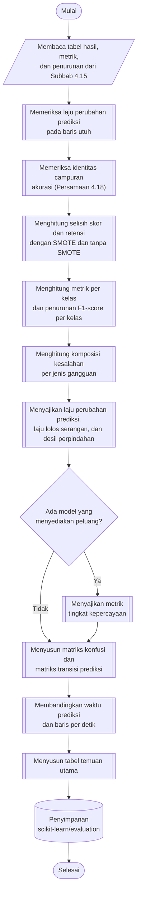

## **4.16 Analisis Lanjutan Ketahanan Model**

Peringkat ketahanan pada Subbab 4.15 menjawab model mana yang paling mampu mempertahankan kinerjanya, tetapi belum menjelaskan bagaimana gangguan memengaruhi model. Oleh karena itu, dirancang analisis lanjutan yang memanfaatkan tabel hasil dan metrik dari Subbab 4.15 tanpa memerlukan pelatihan maupun prediksi ulang. Analisis ini mencakup pemeriksaan keabsahan acuan, efek SMOTE, kinerja per kelas, komposisi kesalahan, stabilitas prediksi, tingkat kepercayaan model, matriks konfusi, biaya prediksi, dan rangkuman temuan utama.

### **4.16.1 Pemeriksaan Keabsahan Acuan**

Baris utuh pada setiap skenario memiliki fitur yang identik dengan data uji bersih dan diproses dengan batas kelompok yang sama (Subbab 4.15.1), sehingga prediksi model pada baris utuh harus sama persis dengan prediksi bersihnya. Laju perubahan prediksi pada populasi baris utuh karenanya harus bernilai nol. Nilai selain nol berarti prediksi bersih dan prediksi skenario berasal dari model atau praproses yang berbeda, sehingga perbandingan berpasangan pada Subbab 4.15.3 tidak sah. Laju perubahan prediksi terbesar pada baris utuh di seluruh skenario dan model dilaporkan sebagai bukti keabsahan acuan.

Hubungan antara skor seluruh baris dan skor kedua populasi juga diperiksa melalui identitas campuran untuk akurasi.

${Akurasi}_{all}=\left(1-f\right)\,{Akurasi}_{intact}+f\,{Akurasi}_{noisy}$ (4.18)

Persamaan 4.18 adalah identitas campuran, dengan $f$ adalah proporsi baris terganggu terhadap seluruh baris. Identitas ini berlaku tepat untuk akurasi karena akurasi merupakan rata-rata yang tertimbang menurut jumlah baris, sedangkan F1-*score* rata-rata makro tidak dapat diuraikan secara linear sehingga tidak diperiksa dengan cara ini. Selisih antara akurasi seluruh baris dan ruas kanan Persamaan 4.18 dicatat sebagai residu, yang diharapkan mendekati nol pada seluruh pengujian. Residu yang mendekati nol menegaskan bahwa pemisahan populasi konsisten dengan skor yang dilaporkan.

### **4.16.2 Efek SMOTE**

Pengaruh SMOTE terhadap kinerja dan ketahanan diukur dengan memasangkan hasil model yang sama pada kedua pengaturan, yaitu dengan SMOTE dan tanpa SMOTE, untuk setiap skenario, populasi, dan metrik. Untuk setiap pasangan dihitung selisih skor dan selisih retensi, yaitu nilai dengan SMOTE dikurangi nilai tanpa SMOTE. Selisih positif berarti SMOTE meningkatkan skor atau ketahanan model tersebut. Selisih F1-*score* rata-rata makro pada seluruh baris disajikan sebagai peta panas model terhadap skenario dengan skala warna divergen yang berpusat pada nol.

### **4.16.3 Kinerja per Kelas**

Metrik rata-rata dapat menyembunyikan kelas yang paling terdampak gangguan. Oleh karena itu, untuk setiap pengujian dan populasi dihitung metrik per kelas, yaitu jumlah baris (*support*), jumlah prediksi, presisi, *recall*, dan F1-*score* beserta nilai bersihnya, laju perubahan prediksi, proporsi baris yang diprediksi sebagai *Benign* pada skenario dan pada data bersih, serta rata-rata tingkat kepercayaan. Penurunan F1-*score* setiap kelas dihitung sebagai selisih F1-*score* bersih dan F1-*score* pada skenario. Hasilnya disajikan sebagai peta panas F1-*score* per kelas pada data uji bersih, peta panas penurunan F1-*score* per kelas pada baris terganggu untuk skenario berintensitas 30% pada setiap jenis gangguan, dan peta panas proporsi setiap kelas yang diprediksi sebagai *Benign* pada skenario yang sama. Proporsi yang diprediksi sebagai *Benign* menunjukkan kelas serangan yang paling mudah lolos dari deteksi ketika datanya terganggu.

### **4.16.4 Komposisi Kesalahan**

Kesalahan model pada sistem deteksi intrusi tidak memiliki dampak yang sama. Oleh karena itu, setiap kesalahan diklasifikasikan ke dalam tiga kelompok, yaitu serangan yang diprediksi sebagai *Benign* (serangan tidak terdeteksi), serangan yang diprediksi sebagai kelas serangan lain, dan *Benign* yang diprediksi sebagai serangan (alarm palsu). Setiap kelompok dinyatakan sebagai proporsi terhadap seluruh kesalahan, kemudian dirata-ratakan pada ketiga intensitas untuk setiap jenis gangguan, bersama laju kesalahan, laju deteksi serangan, dan laju alarm palsu. Komposisi pada data uji bersih dibandingkan dengan komposisi pada baris terganggu dan disajikan sebagai diagram batang bertumpuk, dengan tinggi setiap batang sama dengan laju kesalahan model. Pembedaan ini penting karena serangan yang tidak terdeteksi (*false negative*) berpotensi menimbulkan kerugian yang lebih besar daripada alarm palsu (Subbab 2.8.3).

### **4.16.5 Stabilitas Prediksi dan Perpindahan**

Stabilitas prediksi pada baris terganggu disajikan sebagai peta panas laju perubahan prediksi dan laju lolos serangan untuk setiap model dan skenario. Hubungan antara besar gangguan dan perubahan prediksi dianalisis menggunakan desil perpindahan dari Subbab 4.15.2. Untuk skenario berintensitas 30%, laju perubahan prediksi pada setiap desil digambarkan terhadap rata-rata perpindahan desil tersebut pada skala logaritmik. Grafik ini menunjukkan seberapa jauh suatu baris harus bergeser pada ruang komponen utama sebelum prediksi model berubah, sehingga model yang prediksinya baru berubah pada perpindahan yang besar dapat dinyatakan lebih stabil.

### **4.16.6 Tingkat Kepercayaan Model**

Model yang tahan tidak hanya mempertahankan akurasinya, tetapi juga tidak menjadi sangat yakin pada prediksi yang salah. Untuk model yang menyediakan peluang kelas, yaitu seluruh model kecuali SVM, dibandingkan rata-rata tingkat kepercayaan, rata-rata tingkat kepercayaan pada kesalahan, kesenjangan kepercayaan (*confidence gap*), dan *log loss* pada seluruh baris dan baris terganggu. Kesenjangan kepercayaan adalah selisih rata-rata tingkat kepercayaan dan akurasi, yang bernilai positif apabila model terlalu yakin dibandingkan ketepatannya. Proporsi kesalahan yakin, yaitu kesalahan dengan tingkat kepercayaan sedikitnya 0,9, pada baris terganggu disajikan sebagai peta panas model terhadap skenario.

### **4.16.7 Matriks Konfusi dan Biaya Prediksi**

Untuk setiap pengujian disusun matriks konfusi lima belas kelas pada seluruh baris dan pada baris terganggu, yang dihitung dari tabel hasil dengan jumlah baris sebagai bobot. Selain itu, pada baris terganggu disusun matriks transisi prediksi, yaitu matriks antara prediksi pada baris bersih dan prediksi setelah diganggu, yang memperlihatkan ke kelas mana prediksi berpindah akibat gangguan. Seluruh matriks disajikan sebagai peta panas berskala logaritmik dan disimpan sebagai gambar, sedangkan matriks pada data uji bersih juga ditampilkan langsung. Biaya prediksi setiap model dibandingkan menggunakan ringkasan pengujian (Subbab 4.15.1), yaitu waktu prediksi setiap skenario dan jumlah baris yang diprediksi per detik.

### **4.16.8 Rangkuman Temuan Utama**

Hasil seluruh analisis dirangkum secara otomatis menjadi tabel temuan utama untuk setiap pengaturan SMOTE. Tabel ini menjawab pertanyaan-pertanyaan berikut: model dengan F1-*score* makro bersih tertinggi, model yang paling tahan dan paling rentan pada seluruh baris dan pada baris terganggu, skenario tersulit, jenis gangguan yang paling merusak, model dengan laju perubahan prediksi, laju lolos serangan, laju alarm palsu, dan proporsi kesalahan yakin tertinggi, kelas serangan yang paling sering diprediksi sebagai *Benign*, kelas serangan dengan penurunan F1-*score* terbesar, selisih rata-rata retensi akibat SMOTE untuk setiap model, serta laju perubahan prediksi terbesar pada baris utuh dan residu identitas campuran terbesar sebagai bukti keabsahan analisis.

Prosedur analisis lanjutan dilaksanakan melalui algoritma berikut:

1. **Pemeriksaan keabsahan acuan**, Laju perubahan prediksi terbesar pada baris utuh dihitung, dan identitas campuran Persamaan 4.18 diperiksa pada seluruh pengujian skenario.
2. **Pengukuran efek SMOTE**, Hasil kedua pengaturan SMOTE dipasangkan dan selisih skor serta selisih retensinya dihitung.
3. **Penghitungan metrik per kelas**, Metrik setiap kelas dihitung untuk setiap pengujian dan populasi, beserta penurunan F1-*score* per kelas.
4. **Penghitungan komposisi kesalahan**, Proporsi ketiga kelompok kesalahan dihitung dan dirata-ratakan per jenis gangguan.
5. **Analisis stabilitas dan kepercayaan**, Laju perubahan prediksi, laju lolos serangan, desil perpindahan, dan metrik kepercayaan disajikan.
6. **Penyusunan matriks konfusi**, Matriks konfusi dan matriks transisi prediksi disusun dan disimpan sebagai gambar.
7. **Perbandingan biaya prediksi**, Waktu prediksi dan jumlah baris per detik dikumpulkan dari ringkasan pengujian.
8. **Penyusunan temuan utama**, Jawaban setiap pertanyaan temuan utama dihitung dan disimpan sebagai tabel.

Seluruh hasil analisis lanjutan disimpan pada folder `scikit-learn/evaluation` dalam bentuk tabel CSV dan gambar, termasuk matriks konfusi yang dikelompokkan menurut pengaturan SMOTE dan model. Karena seluruh analisis dihitung dari tabel hasil yang telah diringkas, analisis dapat diulang atau diperluas tanpa mengulang prediksi yang membutuhkan waktu lama.
