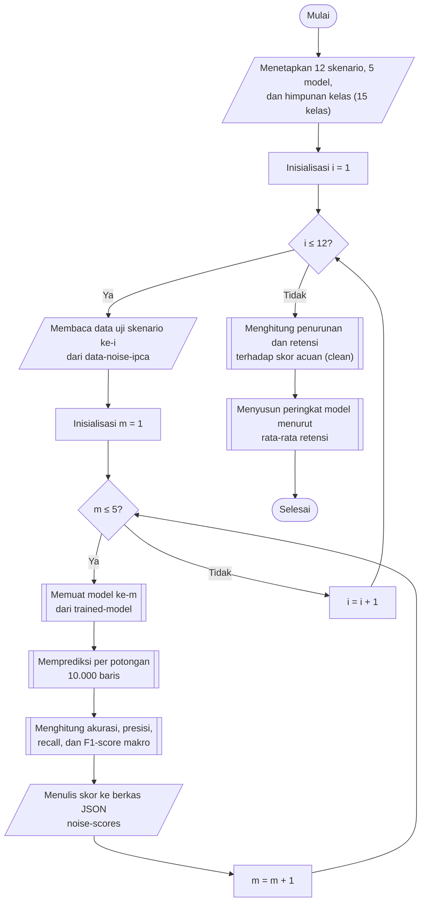

## **4.16 Pengujian dan Pengukuran Ketahanan Model**

Setelah 12 skenario gangguan terbentuk (Subbab 4.15), setiap model diuji pada setiap skenario tanpa dilatih ulang. Pengujian dilaksanakan pada 5 model dan 12 skenario, sehingga terdapat 60 pengujian. Kinerja model pada data uji yang tidak dimodifikasi (*clean*), yang diperoleh pada Subbab 4.9, digunakan sebagai acuan (*baseline*) sehingga terdapat 5 skor acuan tambahan. Pengujian pada satu skenario dilaksanakan dengan memuat data uji skenario tersebut dari folder *data-noise-ipca*, memuat model akhir dari folder *trained-model*, memprediksi seluruh baris per potongan 10.000 baris, dan menghitung metrik yang sama dengan Subbab 4.9. Data uji setiap skenario berjumlah 3.246.594 baris sehingga prediksi terbagi menjadi 325 potongan untuk setiap model.

F1-*score* rata-rata makro digunakan sebagai metrik utama pengujian ketahanan, sejalan dengan Subbab 2.8.4 dan Subbab 4.9. Seluruh pengujian dihitung terhadap himpunan kelas yang sama, yaitu 15 kelas yang terdapat pada label data uji, yang ditetapkan satu kali. Penetapan ini menjaga agar rata-rata makro pada setiap pengujian dihitung dengan pembagi yang sama, sehingga skor antarskenario dan antarmodel dapat dibandingkan secara langsung, dan tidak mengecil atau membesar hanya karena suatu kelas tidak muncul pada prediksi sebuah pengujian.

Pengujian pada seluruh skenario memerlukan sumber daya yang besar sehingga dirancang agar dapat dilanjutkan apabila terputus. Data uji satu skenario dimuat sekali, digunakan secara berurutan oleh kelima model, kemudian dilepaskan dari memori sebelum skenario berikutnya dimuat. Hasil prediksi disimpan per potongan pada folder *prediction-result* untuk setiap model dan skenario, dan potongan yang sudah ada tidak dihitung ulang. Skor setiap pengujian disimpan sebagai berkas JSON tersendiri pada folder *hyperparameter-search/noise-scores*, yang memuat model, jenis gangguan, intensitas, metrik, jumlah baris, dan waktu penilaian, dan ditulis melalui berkas sementara agar tidak pernah tertulis sebagian. Sebuah tabel status merangkum, untuk setiap pasangan model dan skenario, jumlah potongan yang telah diprediksi terhadap jumlah yang diperlukan, serta apakah skor telah tersimpan, sehingga pengujian yang belum selesai dapat diidentifikasi.

Penurunan kinerja diukur relatif terhadap skor acuan model yang sama. Untuk model *m* pada skenario *s*, penurunan mutlak (*drop*) dan retensi (*retention*) F1-*score* rata-rata makro didefinisikan sebagai berikut.

${\Delta }_{m,s}=F{1}_{m}^{clean}-F{1}_{m,s}$ (4.8)

${R}_{m,s}=\frac{F{1}_{m,s}}{F{1}_{m}^{clean}}$ (4.9)

Persamaan 4.8 adalah penurunan mutlak, yaitu selisih F1-*score* rata-rata makro pada data bersih dan pada skenario *s*, sedangkan Persamaan 4.9 adalah retensi, yaitu proporsi skor data bersih yang dipertahankan pada skenario *s*. Retensi digunakan sebagai dasar pembandingan karena skor data bersih setiap model berbeda, sehingga model dinilai berdasarkan bagian kinerjanya sendiri yang dipertahankan, dan bukan berdasarkan skor mutlak yang dipengaruhi oleh kinerja awal.

Ketahanan setiap model dirangkum sebagai rata-rata retensi pada seluruh 12 skenario, sedangkan peringkat ketahanan ditetapkan dengan mengurutkan model menurut rata-rata retensi dari yang terbesar.

${\bar{R}}_{m}=\frac{1}{12}\sum _{s=1}^{12}{R}_{m,s}$ (4.10)

Persamaan 4.10 adalah rata-rata retensi model *m*, yang memberikan bobot yang sama kepada setiap jenis gangguan dan setiap intensitas. Selain rata-rata retensi, dicatat pula retensi terburuk beserta skenario tempat retensi tersebut terjadi, rata-rata penurunan mutlak, dan penurunan mutlak terbesar, sehingga kerentanan model terhadap satu skenario tertentu tidak tersembunyi oleh rata-rata. Model dengan rata-rata retensi tertinggi dinyatakan sebagai model yang paling tahan.

Prosedur pengujian dan pengukuran ketahanan dilaksanakan melalui algoritma berikut:

1. **Menetapkan skenario, model, dan himpunan kelas.** Dua belas skenario, lima model, dan himpunan kelas yang sama untuk seluruh pengujian, yaitu 15 kelas pada label data uji, ditetapkan.

2. **Memuat data uji skenario.** Seluruh berkas pada folder *data-noise-ipca* untuk skenario ke-*i* dibaca menggunakan pustaka *Polars* menjadi satu tabel fitur. Tabel ini digunakan bergantian oleh kelima model.

3. **Memuat model tersimpan.** Model ke-*m* dimuat dari folder *trained-model*. Apabila berkas model tidak tersedia, pengujian model tersebut dilewati dengan pemberitahuan.

4. **Memprediksi per potongan.** Prediksi dilaksanakan per potongan 10.000 baris dan disimpan pada folder *prediction-result* sebagaimana diuraikan pada Subbab 4.9.

5. **Menghitung skor.** Prediksi dibandingkan dengan label data uji, dengan panjang keduanya diperiksa harus sama, kemudian akurasi serta presisi, *recall*, dan F1-*score* rata-rata makro dihitung terhadap himpunan kelas yang sama.

6. **Menyimpan skor.** Skor disimpan sebagai berkas JSON pada folder *hyperparameter-search/noise-scores*. Langkah 3 hingga 6 diulang untuk kelima model, dan langkah 2 hingga 6 diulang untuk kedua belas skenario.

7. **Menghitung penurunan dan retensi.** Skor seluruh pengujian dikumpulkan bersama skor acuan, kemudian penurunan mutlak dan retensi dihitung menurut Persamaan 4.8 dan 4.9.

8. **Menyusun peringkat ketahanan.** Rata-rata retensi dihitung menurut Persamaan 4.10 bersama retensi terburuk, skenario terburuk, rata-rata penurunan, dan penurunan terbesar, kemudian model diurutkan menurut rata-rata retensi dan hasilnya disimpan pada berkas *hyperparameter-search/noise-robustness-ranking.csv*.

Hasil pengujian disajikan dalam tiga bentuk. Bentuk pertama adalah tabel F1-*score* rata-rata makro untuk setiap model pada data bersih dan pada setiap skenario, yang disimpan pada berkas *hyperparameter-search/noise-robustness.csv*, beserta grafik garis F1-*score* terhadap intensitas untuk setiap jenis gangguan dengan skor data bersih sebagai titik pada intensitas 0%. Bentuk kedua adalah peta panas (*heatmap*) retensi untuk setiap pasangan model dan skenario. Bentuk ketiga adalah peta panas F1-*score* per kelas pada satu skenario terpilih, yang memperlihatkan kelas serangan yang paling mudah tidak terdeteksi. Penyajian ini memenuhi kebutuhan penyajian hasil evaluasi pada Subbab 3.3.5.
