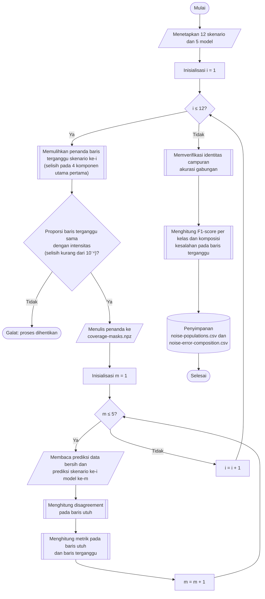

## **4.17 Analisis Populasi Baris Utuh dan Baris Terganggu**

Pada setiap skenario, hanya *p*% baris data uji yang diganggu (Subbab 4.15), sedangkan (1 − *p*)% baris lainnya identik dengan data bersih. Akibatnya, skor gabungan pada Subbab 4.16 merupakan campuran dari dua populasi yang sangat berbeda, yaitu baris utuh (*intact*) dan baris terganggu (*corrupted*). Skor gabungan mengaburkan dampak gangguan pada baris yang benar-benar terganggu, dan tidak dapat menunjukkan apakah selisih antara skor data bersih dan skor pada skenario benar-benar berasal dari gangguan. Oleh karena itu, dirancang analisis lanjutan yang memisahkan kedua populasi tersebut, mengaudit skor acuan data bersih, dan menguraikan komposisi kesalahan model.

Baris yang terganggu tidak dicatat pada saat skenario dibentuk (Subbab 4.15), sehingga penandanya (*coverage mask*) dipulihkan dari data. Sebuah baris dinyatakan terganggu apabila nilainya pada data ternoise berbeda dari data bersih pada sedikitnya satu dari empat komponen utama pertama. Perbandingan dilakukan dengan fungsi *numpy.isclose* menggunakan toleransi relatif 10⁻⁷ dan toleransi mutlak 10⁻¹⁰, dengan *NaN* dianggap sama. Empat komponen pertama dipilih untuk membatasi volume data yang dibaca, dan kecukupannya diverifikasi: proporsi baris terganggu yang terpulihkan pada setiap skenario harus sama dengan intensitasnya dengan selisih kurang dari 10⁻⁴. Penanda seluruh skenario disimpan pada berkas *analysis/coverage-masks.npz* sehingga tidak perlu dipulihkan ulang.

Karena baris utuh memiliki fitur yang identik dengan data bersih, prediksi sebuah model pada baris utuh di setiap skenario harus sama persis dengan prediksi model yang sama pada data bersih (Subbab 4.9). Audit skor acuan menghitung proporsi baris utuh yang diprediksi berbeda (*disagreement*), yang harus bernilai nol. Nilai selain nol berarti prediksi acuan dan prediksi pada skenario berasal dari model yang berbeda, sehingga skor acuan tersimpan tidak sah dibandingkan dengan skor skenario. Apabila hal tersebut terjadi, akurasi pada baris utuh (*recovered clean*) digunakan sebagai pengganti skor acuan tersimpan. Audit ini diperlukan karena prediksi disimpan dalam *cache* dan tidak dihitung ulang (Subbab 4.9), sehingga prediksi data bersih yang dihasilkan sebelum model dilatih ulang dapat terbawa tanpa disadari.

Kedua populasi kemudian dinilai secara terpisah menggunakan metrik dan himpunan kelas yang sama dengan Subbab 4.16, sehingga skor baris utuh dan baris terganggu dapat dibandingkan langsung. Hubungan antara skor gabungan dan skor kedua populasi diperiksa melalui identitas campuran untuk akurasi.

${Akurasi}_{gabungan}=\left(1-p\right)\,{Akurasi}_{utuh}+p\,{Akurasi}_{terganggu}$ (4.11)

Persamaan 4.11 adalah identitas campuran, dengan *p* adalah intensitas skenario. Identitas ini berlaku tepat untuk akurasi karena akurasi merupakan rata-rata tertimbang menurut jumlah baris, sedangkan F1-*score* rata-rata makro tidak dapat diuraikan secara linear sehingga tidak diperiksa dengan cara ini. Selisih antara skor gabungan yang tersimpan pada Subbab 4.16 dan ruas kanan Persamaan 4.11 diharapkan mendekati nol dan pada seluruh 60 pengujian kurang dari 10⁻⁶, sehingga pemisahan populasi dinyatakan konsisten dengan skor yang dilaporkan.

Terakhir, cara model gagal pada baris terganggu diuraikan. F1-*score* per kelas pada populasi terganggu dihitung untuk skenario terpilih. Matriks konfusi dihitung untuk setiap model, skenario, dan populasi, kemudian dijumlahkan pada ketiga intensitas untuk setiap jenis gangguan. Dari matriks tersebut, kesalahan diklasifikasikan ke dalam tiga kelompok, yaitu serangan yang diprediksi sebagai *Benign* (serangan tidak terdeteksi), serangan yang diprediksi sebagai kelas serangan lain, dan *Benign* yang diprediksi sebagai serangan (alarm palsu). Setiap kelompok dinyatakan sebagai proporsi terhadap seluruh kesalahan, dan laju kesalahan keseluruhan dicatat. Pembedaan ini penting pada sistem deteksi intrusi karena serangan yang tidak terdeteksi (*false negative*) berpotensi menimbulkan kerugian yang lebih besar daripada alarm palsu (Subbab 2.8.3).

Prosedur analisis populasi dilaksanakan melalui algoritma berikut:

1. **Menetapkan skenario dan model.** Dua belas skenario dan lima model yang sama dengan Subbab 4.16 ditetapkan, dengan skenario dinyatakan sebagai *i* dan model dinyatakan sebagai *m*.

2. **Memulihkan penanda baris terganggu.** Untuk skenario ke-*i*, empat komponen utama pertama dibaca dari data bersih pada folder *data-ipca/test* dan dari data ternoise pada folder *data-noise-ipca*, berkas demi berkas. Baris yang berbeda pada sedikitnya satu komponen ditandai terganggu, dan penanda seluruh berkas digabung menurut urutan berkas.

3. **Memverifikasi dan menyimpan penanda.** Proporsi baris yang ditandai terganggu dibandingkan dengan intensitas skenario, dan proses dihentikan dengan galat apabila selisihnya tidak kurang dari 10⁻⁴. Penanda yang lolos disimpan pada berkas *analysis/coverage-masks.npz*.

4. **Mengaudit skor acuan.** Untuk model ke-*m*, prediksi data bersih dan prediksi skenario ke-*i* dibaca dari folder *prediction-result*. Dihitung proporsi baris utuh yang diprediksi berbeda antara kedua prediksi, akurasi prediksi data bersih tersimpan pada seluruh baris, dan akurasi prediksi skenario pada baris utuh, yaitu *recovered clean*.

5. **Menilai kedua populasi.** Akurasi serta presisi, *recall*, dan F1-*score* rata-rata makro dihitung secara terpisah pada baris utuh dan baris terganggu terhadap himpunan 15 kelas yang sama, kemudian dicatat bersama jumlah barisnya. Langkah 4 dan 5 diulang untuk kelima model, dan langkah 2 hingga 5 diulang untuk kedua belas skenario.

6. **Memverifikasi identitas campuran.** Akurasi gabungan yang tersimpan dibandingkan dengan campuran akurasi kedua populasi menurut Persamaan 4.11, dan selisihnya dicatat sebagai residu.

7. **Menganalisis F1-*score* per kelas dan komposisi kesalahan.** F1-*score* per kelas pada populasi terganggu dihitung untuk skenario terpilih. Matriks konfusi setiap model dan skenario pada populasi terganggu dijumlahkan pada ketiga intensitas setiap jenis gangguan, kemudian laju kesalahan dan proporsi ketiga kelompok kesalahan dihitung, dan hasilnya disimpan pada berkas *hyperparameter-search/noise-error-composition.csv*. Skor kedua populasi disimpan pada berkas *hyperparameter-search/noise-populations.csv*.

Analisis ini dilaksanakan pada tingkat data hasil prediksi yang telah tersimpan, dan tidak memerlukan pelatihan ulang maupun prediksi ulang model. Hasilnya disajikan dalam bentuk grafik batang skor baris utuh dan baris terganggu untuk setiap jenis gangguan, grafik kesesuaian identitas campuran, peta panas F1-*score* per kelas, serta peta panas matriks konfusi pada kedua populasi untuk pasangan model dan skenario terpilih.
